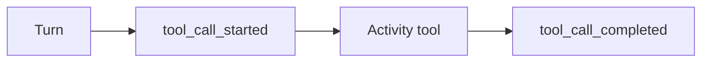

<h1>Activity Tool </h1>

## Overview

The Activity Tool pattern wraps a side-effecting function (API call, database write, external system) as a Temporal Activity-backed tool.
Each tool call is a durable Step with retries, timeouts, metrics, and clear start/end events.
Primitives used: ToolDefinition (`kind=activity`), ToolCallStep, StepPolicy, tool events.

## Problem

Agents call APIs and mutate systems.
If those calls run inside the Workflow or a non-durable loop, restarts re-execute side effects and you cannot attach retries, timeouts, or approvals per tool.

## Solution

Implement each IO tool as an Activity.
The Session or Turn Workflow invokes the Activity at a step boundary and records `tool_call_started` / `tool_call_completed` (or failed) on the event stream.



The following describes each step in the diagram:

1. The Turn selects a tool and emits `tool_call_started` with tool ID and inputs.
2. Temporal schedules the Activity with the tool's timeout and retry policy.
3. On success or failure, the Turn records the matching end event and continues.

```python
# activities.py
from temporalio import activity

@activity.defn
async def charge_card(amount_cents: int, idempotency_key: str) -> str:
    return f"charged:{amount_cents}:{idempotency_key}"
```

```python
# workflows.py — invoke as a durable tool step
result = await workflow.execute_activity(
    charge_card,
    args=[500, f"{session_id}-charge-1"],
    start_to_close_timeout=timedelta(seconds=30),
)
```

## Implementation

<DaytonaRunner pattern="activity-tool" />

### Idempotency

Non-idempotent tools need an idempotency key or an approval gate before automatic retries.
Pass the key into the Activity so provider APIs can deduplicate.

### Timeouts and retries

Set `start_to_close_timeout` and a RetryPolicy that matches the tool's safety profile.
Read-only tools can retry more aggressively than payments.

## When to use

Use Activity Tools for any IO or non-deterministic work the agent performs.
Do not use them for pure deterministic transforms that must stay in-Workflow (see Workflow Tool).

## Benefits and trade-offs

You gain durable retries, heartbeats for long calls, and clear observability.
Each call costs an Activity schedule; very chatty tools may need batching or Code Mode.

## Comparison with alternatives

| Approach | Side effects | Replay-safe |
| :--- | :--- | :--- |
| Activity Tool | Yes | Yes |
| Workflow Tool | No | Yes |
| Inline HTTP in Workflow | Yes | No |

## Best practices

- **One Activity per tool call.** Keep arguments and results schema-validated.
- **Classify safety.** Mark tools inherently safe, idempotent, or non-idempotent.
- **Heartbeat long calls.** Use Activity heartbeats for multi-minute IO.

## Common pitfalls

- **Retrying payments without keys.** Double charges follow.
- **Huge payloads in Activity results.** Prefer summaries or externalized blobs.
- **Catching and swallowing Activity errors in the Workflow.** Surface failures as step failures or approval waits.

## Related patterns

- [Workflow Tool](/workflow-tool)
- [Tool Retry Profiles](/tool-retry-profiles)
- [Approval-Gated Tools](/approval-gated-tools)
- [Safety-Profiled Tools](/safety-profiled-tools)

## Sample code

- [`sandbox-runner/patterns/activity-tool/python/`](https://github.com/temporal-sa/temporal-agentic-patterns/tree/main/sandbox-runner/patterns/activity-tool/python)

## References

- [Temporal Docs: Activities](https://docs.temporal.io/activities)
- [Temporal Docs: Activity retries](https://docs.temporal.io/encyclopedia/retry-policies)
