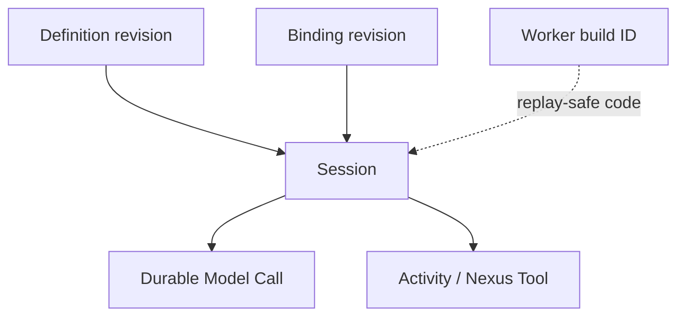

<h1>Agent Definition Versioning </h1>

## Overview

The Agent Definition Versioning pattern pins two immutable revisions on every Session: a **definition revision** (instructions, tools, policies, prompts the agent *is*) and a **binding revision** (which Activity types, Task Queues, Nexus endpoints, and models those logical names map to).
Primitives used: Session start pins, Prompt Versioning, Worker Versioning, Durable Model Call / Activity Tool options, evals.

## Problem

[Prompt Versioning](/prompt-versioning) alone does not stop a deploy from moving `search` from one Task Queue to another or swapping a Nexus endpoint under an open Session.
Worker Versioning alone does not freeze mutable prompt files or tool schemas loaded from storage.
Mixed together without names, ops cannot tell "agent config changed" from "infrastructure placement changed."

## Solution

At Session (or Turn) start, record:

| Revision | Identifies |
| :--- | :--- |
| `definition_revision` | Immutable agent bundle: instructions, tool schemas/names, safety profile, prompt IDs/versions, subagent graph |
| `binding_revision` | Immutable map: logical tool/model → Activity type, Task Queue, Nexus Operation, secrets handle |

Pass both into model/tool Activities.
Changing either mid-session is an explicit migration (event + optional Continue-As-New), never a silent Worker pickup.



The following describes each step in the diagram:

1. Build pipelines publish definition and binding artifacts with content hashes or version tags.
2. Session start stores both revisions in Workflow state.
3. Steps resolve prompts/tools through those pins.
4. Worker Deployment Versioning still applies to Workflow code replay; it does not replace definition/binding pins.

```python
from dataclasses import dataclass
from datetime import timedelta

from temporalio import workflow

@dataclass
class SessionPins:
    definition_revision: str  # e.g. "agent@sha256:…"
    binding_revision: str     # e.g. "bind@2026-08-13.3"

@workflow.defn
class AgentSessionWorkflow:
    @workflow.run
    async def run(self, session_id: str, pins: SessionPins, user_message: str) -> str:
        return await workflow.execute_activity(
            call_model,
            args=[pins.definition_revision, pins.binding_revision, user_message],
            start_to_close_timeout=timedelta(seconds=60),
            # task_queue resolved from binding_revision inside activity or options builder
        )
```

## Implementation

<DaytonaRunner pattern="agent-definition-versioning" />

### What belongs where

| Concern | Definition | Binding |
| :--- | :--- | :--- |
| System prompt text / prompt_id | Yes | No |
| Tool JSON schema & name | Yes | No |
| Approval policy labels | Yes | No |
| Activity type / Task Queue | No | Yes |
| Nexus Endpoint / Operation | No | Yes |
| Model provider route | Often definition ID + binding route | Yes for queue/key |
| Worker build ID | No | Separate Worker Versioning |

### Relationship to Prompt Versioning

Prompt Versioning is the definition-slice for prompt files.
Keep using `prompt_id` + `prompt_version` inside a definition revision, or treat the whole definition hash as the pin.

### Relationship to Worker Versioning

Use [Agent Worker Versioning](/agent-worker-versioning) to pin Worker Deployment / build identity so Workflow/Activity *code* stays replay-compatible.
Still pin definition/binding so config loaded from object storage cannot drift under that code.

### Explicit migration

To upgrade an open Session: emit `definition_migrated` / `binding_migrated`, then Continue-As-New with new pins—or reject until the Session idles.
Never swap bindings underneath an in-flight tool without a recorded decision.

### Evals

Fixtures pin definition_revision (and binding when placement affects behavior) so reruns match production.

## When to use

Use for production multi-tenant or long-lived Sessions.
Combine with Prompt Versioning for file-level prompt ops.
Skip dual revisions only for throwaway demos.

## Benefits and trade-offs

You can reason about config vs placement incidents and reproduce Sessions in evals.
You operate two artifact pipelines and migration rules.

## Comparison with alternatives

| Approach | Config drift | Placement drift |
| :--- | :--- | :--- |
| Definition + binding pins | Controlled | Controlled |
| Prompt version only | Partial | Uncontrolled |
| Worker Versioning only | Uncontrolled if config external | Code-safe |
| Mutable "latest" config | Unsafe | Unsafe |

## Best practices

- **Hash the definition bundle** (instructions + tool schemas + policy).
- **Version bindings separately** so you can move queues without claiming the agent "changed."
- **Surface both revisions** on Session Queries and traces.
- **Block silent binding changes** while a Turn is open.

## Common pitfalls

- **Putting Task Queues in the definition.** Forces a "new agent" to move infrastructure.
- **Putting prompt text only in Workers** with no definition pin.
- **Migrating mid-tool** without compensation / cancel policy.
- **Equating git commit with definition revision** when prompts load from mutable CMS without digest.

## Related patterns

- [Catalog Snapshot Pinning](/catalog-snapshot-pinning)
- [Binding Readiness Gate](/binding-readiness-gate)
- [Agent Worker Versioning](/agent-worker-versioning)
- [Prompt Versioning](/prompt-versioning)
- [Durable Model Call](/durable-model-call)
- [Activity Tool](/activity-tool)
- [Nexus Tool](/nexus-tool)
- [Continue-As-New Session](/continue-as-new-session)
- [Eval-Backed Behavior Checks](/eval-backed-behavior-checks)
- [Security Profiles per Agent](/security-profiles-per-agent)

## Sample code

- [`sandbox-runner/patterns/agent-definition-versioning/python/`](https://github.com/temporal-sa/temporal-agentic-patterns/tree/main/sandbox-runner/patterns/agent-definition-versioning/python)

## References

- [Temporal Docs: Worker Versioning](https://docs.temporal.io/production-deployment/worker-deployments/worker-versioning)
- [Temporal Docs: Versioning](https://docs.temporal.io/workflow-definition#workflow-versioning)
