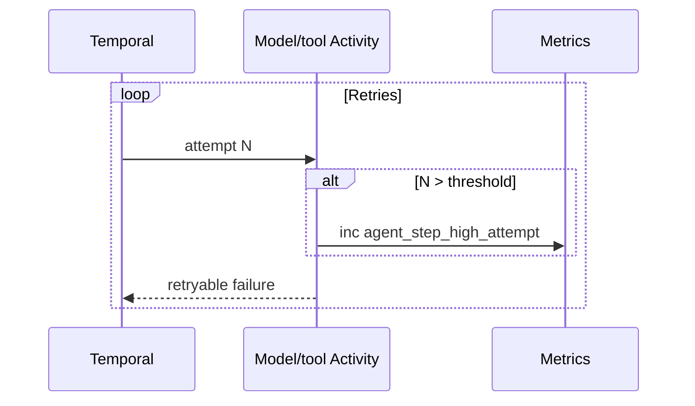

<h1>Agent Step Retry Alerting </h1>

## Overview

The Agent Step Retry Alerting pattern emits metrics (and optional events) when model or tool Activity attempts cross a threshold—so on-call sees silent retry storms and token burn before users or invoices do.
Primitives used: Activity attempt number, SDK metrics scope, Cost & Token Accounting, Agent Tracing.

## Problem

Long RetryPolicies and Fast/Slow slow phases can run for hours while the Temporal UI is the only place attempt counts appear.
Provider outages and bad tool configs then surface as "agent feels slow" or a surprise bill, not a paging alert.
Workflow-level custom tracking for every Step is noisy; you need a cheap signal from inside the Activity.

## Solution

In model and tool Activities, read `activity.info().attempt`.
When attempt exceeds a threshold (for example 5), increment a counter via the Worker metrics scope tagged with `tool_id` / `model`, `tenant_id`, and `session_id` when available.
Optionally emit a single `step_retry_threshold` event for the Session stream on first crossing.
Alerts fire from your metrics backend; retry behavior stays unchanged.



The following describes each step in the diagram:

1. Temporal runs the Activity with attempt N.
2. The Activity compares N to the alert threshold.
3. On crossing, it increments a labeled counter (and optionally records one event).
4. Your alert rule pages when the counter or rate exceeds budget.

```python
from temporalio import activity

THRESHOLD = 5

@activity.defn
async def call_model(prompt: str) -> str:
    attempt = activity.info().attempt
    if attempt > THRESHOLD:
        meter = activity.metric_meter()
        meter.create_counter("agent_step_high_attempt").add(
            1,
            {"activity": "call_model", "attempt": str(attempt)},
        )
    return await provider_complete(prompt)
```

Exact metrics API names vary by SDK version—use the Worker metrics integration your deployment already exports to Prometheus or equivalent.

## Implementation

### What to tag

| Label | Why |
| :--- | :--- |
| `activity` / `tool_id` | Find bad tools |
| `model` | Find provider incidents |
| `tenant_id` | Fairness / noisy neighbor |
| `phase` | `fast` vs `slow` when using Fast/Slow Tool Retries |

Avoid high-cardinality labels (raw prompts, full session ids at huge scale)—hash or bucket if needed.

### Cost correlation

Tie threshold crossings to [Cost & Token Accounting](/cost-token-accounting) so alerts can show spend rate, not only attempt counts.

### Compensation failures

Also alert when [Tool Compensation](/tool-compensation) undo Activities cross the threshold—failed undos are data-integrity incidents.

## When to use

Use for production agents with unbounded or long slow-phase retries.
Skip for local demos and unit tests.

## Benefits and trade-offs

You learn about stuck Steps from paging, not from customers.
You must maintain alert thresholds and avoid label cardinality explosions.

## Comparison with alternatives

| Approach | Signal | Changes retries? |
| :--- | :--- | :--- |
| Agent Step Retry Alerting | Metrics / optional event | No |
| Watch Temporal UI | Manual | No |
| Fail fast after N | User-visible errors | Yes |
| Only invoice alerts | Too late | No |

## Best practices

- **Alert on rate, not a single bump** when many Sessions share an outage.
- **Separate interactive vs scheduled** thresholds.
- **Include runbooks** (provider status, pause Schedule, flip prompt version).
- **Test the metric path** in staging with a forced failing Activity.

## Common pitfalls

- **Emitting per-token metrics.** Use attempt thresholds, not token loops.
- **Paging on every retry from attempt 1.** Set a real threshold.
- **No tenant labels** during multi-tenant incidents.
- **Counting compensation failures as normal tool noise.** Give undo Activities distinct metric names.

## Related patterns

- [Cost & Token Accounting](/cost-token-accounting)
- [Agent Tracing](/agent-tracing)
- [Fast/Slow Tool Retries](/fast-slow-tool-retries)
- [Tool Retry Profiles](/tool-retry-profiles)
- [Durable Model Call](/durable-model-call)
- [Tool Compensation](/tool-compensation)

## Sample code

Add attempt-threshold counters inside the [Durable Model Call](/durable-model-call) and [Activity Tool](/activity-tool) Activity bodies; wire Worker metrics to your existing Prometheus (or equivalent) alerts.

## References

- [Temporal Docs: Metrics](https://docs.temporal.io/production-deployment/metrics)
- [Temporal Docs: Activity info](https://docs.temporal.io/activities)
