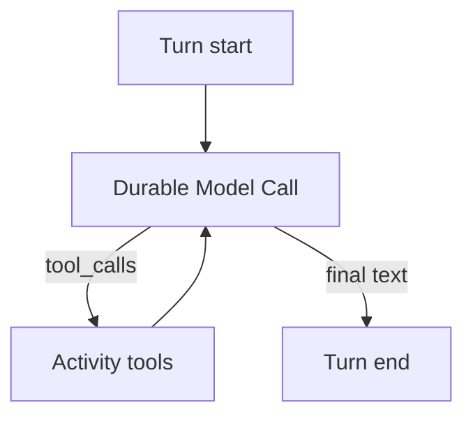

<h1>Agent Tool Loop </h1>

## Overview

The Agent Tool Loop pattern runs a Turn as a durable loop: call the model, execute selected tools, feed results back, and repeat until the model returns a final reply.
Each model call and tool call is its own Activity Step so retries and history stay clear.
Primitives used: Turn, Durable Model Call, Activity Tool, Step events.

## Problem

A single model call rarely finishes real work.
If the whole loop lives outside Temporal, a crash mid-tool loses progress and may double-run side effects.

## Solution

Inside the Turn (Session sub-state or Child Workflow), loop:
1) Durable Model Call with tool schemas,
2) for each tool call, Activity Tool or Workflow Tool,
3) append tool results to the message list,
4) exit when there are no tool calls or a cap is hit.



The following describes each step in the diagram:

1. The Turn starts with the user input and session memory.
2. A model Activity returns content and optional tool_calls.
3. Each tool runs as its own Step with the tool's retry and approval profile.
4. Results return to the next model call until a final reply or a loop limit.

```python
while True:
    response = await workflow.execute_activity(
        call_llm, request, start_to_close_timeout=timedelta(seconds=30)
    )
    if not response.tool_calls:
        return response.content
    for call in response.tool_calls:
        result = await workflow.execute_activity(
            execute_tool, call, start_to_close_timeout=timedelta(seconds=60)
        )
        request = request.with_tool_result(call.id, result)
```

## Implementation

<DaytonaRunner pattern="agent-tool-loop" />

### Loop limits

Cap iterations and total tokens so a runaway model cannot loop forever.

### Deterministic tools

State-only tools (for example updating a TODO list in Session state) belong in Workflow code; IO tools stay Activities.

## When to use

Use for tool-using chat and job agents.
Prefer Code Mode when one script should orchestrate many tools without round trips.

## Benefits and trade-offs

You get a clear audit trail of every model and tool Step.
Long loops grow history—combine with Continue-As-New Session on long jobs.

## Comparison with alternatives

| Approach | Durability | Round trips |
| :--- | :--- | :--- |
| Agent Tool Loop | Per Step | Many |
| Code Mode Orchestrator | Per host call | Fewer |
| Single-shot model call | One Step | One |

## Best practices

- **Separate model and tool Activities.** Do not hide tool IO inside the model Activity.
- **Apply per-tool profiles** inside the loop.
- **Emit turn and step events** for each iteration.

## Common pitfalls

- **Unbounded while True without a max_steps guard.**
- **Putting the provider SDK in the Workflow.**
- **Re-running the whole loop after Continue-As-New without snapshotting messages.**
- **Re-running completed tool Steps on recovery without idempotency.** Replay or recovery must not double-apply side effects.
- **Stuffing full tool payloads into next model args.** Use Claim-Check refs and short summaries instead.

## Related patterns

- [Durable Model Call](/durable-model-call)
- [Activity Tool](/activity-tool)
- [Workflow Tool](/workflow-tool)
- [Code Mode Orchestrator](/code-mode-orchestrator)

## Sample code

- [`sandbox-runner/patterns/agent-tool-loop/python/`](https://github.com/temporal-sa/temporal-agentic-patterns/tree/main/sandbox-runner/patterns/agent-tool-loop/python)

## References

- [Temporal Docs: Activities](https://docs.temporal.io/activities)
- [Temporal Docs: Workflows](https://docs.temporal.io/workflows)
