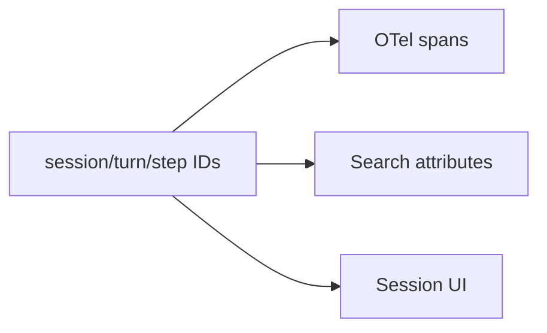

<h1>Agent Tracing </h1>

## Overview

The Agent Tracing pattern wraps model calls, tools, and subagents with OpenTelemetry spans that carry session, turn, step, and tool IDs.
Temporal search attributes mirror these IDs so operators can jump between traces, logs, and Workflow histories.
Primitives used: Identity IDs, OTel spans, Temporal search attributes.

## Problem

Without correlated IDs, a failed tool in logs cannot be found in Temporal Web or the session UI.

## Solution

Propagate `session_id`, `turn_id`, `step_id`, `agent_id`, and `tool_id` into span attributes and search attributes.
Create spans around model Activities, tool Activities, and subagent operations.



The following describes each step in the diagram:

1. Each Turn allocates IDs for its Steps.
2. Activities set span attributes from those IDs.
3. Workflow upserts search attributes for session status.
4. Operators pivot from UI → Temporal → traces using the same IDs.

```python
# Activity side
with tracer.start_as_current_span("tool_call") as span:
    span.set_attribute("session_id", session_id)
    span.set_attribute("turn_id", turn_id)
    span.set_attribute("tool_id", tool_id)
    return await invoke_tool(...)
```

## Implementation

### Workflow vs Activity instrumentation

Prefer heavy instrumentation in Activities.
Workflows should stay deterministic; use upsert_search_attributes for queryable fields.

## When to use

Use for any production agent.
Omit only in local teaching samples.

## Benefits and trade-offs

You debug across systems with one ID space.
You must keep attribute schemas consistent.

## Comparison with alternatives

| Signal | System |
| :--- | :--- |
| Event stream | Product UI |
| Search attributes | Temporal visibility |
| OTel spans | APM |

## Best practices

- **One ID vocabulary everywhere.**
- **Sample carefully.** High-cardinality labels need care.
- **Link parent/child spans for subagents.**

## Common pitfalls

- **New random IDs in each Activity retry.** Use Workflow-supplied step IDs.
- **PII in span attributes.**

## Related patterns

- [Standardized Event Stream](/standardized-event-stream)
- [Identity](/identity)
- [Cost & Token Accounting](/cost-token-accounting)

## Sample code

See related runnable samples under `sandbox-runner/patterns/` when this pattern builds on Session Workflow, Activity Tool, or Code Mode.

## References

- [Temporal Docs: Visibility](https://docs.temporal.io/visibility)
