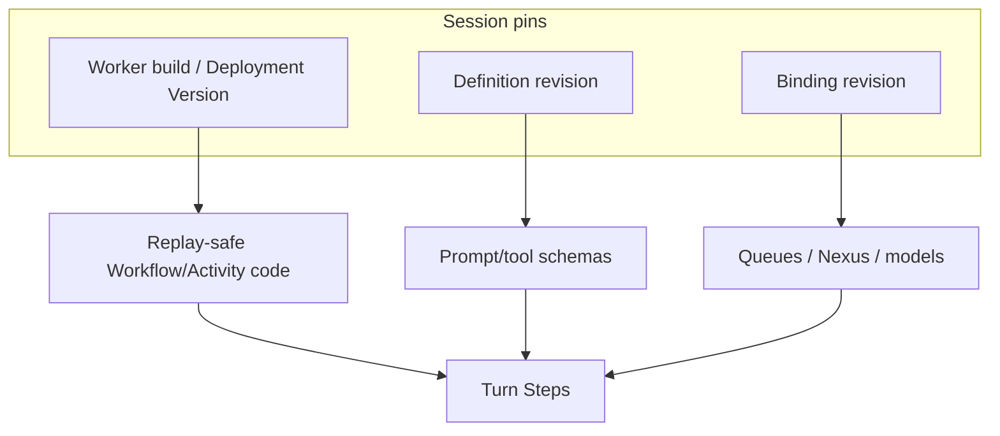

<h1>Agent Worker Versioning </h1>

## Overview

The Agent Worker Versioning pattern pins Temporal Worker Deployment / build identity so open Sessions replay against compatible Workflow and Activity *code*, independently of definition and binding config pins.
Primitives used: Worker Versioning (Worker Deployments / build IDs), Task Queues, [Agent Definition Versioning](/agent-definition-versioning), [Prompt Versioning](/prompt-versioning), optional Continue-As-New migration.

## Problem

Shipping a Worker that changes Workflow branching, Activity names, or sandbox behavior under an open Session breaks replay or silently changes tool semantics mid-Turn.
Pinning prompts alone does not freeze Python/TypeScript Worker code.
Pinning Worker code alone does not freeze prompts loaded from object storage.

## Solution

Treat three pin layers as distinct:

| Layer | What it freezes |
| :--- | :--- |
| **Worker build / Deployment Version** | Workflow + Activity code on the Task Queue |
| **Definition revision** | Instructions, tool schemas, safety, prompt ids |
| **Binding revision** | Logical name → queue, Nexus endpoint, model route |

Enable Worker Versioning on agent Task Queues.
New Sessions (or explicit migrations) target a Deployment Version; open Sessions keep completing on the version their history expects unless you deliberately redirect.



The following describes each step in the diagram:

1. CI publishes a Worker Deployment Version (build ID) with agent Workflow/Activity code.
2. Session start records which Deployment Version (and definition/binding revisions) it uses.
3. Turns execute only on Workers compatible with that versioning ruleset.
4. Config and placement pins stay separate so you can move infrastructure without claiming the agent "changed," and change prompts without redeploying code—each with an explicit migration.

```python
from dataclasses import dataclass

from temporalio import workflow

@dataclass
class SessionPins:
    worker_build_id: str
    definition_revision: str
    binding_revision: str

@workflow.defn
class AgentSessionWorkflow:
    @workflow.query
    def pins(self) -> dict:
        return {
            "worker_build_id": self._pins.worker_build_id,
            "definition_revision": self._pins.definition_revision,
            "binding_revision": self._pins.binding_revision,
        }

    @workflow.run
    async def run(self, session_id: str, pins: SessionPins, user_message: str) -> str:
        self._pins = pins
        # Workflow/Activity code compatibility comes from Worker Versioning on the Task Queue.
        # Definition/binding pins still passed into Activities for config resolution.
        return await workflow.execute_activity(
            call_model,
            args=[pins.definition_revision, pins.binding_revision, user_message],
            start_to_close_timeout=...,
        )
```

## Implementation

<DaytonaRunner pattern="agent-worker-versioning" />

### Enable versioning on agent queues

Use Temporal Worker Deployments / Worker Versioning for the Task Queues that run Session, Turn, model, and tool Workers.
Keep sandbox-sticky queues in the same versioning story or document why sticky Workers pin build IDs separately ([Sticky Sandbox Task Queues](/sticky-sandbox-task-queues)).

### Three-layer pin checklist

1. **Worker build** — code replay (`patched` / Deployment Version).
2. **Definition revision** — agent bundle hash ([Agent Definition Versioning](/agent-definition-versioning)).
3. **Binding revision** — placement map.

Surface all three on Session Queries and traces.

### Rolling out code

- **New Sessions** → new Deployment Version.
- **Open Sessions** → stay on current version until idle, then Continue-As-New onto the new version *with* an explicit event.
- **Incompatible Workflow changes** → use `workflow.patched` / `GetVersion` ([Patched evolution](https://docs.temporal.io/workflow-definition#workflow-versioning)) inside the same build line when you must change branching without a hard cut.

### Activities and sandboxes

Activity implementations change with Worker builds too.
A new build that alters tool side effects under an old definition revision is still a behavior change—gate tool semantics behind definition pins where possible, and version Activity code carefully.

### Evals and incidents

Reproduce a Session with the same three pins.
Incidents: "bad prompt" vs "bad Worker build" vs "wrong queue binding" become separable.

## When to use

Use for production agent Task Queues with long-lived Sessions.
Skip only for throwaway demos where killing open Sessions on deploy is acceptable.

## Benefits and trade-offs

You get replay safety and staged rollouts for agent code, cleanly separated from config pins.
You operate Deployment Versioning plus definition/binding pipelines.

## Comparison with alternatives

| Approach | Code drift | Config drift |
| :--- | :--- | :--- |
| Agent Worker Versioning + definition/binding | Controlled | Controlled |
| Worker Versioning only | Controlled | Uncontrolled if config external |
| Definition pins only | Uncontrolled | Controlled |
| Latest Workers always | Unsafe for open Sessions | Unsafe |

## Best practices

- **Never equate git SHA of prompts with Worker build ID.**
- **Migrate open Sessions deliberately** (idle + Continue-As-New + event).
- **Version sandbox Workers** the same way as model/tool Workers.
- **Record `worker_build_id` on cost and trace records.**

## Common pitfalls

- **Deploying Workflow changes without versioning**—replay breaks on open Sessions.
- **Assuming Prompt Versioning freezes Activity code.**
- **Redirecting all traffic to a new build** while Turns are mid-tool.
- **Different build IDs on Session vs sticky sandbox queues** without a documented pin story.
- **Silent binding changes** under a stable Worker build—still a behavior change; pin bindings too.

## Related patterns

- [Patched Agent Workflow Evolution](/patched-agent-workflow-evolution)
- [Agent Definition Versioning](/agent-definition-versioning)
- [Prompt Versioning](/prompt-versioning)
- [Continue-As-New Session](/continue-as-new-session)
- [Sticky Sandbox Task Queues](/sticky-sandbox-task-queues)
- [Eval-Backed Behavior Checks](/eval-backed-behavior-checks)
- [Session Visibility Attributes](/session-visibility-attributes)

## Sample code

- [`sandbox-runner/patterns/agent-worker-versioning/python/`](https://github.com/temporal-sa/temporal-agentic-patterns/tree/main/sandbox-runner/patterns/agent-worker-versioning/python)

## References

- [Temporal Docs: Worker Versioning](https://docs.temporal.io/production-deployment/worker-deployments/worker-versioning)
- [Temporal Docs: Workflow Versioning (patched)](https://docs.temporal.io/workflow-definition#workflow-versioning)
- [Temporal Docs: Worker Deployments](https://docs.temporal.io/production-deployment/worker-deployments)
