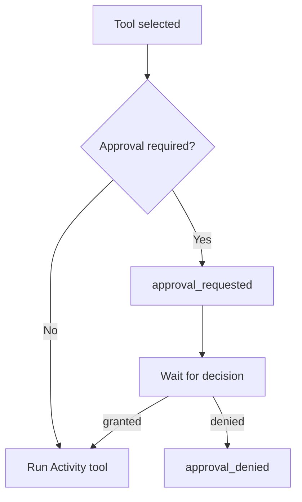

<h1>Approval-Gated Tools </h1>

## Overview

The Approval-Gated Tools pattern requires human approval before invoking specific tools.
The agent pauses when a gated tool is selected, emits an approval event, and proceeds only after grant or denial.
Primitives used: ApprovalPolicy, ApprovalWaitStep, `approval_requested` / `approval_granted` / `approval_denied`.

## Problem

Agents can select destructive or costly tools.
Automatic execution risks payments, deletes, or irreversible changes without an operator in the loop.
You need a durable pause that survives worker restarts for as long as the human takes.

## Solution

When policy requires approval, the Session Workflow parks on a wait condition (Signal, Update, or queryable flag) instead of invoking the tool Activity.
Emit `approval_requested` with tool ID, arguments, and justification; resume on `approval_granted` or fail the step on denial.



The following describes each step in the diagram:

1. The Turn selects a tool and evaluates ApprovalPolicy.
2. If gated, the Workflow emits `approval_requested` and waits without holding a worker thread.
3. An operator decision arrives as a Signal or Update.
4. On grant, the Activity tool runs; on denial, the step fails closed.

## Implementation

<DaytonaRunner pattern="approval-gated-tools" />

The sample signals `approve("granted")` from the starter so the run completes in the live runner.
In production, your UI or channel sends that Signal after a human decides.

### Policy defaults

Safe defaults require approval for non-idempotent tools and allow inherently safe tools.
Per-session overrides belong in Session state (see Session-Scoped Approvals).

### Timeouts and escalation

Parked approvals must not wait forever without a policy.
Start a durable timer when you emit `approval_requested`.
On timeout: fail closed (deny), auto-approve only when product risk allows, or escalate (notify a second reviewer and wait on a longer timer).
Handle duplicate grant/deny Signals idempotently—operators double-click.

```python
# Conceptual: wait for decision or timeout, then escalate once
decision = await workflow.wait_condition(
    lambda: self._decision is not None,
    timeout=timedelta(hours=4),
)
if self._decision is None:
    await workflow.execute_activity(notify_escalation, details, start_to_close_timeout=timedelta(seconds=30))
    await workflow.wait_condition(lambda: self._decision is not None, timeout=timedelta(hours=24))
if self._decision != "granted":
    raise ApplicationError("approval_denied_or_timed_out", non_retryable=True)
```

## When to use

Use this pattern for payments, destructive operations, or risky changes.
Skip it for read-only tools that are inherently safe and high-volume.

## Benefits and trade-offs

You prevent silent side effects and keep the wait durable.
You add latency and operational load for gated tools.

## Comparison with alternatives

| Approach | Safety | Latency |
| :--- | :--- | :--- |
| Approval-gated | High | Human-bound |
| Automatic retries only | Low for non-idempotent | Low |
| External ticket queue | Medium | High, prone to desync |

## Best practices

- **Fail closed.** Denial or timeout should not run the tool.
- **Include arguments in the approval event.** Operators need to see what they approve.
- **Record actor identity** when available on grant/deny events.

## Common pitfalls

- **Approving in an external DB without parking the Workflow.** Restarts lose the correlation.
- **Running the tool before the wait.** The gate must precede the Activity.
- **No timeout or escalation.** Approvals stall silently for days with no path forward.
- **Non-idempotent decision handlers.** Duplicate Signals must not run the tool twice.

## Related patterns

- [Session-Scoped Approvals](/session-scoped-approvals)
- [Operator Slash Commands](/operator-slash-commands)
- [Safety-Profiled Tools](/safety-profiled-tools)

## Sample code

- [`sandbox-runner/patterns/approval-gated-tools/python/`](https://github.com/temporal-sa/temporal-agentic-patterns/tree/main/sandbox-runner/patterns/approval-gated-tools/python)

## References

- [Temporal Docs: Signals](https://docs.temporal.io/encyclopedia/workflow-message-passing#sending-signals)
- [Temporal Docs: Workflow waiting](https://docs.temporal.io/encyclopedia/detecting-workflow-failures)
