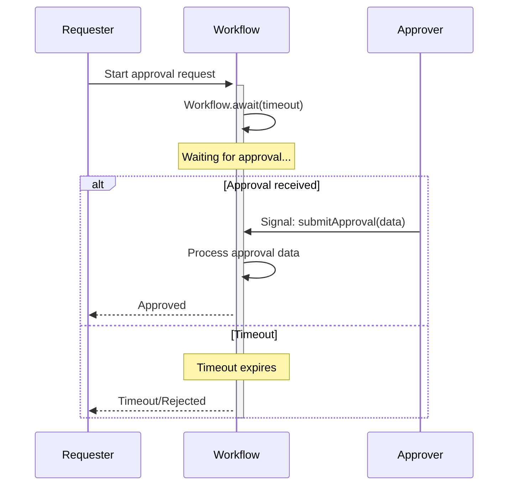

# Approval Pattern

## Overview

The Approval pattern implements human-in-the-loop Workflows where execution blocks until an external decision is made.
It uses Workflow Signals with custom input data to unblock Workflows, enabling approval processes, manual reviews, and decision gates in automated business processes.

<video src="https://github.com/user-attachments/assets/545fae48-939e-4419-90fa-6e1a7f82098e" width="700" controls></video>

## Problem

In many business processes, you need Workflows that wait for human approval before proceeding.
These Workflows must capture approval decisions along with metadata such as the approver's identity, a reason, and a timestamp.
They must also support multiple outcomes — approval, rejection, or escalation — and handle timeout scenarios when no decision arrives.

Without a structured approval pattern, you are forced to poll external systems for approval status, implement complex state machines by hand, and manage race conditions between timeouts and incoming approvals.
You also risk losing approval context and metadata, and you must build custom audit logging to meet compliance requirements.

## Solution

The Approval pattern uses `Workflow.await()` to block execution until a Signal is received.
The Signal carries custom data — the approval decision, approver details, and comments — that the Workflow captures and uses to determine next steps.



The following describes each step in the diagram:

1. The requester starts the Workflow with an approval request.
2. The Workflow calls `Workflow.await()` with a timeout duration and blocks execution.
3. If an approver sends a Signal before the timeout expires, the Workflow receives the approval data, processes the decision, and returns the result to the requester.
4. If the timeout expires before any Signal arrives, the Workflow unblocks and follows the timeout path, which typically results in rejection or escalation.

The approval data object carries the decision context through the Workflow.
Define a class to hold the approver's identity, the decision, any comments, and a timestamp:

```java
// ApprovalData.java
public class ApprovalData {
  private String approver;
  private String decision; // "APPROVED", "REJECTED", "ESCALATED"
  private String comments;
  private long timestamp;
  
  // Constructor, getters, setters
}
```

This class gives you a structured way to pass rich context through the Signal rather than a plain boolean.

Next, define the Workflow interface.
The `@WorkflowMethod` accepts a request ID and a timeout duration.
The `@SignalMethod` receives the approval data from an external system.
The `@QueryMethod` exposes the current status without modifying Workflow state:

```java
// ApprovalWorkflow.java
@WorkflowInterface
public interface ApprovalWorkflow {
  @WorkflowMethod
  String execute(String requestId, Duration timeout);
  
  @SignalMethod
  void submitApproval(ApprovalData approvalData);
  
  @QueryMethod
  String getStatus();
}
```

These three methods form the contract for any approval Workflow implementation.

The implementation ties everything together.
The Workflow blocks on `Workflow.await()` until either the approval data arrives via Signal or the timeout expires:

```java
// ApprovalWorkflowImpl.java
public class ApprovalWorkflowImpl implements ApprovalWorkflow {
  private ApprovalData approvalData;
  private String status = "PENDING";
  
  @Override
  public String execute(String requestId, Duration timeout) {
    boolean approved = Workflow.await(timeout, () -> approvalData != null);
    
    if (approved) {
      status = approvalData.getDecision();
      return "Request " + requestId + " " + status + " by " + approvalData.getApprover();
    } else {
      status = "TIMEOUT";
      return "Request " + requestId + " timed out";
    }
  }
  
  @Override
  public void submitApproval(ApprovalData data) {
    this.approvalData = data;
  }
  
  @Override
  public String getStatus() {
    return status;
  }
}
```

The `Workflow.await()` call takes two arguments: the timeout duration and a condition lambda that checks whether `approvalData` has been set.
The condition is evaluated on every state transition, so it must not call blocking operations, mutate Workflow state, or use time-based checks.
When the Signal handler sets `approvalData`, the condition evaluates to `true` and the Workflow unblocks.
If the timeout expires first, `Workflow.await()` returns `false` and the Workflow follows the timeout path.

## Implementation

### Basic approval with timeout

The following implementation shows the minimal version of the pattern.
The Workflow waits for a boolean approval flag to be set via Signal, and falls back to auto-rejection on timeout:

```java
// SimpleApprovalWorkflowImpl.java
public class SimpleApprovalWorkflowImpl implements ApprovalWorkflow {
  private boolean approved = false;
  private String approver;
  
  @Override
  public String execute(String requestId, Duration timeout) {
    Workflow.await(timeout, () -> approved);
    
    if (approved) {
      return "Approved by " + approver;
    } else {
      return "Approval timeout - auto-rejected";
    }
  }
  
  @Override
  public void submitApproval(String approverName) {
    this.approved = true;
    this.approver = approverName;
  }
}
```

The `submitApproval` Signal handler sets both the `approved` flag and the approver's name.
When `Workflow.await()` unblocks, the Workflow checks the flag and returns the appropriate result.

### Multi-level approval chain

Some business processes require approvals from multiple levels of authority in sequence.
The following implementation iterates through a list of required approval levels, waiting for a Signal at each level before proceeding to the next:

```java
// MultiLevelApprovalData.java
public class MultiLevelApprovalData {
  private String level; // "L1", "L2", "L3"
  private String approver;
  private String decision;
  private String comments;
}
```

This data class extends the basic approval data with a `level` field that identifies which approval tier the decision belongs to.

```java
// MultiLevelApprovalWorkflowImpl.java
public class MultiLevelApprovalWorkflowImpl implements ApprovalWorkflow {
  private List<MultiLevelApprovalData> approvals = new ArrayList<>();
  private String[] requiredLevels = {"L1", "L2", "L3"};
  
  @Override
  public String execute(String requestId, Duration timeoutPerLevel) {
    for (String level : requiredLevels) {
      boolean received = Workflow.await(
          timeoutPerLevel,
          () -> hasApprovalForLevel(level));
      
      if (!received) {
        return "Timeout at " + level;
      }
      
      MultiLevelApprovalData approval = getApprovalForLevel(level);
      if (approval.getDecision().equals("REJECTED")) {
        return "Rejected at " + level + " by " + approval.getApprover();
      }
    }
    
    return "Fully approved through all levels";
  }
  
  @Override
  public void submitApproval(MultiLevelApprovalData data) {
    approvals.add(data);
  }
  
  private boolean hasApprovalForLevel(String level) {
    return approvals.stream().anyMatch(a -> a.getLevel().equals(level));
  }
  
  private MultiLevelApprovalData getApprovalForLevel(String level) {
    return approvals.stream()
        .filter(a -> a.getLevel().equals(level))
        .findFirst()
        .orElse(null);
  }
}
```

The Workflow loops through each required level and calls `Workflow.await()` with a per-level timeout.
The `hasApprovalForLevel` helper checks whether a Signal has arrived for the current level.
If a timeout occurs at any level, the Workflow exits with a timeout result.
If any level returns a rejection, the Workflow exits immediately without proceeding to subsequent levels.

### Approval with escalation

When an initial approval times out, you may want to escalate the request to a manager rather than rejecting it outright.
The following implementation adds an escalation step with an extended timeout:

```java
// EscalatingApprovalWorkflowImpl.java
public class EscalatingApprovalWorkflowImpl implements ApprovalWorkflow {
  private ApprovalData approvalData;
  private boolean escalated = false;
  
  @Override
  public String execute(String requestId, Duration initialTimeout) {
    boolean received = Workflow.await(initialTimeout, () -> approvalData != null);
    
    if (!received) {
      escalated = true;
      sendEscalationNotification();
      
      received = Workflow.await(
          Duration.ofHours(24),
          () -> approvalData != null);
      
      if (!received) {
        return "Escalation timeout - auto-rejected";
      }
    }
    
    String decision = approvalData.getDecision();
    String approver = approvalData.getApprover();
    String escalationNote = escalated ? " (escalated)" : "";
    
    return decision + " by " + approver + escalationNote;
  }
  
  @Override
  public void submitApproval(ApprovalData data) {
    this.approvalData = data;
  }
  
  private void sendEscalationNotification() {
    ActivityOptions options = ActivityOptions.newBuilder()
        .setStartToCloseTimeout(Duration.ofSeconds(10))
        .build();
    NotificationActivities activities = 
        Workflow.newActivityStub(NotificationActivities.class, options);
    activities.sendEscalationEmail();
  }
}
```

The Workflow first waits for the initial timeout.
If no Signal arrives, it sets the `escalated` flag, executes a notification Activity to alert the manager, and then waits again with a 24-hour extended timeout.
The `sendEscalationNotification` method creates an Activity stub with a short start-to-close timeout, since sending an email should complete quickly.
The final result includes an escalation note so the caller knows the request was escalated before approval.

## When to use

The Approval pattern is a good fit for purchase order approvals, expense report reviews, code deployment gates, contract signing Workflows, manual quality checks, compliance reviews, budget authorization, and access request approvals.

It is not a good fit for fully automated processes that require no human input, real-time decisions that need synchronous API responses, or processes that require sub-second response times.
If you only need a boolean yes/no without any context, a plain boolean Signal may be sufficient.

## Benefits and trade-offs

The Approval pattern captures rich context — approver identity, reasons, and timestamps — alongside each decision.
All approval data is recorded in the Workflow history as Signal events, giving you a built-in audit trail.
Timeout handling is automatic: you define the maximum wait time and the Workflow handles the fallback.
The pattern supports multi-level, conditional, and escalating approval chains, and you can check approval status at any time through Query methods without modifying Workflow state.
Because all decisions are recorded in the event history, the Workflow is deterministic and replay-safe.

The trade-offs to consider are that the pattern requires an external system to send approval Signals, which means you need a separate approval interface.
The Workflow blocks until the approval arrives or the timeout expires, so you must define a maximum wait time.
Large approval data objects increase the size of the Workflow history.

## Comparison with alternatives

| Approach | Rich data | Built-in wait | Caller gets result | Complexity | Use case |
| :--- | :--- | :--- | :--- | :--- | :--- |
| Signal with data | Yes | Yes | No | Low | Approval Workflows |
| Update | Yes | No | Yes | Low | Synchronous validation with immediate confirmation |
| Boolean Signal | No | Yes | No | Low | Yes/no decisions |
| Polling Activity | Yes | Yes | Yes | High | External approval systems |

Signals are fire-and-forget: the caller receives an acknowledgement from the server but cannot wait for the Workflow to process the Signal or receive a result.
Updates are synchronous: the caller blocks until the handler completes and can receive a return value or error.
If the approver's interface needs immediate confirmation that the approval was accepted and valid, consider using an Update with a validator instead of a Signal.

## Best practices

- **Use custom data objects.** Capture rich approval context — approver identity, comments, timestamps — rather than a plain boolean.
- **Set reasonable timeouts.** Balance responsiveness with the time approvers realistically need to respond.
- **Add Query methods.** Expose the current approval status so external systems can check progress without sending a Signal.
- **Validate Signal data.** Verify approver permissions and data completeness before accepting an approval.
- **Log approval events.** Record each decision for audit trails and compliance.
- **Handle timeouts gracefully.** Define clear timeout behavior such as rejection, escalation, or notification.
- **Support cancellation.** Allow Workflows to be cancelled if the request is withdrawn.
- **Ensure idempotency.** Handle duplicate approval Signals safely so that re-delivery does not corrupt state. Signals [may be duplicated in rare cases](https://docs.temporal.io/workflows#signal), so use idempotency keys when necessary.
- **Include timestamps.** Record when each approval was submitted to support time-based auditing.
- **Expose approval history.** Provide a Query method that returns all approval attempts, not only the final decision.

## Common pitfalls

- **No timeout.** Without a timeout, the Workflow waits indefinitely for an approval that may never arrive.
- **Missing validation.** Accepting approvals from unauthorized users compromises the integrity of the process.
- **Lost context.** Failing to capture the approver's identity or reason makes audit trails incomplete.
- **Assuming non-deterministic races.** Temporal processes events in a deterministic, single-threaded order, so a Signal and a timer cannot truly "race." However, if the Signal arrives after the timer fires in the event history, `Workflow.await()` will have already returned `false`. Design your timeout path to account for late-arriving Signals.
- **No audit trail.** Skipping approval logging makes it difficult to meet compliance requirements.
- **Tight timeouts.** Setting the timeout too short causes legitimate approvals to be rejected.
- **Boolean-only Signals.** Using a plain boolean instead of a rich data object limits your ability to capture decision context.
- **No status Query.** Without a Query method, external systems have no way to check approval progress.
- **No duplicate handling.** Receiving multiple approval Signals without deduplication can overwrite earlier decisions.
- **No escalation path.** Without a fallback when the initial approval times out, requests stall or are silently rejected.

## Related patterns

- [Signal-Based Event Handling](signal-with-start.md): Receiving external events through Signals.
- [Updatable Timer](updatable-timer.md): Extending approval deadlines dynamically.
- [Saga Pattern](saga-pattern.md): Executing compensating actions on rejection.

## Sample code

- [Hello Signal](https://github.com/temporalio/samples-java/tree/main/core/src/main/java/io/temporal/samples/hello/HelloSignal.java) — Basic Signal handling in a Workflow.
- [Safe Message Passing](https://github.com/temporalio/samples-java/tree/main/core/src/main/java/io/temporal/samples/safemessagepassing) — Concurrent Signal handling with validation.
