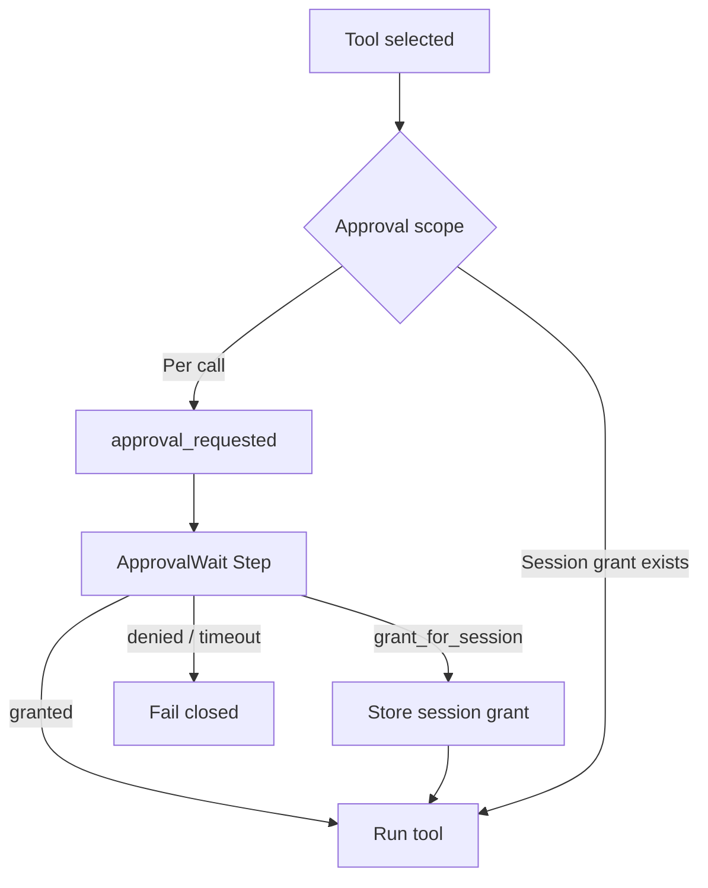

# Approvals

## Overview

An Approval is a durable pause before a side effect runs: the Session emits an approval request, waits for a human decision, then grants or denies the tool call.
Approvals may apply per tool invocation or for the remainder of a Session.

## Problem

Agents select destructive or costly tools without a human in the loop.
If you gate in an external ticket system without parking the Workflow, restarts lose correlation and the tool may run twice—or never.
You need catalog terms for the request, the wait, and the scope of a grant.

## Solution

Model approvals as first-class Steps inside the Turn:

The following describes each step in the diagram:

1. Policy evaluates the selected Tool (and arguments) against defaults and any Session-scoped grants.
2. If approval is required, the Session emits `approval_requested` and enters an ApprovalWait Step (Signal, Update, or queryable flag)—without holding a worker thread.
3. An Actor decides: grant once, deny, or grant for the rest of the Session.
4. On grant, the tool Step runs; on denial or timeout, the Step fails closed and the Turn records the outcome.

Per-tool approvals re-ask on every gated call. Session-scoped approvals store a grant in Session state so later Turns skip the wait for that tool (until revoked or the Session ends).

## When to use

Use Approvals for payments, deletes, irreversible writes, or costly actions.
Skip them for inherently safe, high-volume read tools—or rely on safety profiles that mark those tools auto-allowed.

## Benefits and trade-offs

Durable waits keep human latency off the critical worker path and survive restarts.
The trade-off is operational load and turn latency for gated tools.

## Comparison with alternatives

| Approach | Survives restart | Scope control |
| :--- | :--- | :--- |
| Workflow ApprovalWait | Yes | Per-call or session grant |
| External ticket only | Often no | Easy to desync |
| Always auto-run | N/A | None |

## Best practices

- **Fail closed.** Denial and timeout must not run the tool.
- **Include tool ID and arguments** in `approval_requested` so operators see what they approve.
- **Record actor_id** on grant and deny events.
- **Separate policy from UI.** Slash commands and channel UIs should Signal the same wait.

## Common pitfalls

- **Approving in a database without parking the Workflow.** Correlation breaks on failover.
- **Running the Activity before the wait.** The gate must precede the side effect.
- **Confusing this page with the pattern implementations.** See Approval-Gated Tools and Session-Scoped Approvals for how to build the waits.

## Related patterns

- [Approval-Gated Tools](/approval-gated-tools)
- [Session-Scoped Approvals](/session-scoped-approvals)
- [Operator Slash Commands](/operator-slash-commands)
- [Safety-Profiled Tools](/safety-profiled-tools)
- [Resumable Correction](/resumable-correction)

## Sample code

See [Approval-Gated Tools](/approval-gated-tools) and [Session-Scoped Approvals](/session-scoped-approvals).

## References

- [Temporal Docs: Signals](https://docs.temporal.io/encyclopedia/workflow-message-passing#sending-signals)
- [Temporal Docs: Updates](https://docs.temporal.io/encyclopedia/workflow-message-passing#sending-updates)
