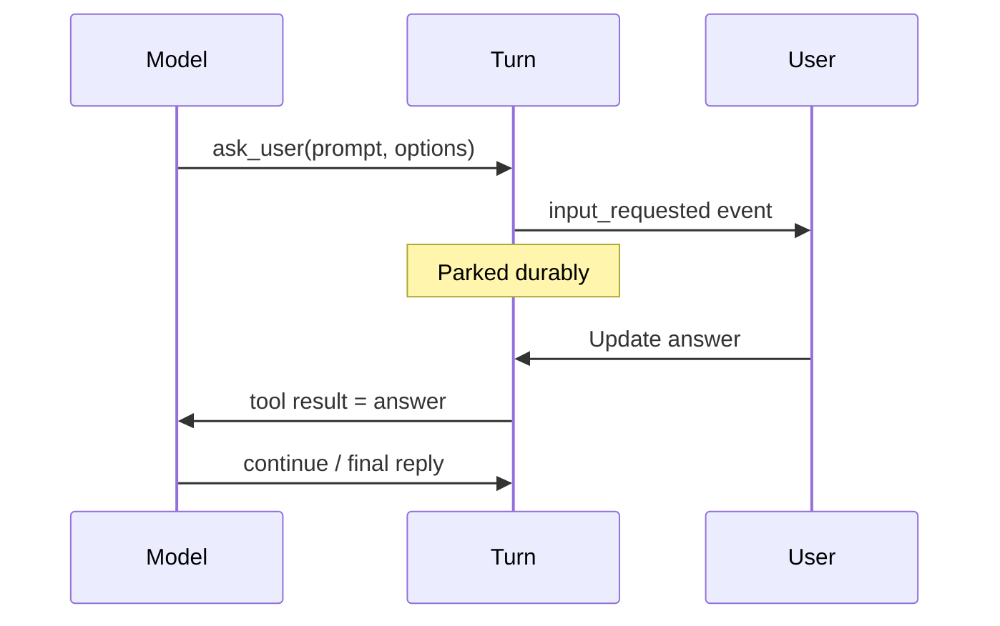

<h1>Ask-User Wait </h1>

## Overview

The Ask-User Wait pattern parks a Turn mid-loop when the model needs a clarifying answer (question, choice, or freeform), then resumes with the user's reply as a durable Signal or Update—distinct from approving a tool call.
Primitives used: Agent Tool Loop wait, Update/Signal resume, Updatable Approval Timer (optional SLA), Progress Streaming / channel UI.

## Problem

Approvals gate *side effects* the model already chose.
Often the model should ask the human *what* to do before selecting tools—refund amount, which account, confirm identity.
If you fake that as an approval, UX and audit trails blur "authorized tool" with "answered question."
If you ask only in the final chat reply, the Turn ends and you lose the in-flight tool loop context.

## Solution

Expose an `ask_user` (or equivalent) tool that does not execute IO.
When the model calls it, the Turn records `input_requested` with prompt/options, parks on `wait_condition`, and emits a channel event.
When the user answers, an Update/Signal supplies the response; the Turn continues the Agent Tool Loop with that content as a tool result.



The following describes each step in the diagram:

1. During the tool loop, the model selects `ask_user`.
2. The Turn emits a waiting event and parks without completing.
3. The user answers through the channel (Update preferred for typed ack).
4. The answer becomes the tool result; the model continues in the same Turn.

```python
from temporalio import workflow

@workflow.defn
class AgentTurnWorkflow:
    def __init__(self) -> None:
        self._answer: str | None = None
        self._waiting: dict | None = None

    @workflow.update
    async def answer_user(self, text: str) -> str:
        if not self._waiting:
            raise ValueError("not waiting")
        self._answer = text
        return "accepted"

    @workflow.run
    async def run(self, session_id: str, user_message: str) -> str:
        # ... model returns tool_call ask_user ...
        self._waiting = {"prompt": "Which account?", "options": ["a", "b"]}
        await workflow.wait_condition(lambda: self._answer is not None)
        answer = self._answer
        self._waiting = None
        # feed answer back into the next Durable Model Call as tool result
        return f"answered:{answer}"
```

## Implementation

<DaytonaRunner pattern="ask-user-wait" />

### vs Approval-Gated Tools

| | Ask-User Wait | Approval-Gated Tools |
| :--- | :--- | :--- |
| Who initiates | Model needs information | Policy gates a tool |
| Payload | Question / options | Tool name + args |
| Resume | Answer text / choice | grant / deny |
| After resume | Continue loop with info | Run or skip tool |

### Channel rendering

Messaging and HTTP channels render `input_requested` as buttons or a form.
Include `turn_id` and a continuation token so replies route to the parked Turn ([HTTP Channel Agent](/http-channel-agent)).

### Timeouts

Pair with [Updatable Approval Timer](/updatable-approval-timer) if unanswered questions should escalate or cancel the Turn.

### Idempotent answers

Apply [Idempotent Delivery](/idempotent-delivery) on the answer Update so double-clicks do not confuse the wait.

## When to use

Use when the model must clarify before acting.
Use approvals when the model already chose a risky tool and a human must authorize it.
Use both in one Turn when needed—they are separate wait kinds.

## Benefits and trade-offs

You keep multi-step reasoning in one durable Turn across human latency.
You must design channel UX for mid-turn questions and timeout policy.

## Comparison with alternatives

| Approach | Keeps Turn open | Clear audit |
| :--- | :--- | :--- |
| Ask-User Wait | Yes | `input_requested` / answer |
| Final reply only | No | User starts new Turn |
| Fake as approval | Yes | Confusing semantics |

## Best practices

- **Separate event types** for questions vs approvals.
- **Bound how many asks per Turn** to avoid interrogation loops.
- **Prefer structured options** when channels can render buttons.
- **Authorize who can answer** the parked Turn.

## Common pitfalls

- **Completing the Turn** before the answer arrives.
- **Treating deny-approval as an ask answer.**
- **No timeout** on questions that block Entity Agents forever.
- **Losing wait state across Continue-As-New**—carry open asks in the snapshot.

## Related patterns

- [Approval-Gated Tools](/approval-gated-tools)
- [Agent Tool Loop](/agent-tool-loop)
- [Updatable Approval Timer](/updatable-approval-timer)
- [Idempotent Delivery](/idempotent-delivery)
- [HTTP Channel Agent](/http-channel-agent)
- [Progress Streaming](/progress-streaming)

## Sample code

- [`sandbox-runner/patterns/ask-user-wait/python/`](https://github.com/temporal-sa/temporal-agentic-patterns/tree/main/sandbox-runner/patterns/ask-user-wait/python)

## References

- [Temporal Docs: Updates](https://docs.temporal.io/encyclopedia/workflow-message-passing#sending-updates)
- [Temporal Docs: Signals](https://docs.temporal.io/encyclopedia/workflow-message-passing#sending-signals)
