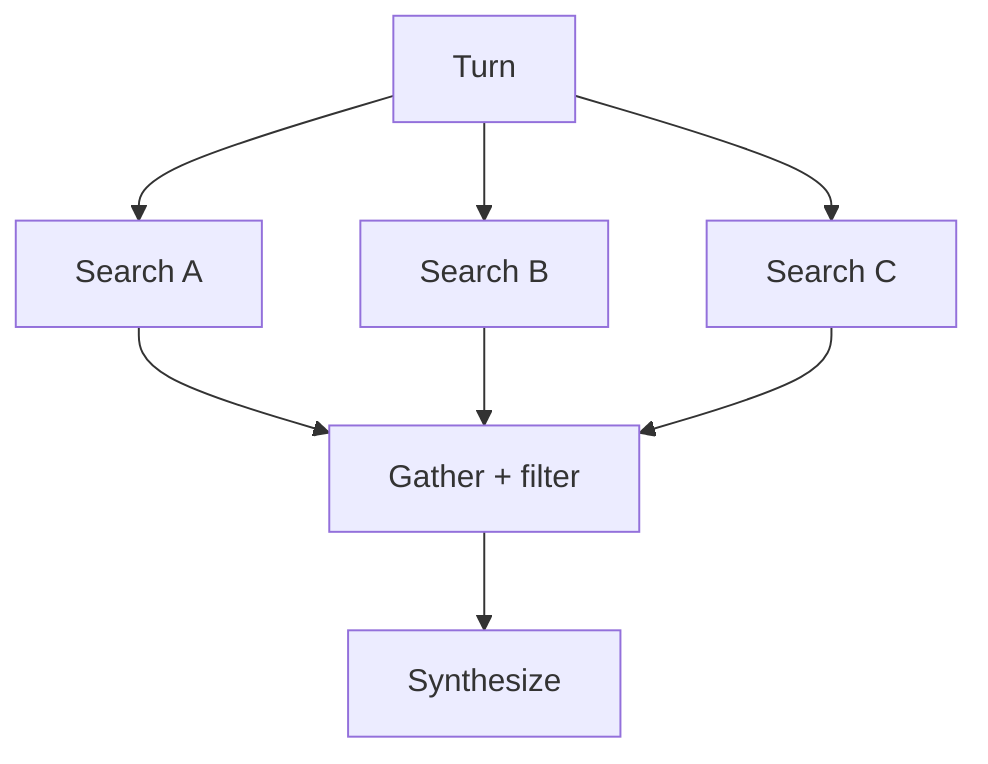

<h1>Best-Effort Parallel Tools </h1>

## Overview

The Best-Effort Parallel Tools pattern runs many independent tool or search Activities concurrently and continues with successful results when some fail (`asyncio.gather(..., return_exceptions=True)`).
Primitives used: parallel Activity Tools, partial failure handling, optional subagent fan-out.

## Problem

Fail-fast parallel joins drop an entire research Turn when one search times out.
Sequential searches are correct but slow.

## Solution

Schedule independent Activities in parallel.
Await with return_exceptions, filter successes, and pass partial results to the next model or synthesis Step.
Set schedule_to_close_timeout so one poisoned retry loop cannot block the gather forever.



The following describes each step in the diagram:

1. The Turn builds a list of independent tool Activities.
2. It awaits them concurrently.
3. Failures become exception values; successes remain payloads.
4. Downstream synthesis uses whatever succeeded and records gaps in events.

```python
tasks = [
    workflow.execute_activity(
        search_web,
        q,
        start_to_close_timeout=timedelta(seconds=300),
        schedule_to_close_timeout=timedelta(seconds=900),
    )
    for q in queries
]
results = await asyncio.gather(*tasks, return_exceptions=True)
ok = [r for r in results if not isinstance(r, Exception)]
```

## Implementation

<DaytonaRunner pattern="best-effort-parallel-tools" />

### When to fail the Turn anyway

If zero successes return, fail the Turn.
If a minimum threshold is required, enforce it explicitly.

### Versus subagent fan-out

Use this pattern for parallel tools; use Fan-Out Subagents when each branch needs its own agent session.

## When to use

Use for research, enrichment, and other independent IO.
Avoid when all results are required for correctness (payments, ledger writes).

## Benefits and trade-offs

You finish useful work despite partial outages.
Callers must understand incomplete result sets.

## Comparison with alternatives

| Join mode | Behavior |
| :--- | :--- |
| Best-effort | Continue with successes |
| Fail-fast | Abort on first error |
| All-required | Fail if any missing |

## Best practices

- **Always set schedule_to_close_timeout on long parallel searches.**
- **Record per-branch failures as events.**
- **Cap concurrency** to protect downstream APIs.

## Common pitfalls

- **Failing the whole Workflow instead of capturing per-branch errors.** One failed tool aborts siblings you meant to keep.
- **Missing `schedule_to_close` or cancel that leaves siblings running.** Stragglers keep consuming slots after the wait group returns.
- **Using best-effort for non-idempotent writes.**

## Related patterns

- [Fan-Out Subagents](/fanout-subagents)
- [Script Fan-Out](/script-fan-out)
- [Tool Compensation](/tool-compensation)
- [Model Timeout Profiles](/model-timeout-profiles)

## Sample code

- [`sandbox-runner/patterns/best-effort-parallel-tools/python/`](https://github.com/temporal-sa/temporal-agentic-patterns/tree/main/sandbox-runner/patterns/best-effort-parallel-tools/python)

## References

- [Temporal Docs: Activities](https://docs.temporal.io/activities)
