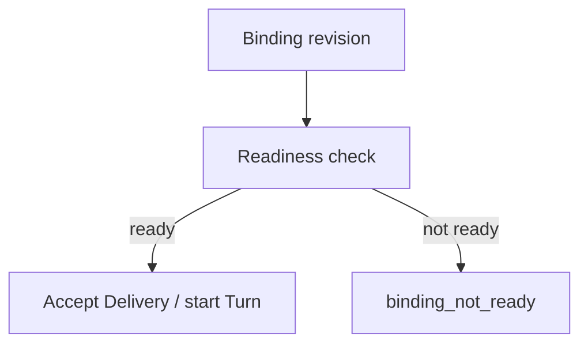

<h1>Binding Readiness Gate </h1>

## Overview

The Binding Readiness Gate pattern validates that Task Queues, Worker Deployments, and Nexus endpoints referenced by a Session’s binding revision have compatible pollers *before* accepting Deliveries or starting Turns—failing closed with a typed readiness error instead of parking work in an empty queue.
Primitives used: Binding revision, Worker Versioning / describe APIs, Nexus endpoint checks, Session start / Update validators, Session Visibility Attributes.

## Problem

A binding can point at `tq-tools-prod` or a Nexus Operation that nothing polls.
Sessions accept Deliveries, then Turns hang until timeouts—users see “stuck,” not “misconfigured.”
Silent queue emptiness is especially painful after canary bindings or region failovers.

## Solution

Before create or before first Turn:

1. Resolve the binding revision → queues / Nexus targets.
2. Run a readiness Activity (or channel-tier check) that confirms poller presence / endpoint active.
3. If not ready, reject Session start or Delivery with `binding_not_ready` (non-retryable for that revision).
4. Optionally upsert Visibility `AgentTurnStatus=binding_not_ready` for ops.



The following describes each step in the diagram:

1. Session pins a binding revision.
2. A readiness check probes the resolved infrastructure.
3. Ready paths proceed; not-ready paths fail closed with a typed error.
4. Ops uses Visibility / events to see mis-bound Sessions.

```python
from datetime import timedelta

from temporalio import activity, workflow
from temporalio.exceptions import ApplicationError

@activity.defn
async def check_binding_ready(binding_revision: str) -> dict:
    # Probe Worker Deployment / queue depth / Nexus in production
    if binding_revision.endswith(":down"):
        raise ApplicationError("binding_not_ready", type="BindingNotReady", non_retryable=True)
    return {"ready": True, "binding_revision": binding_revision}

@workflow.defn
class AgentSessionWorkflow:
    @workflow.run
    async def run(self, session_id: str, binding_revision: str, user_message: str) -> str:
        await workflow.execute_activity(
            check_binding_ready,
            binding_revision,
            start_to_close_timeout=timedelta(seconds=15),
        )
        return "ready"
```

## Implementation

<DaytonaRunner pattern="binding-readiness-gate" />

### What to probe

- Task Queue has pollers for the expected Deployment Version
- Sticky sandbox queues you are about to pin
- Nexus endpoints / Operations reachable
- Optional: model provider circuit-breaker not open (product policy)

### When to run

- Session create (always)
- Binding migration Continues-As-New
- Optional: periodic check for Entity Agents before scheduled Turns

### vs Worker Versioning

Versioning selects *which* build; readiness asks whether *any* compatible poller exists now.

## When to use

Use for multi-queue / multi-region / Nexus-backed tools.
Skip for single local Task Queue demos.

## Benefits and trade-offs

You convert hangs into actionable errors.
You depend on describe/list APIs and must avoid chatty probes on every message (cache per binding revision with TTL).

## Comparison with alternatives

| Approach | User-visible failure | Hang risk |
| :--- | :--- | :--- |
| Binding Readiness Gate | Typed early error | Low |
| Start and wait for timeout | Late timeout | High |
| Manual ops only | Unclear | High |

## Best practices

- **Cache readiness** per binding revision for a short TTL.
- **Non-retryable** when the revision is known bad; retryable when the check itself is unavailable (policy choice).
- **Emit events** for dashboards.
- **Block Deliveries** while not ready if Entity Agents lose all pollers.

## Common pitfalls

- **Checking only Workflow Task Queue**, not tool/sandbox queues.
- **Probing on every token** of a stream.
- **Treating zero backlog as not ready** (idle queues can be healthy).
- **Failing open** on check errors in production multi-tenant.

## Related patterns

- [Agent Definition Versioning](/agent-definition-versioning)
- [Agent Worker Versioning](/agent-worker-versioning)
- [Catalog Snapshot Pinning](/catalog-snapshot-pinning)
- [Nexus Tool](/nexus-tool)
- [Sticky Sandbox Task Queues](/sticky-sandbox-task-queues)
- [Session Visibility Attributes](/session-visibility-attributes)
- [Scheduled Agent Turns](/scheduled-agent-turns)

## Sample code

- [`sandbox-runner/patterns/binding-readiness-gate/python/`](https://github.com/temporal-sa/temporal-agentic-patterns/tree/main/sandbox-runner/patterns/binding-readiness-gate/python)

## References

- [Temporal Docs: Task Queues](https://docs.temporal.io/task-queue)
- [Temporal Docs: Worker Deployments](https://docs.temporal.io/production-deployment/worker-deployments)
- [Temporal Docs: Nexus](https://docs.temporal.io/nexus)
