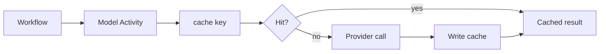

<h1>Cached Model Call </h1>

## Overview

The Cached Model Call pattern serves identical Durable Model Call inputs from an external cache keyed by prompt pin and input hash so Sessions avoid rebilling and re-latency for repeated Steps—while Workflow code stays deterministic by treating the Activity result as truth.
Primitives used: Durable Model Call Activity boundary, external cache (KV), Prompt Versioning / definition pins, Claim-Check Payloads for large bodies, Cost & Token Accounting.

## Problem

Agents often re-ask the same summarization or classification within or across Turns.
Calling the provider every time burns tokens and latency.
Caching inside Workflow memory is not shared and does not survive Continue-As-New or other Sessions.

## Solution

Inside the model Activity (never in Workflow code):

1. Build a cache key from `(prompt_id, prompt_version, model, input_hash)` (and definition revision when relevant).
2. On hit, return the cached completion (and mark usage as cached / zero billed if your meter requires it).
3. On miss, call the provider, store the result (or a claim-check ref), return it.

The Workflow still `execute_activity` once per Step; determinism is preserved because the Activity is the side-effect boundary.



The following describes each step in the diagram:

1. The Turn schedules a Durable Model Call Activity with pinned prompt identifiers and inputs.
2. The Activity looks up an external cache by content-addressed key.
3. Hits skip the provider; misses call, store, and return.
4. Usage events distinguish cached vs fresh calls for Cost & Token Accounting.

```python
import hashlib
from temporalio import activity

@activity.defn
async def call_model(prompt_id: str, prompt_version: str, user: str) -> dict:
    digest = hashlib.sha256(user.encode()).hexdigest()[:16]
    key = f"{prompt_id}:{prompt_version}:{digest}"
    cached = CACHE.get(key)
    if cached is not None:
        return {"text": cached, "cached": True, "total_tokens": 0}
    text = f"fresh:{user}"  # provider call in production
    CACHE[key] = text
    return {"text": text, "cached": False, "total_tokens": 10}
```

## Implementation

<DaytonaRunner pattern="cached-model-call" />

### What is safe to cache

Cache deterministic, side-effect-free completions (summaries, classifications, embeddings).
Do not cache tool-planning turns that must see live Session state, or personalized answers that must not leak across tenants—include `tenant_id` in the key when needed.

### TTL and invalidation

Invalidate when prompt/definition pins change (new key) or on explicit flush.
Bound TTL so stale policy text does not linger after a definition migration.

### Claim-check

Store large completions by reference ([Claim-Check Payloads](/claim-check-payloads)); keep short text or refs in the Activity result.

## When to use

Use for repeated read-mostly model Steps (rag summarize, classify, embed).
Skip for one-shot chat replies where uniqueness is the point.

## Benefits and trade-offs

You cut duplicate spend and latency across Turns/Sessions.
You operate a cache and must design tenant-safe keys.

## Comparison with alternatives

| Approach | Cross-Session | Deterministic WF |
| :--- | :--- | :--- |
| Cached Model Call (Activity) | Yes | Yes |
| Memoize in Workflow state | No | Yes |
| Provider prompt cache only | Opaque | Yes if Activity still called |
| Skip Activity on hit in WF | — | Breaks if you branch on external I/O in WF |

## Best practices

- **Key on pins + input hash**, not raw prompts alone.
- **Emit `cached=true` on usage events.**
- **Fail open or closed** deliberately when the cache is down.
- **Never put cache I/O in Workflow code.**

## Common pitfalls

- **Caching across tenants** without tenant in the key.
- **Caching non-idempotent "actions" phrased as model calls.**
- **Forgetting pin versions**—old prompt text served under new ids.
- **Counting cached hits as full token spend** in budgets.

## Related patterns

- [Durable Model Call](/durable-model-call)
- [Prompt Versioning](/prompt-versioning)
- [Agent Definition Versioning](/agent-definition-versioning)
- [Claim-Check Payloads](/claim-check-payloads)
- [Cost & Token Accounting](/cost-token-accounting)
- [Session Spend Caps](/session-spend-caps)

## Sample code

- [`sandbox-runner/patterns/cached-model-call/python/`](https://github.com/temporal-sa/temporal-agentic-patterns/tree/main/sandbox-runner/patterns/cached-model-call/python)

## References

- [Temporal Docs: Activities](https://docs.temporal.io/activities)
