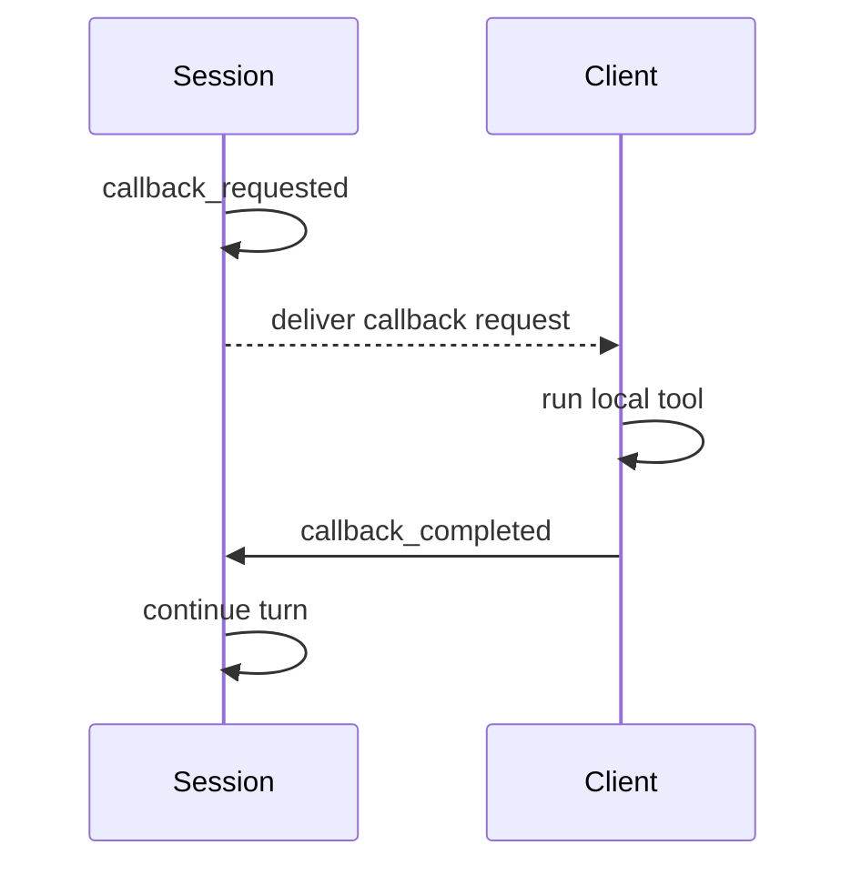

<h1>Callback Tool </h1>

## Overview

The Callback Tool pattern lets an agent call tools that must run on a client (laptop, mobile, private network).
The Workflow pauses, emits a `callback_requested` event, and resumes when a client responds with the result.
Primitives used: ToolDefinition (`kind=callback`), CallbackWaitStep, `callback_requested` / `callback_completed`.

## Problem

Workers cannot reach local files, device sensors, or air-gapped systems.
If you push credentials for those environments into the worker, you expand the blast radius.
You need the client to execute the tool while the Session waits durably.

## Solution

Declare a callback tool with a typed input/output contract and no worker-side body.
When selected, the Session emits `callback_requested` and waits for a Signal or Update carrying `callback_completed` with a schema-validated payload.

The following describes each step in the diagram:

1. The Turn selects a callback tool and parks the Session.
2. The attached client receives the request and runs the local implementation.
3. The client posts the result; the Session validates it and continues the Turn.

## Implementation

<DaytonaRunner pattern="callback-tool" />

The live sample simulates the client by signaling `callback_completed` from the starter.
A real deployment uses a thin client process or UI that listens for callback requests.

### Approvals and events

Callback tools inherit the same approval policy and tool events as Activity tools.
The wait can last seconds or days without holding a worker thread.

## When to use

Use Callback Tools for local files, device capture, or private-network actions.
Do not use them for ordinary backend HTTP the worker can call as an Activity Tool.

## Benefits and trade-offs

You keep sensitive environments on the client and retain durable pause/resume.
You depend on a connected client; without one, the Turn stays parked.

## Comparison with alternatives

| Approach | Where code runs | Durable wait |
| :--- | :--- | :--- |
| Callback Tool | Client | Yes |
| Activity Tool | Worker | Yes |
| Sync RPC to laptop | Client | No |

## Best practices

- **Validate outputs.** Reject payloads that do not match the tool schema.
- **Timeout consciously.** Decide when a missing client fails the Turn.
- **Keep contracts thin.** Prefer small results over shipping entire disks through Signals.

## Common pitfalls

- **Implementing the tool body on the worker anyway.** That defeats the pattern.
- **Forgetting reconnect.** Clients must resume outstanding callbacks after disconnect.
- **Unbounded callback wait.** Set a timeout so a missing client fails or escalates the Turn.
- **Non-idempotent callback completion handling.** Duplicate `callback_completed` deliveries must not apply side effects twice.

## Related patterns

- [Activity Tool](/activity-tool)
- [External Tool Polling](/external-tool-polling)
- [HTTP Channel Agent](/http-channel-agent)
- [Approval-Gated Tools](/approval-gated-tools)

## Sample code

- [`sandbox-runner/patterns/callback-tool/python/`](https://github.com/temporal-sa/temporal-agentic-patterns/tree/main/sandbox-runner/patterns/callback-tool/python)

## References

- [Temporal Docs: Signals](https://docs.temporal.io/encyclopedia/workflow-message-passing#sending-signals)
