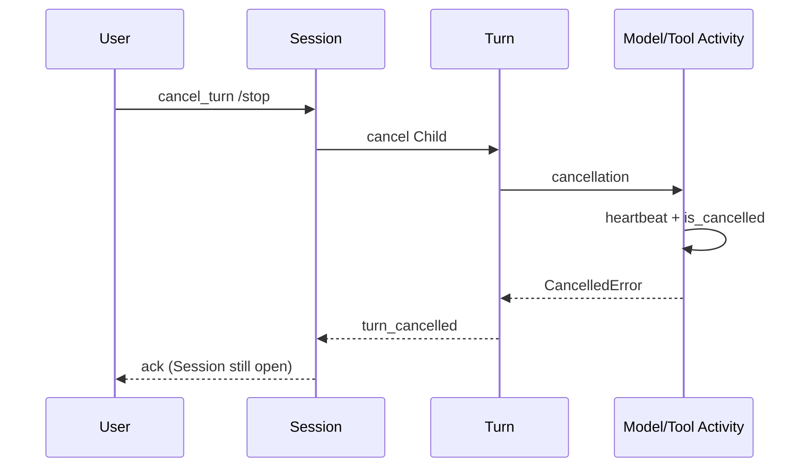

<h1>Cancel In-Flight Turn </h1>

## Overview

The Cancel In-Flight Turn pattern stops an open Turn—and its model/tool Steps—when the user or operator aborts, so spend and side effects do not continue after the UI has moved on.
Primitives used: Turn as Child Workflow (preferred), Workflow cancel, Activity cancellation + heartbeats, Parent Close Policy, Signals/Updates / slash commands, Progress Streaming events.

## Problem

Chat clients send `/stop` or navigate away while a Durable Model Call or tool Activity is still running.
If you only stop streaming to the UI, Activities finish, tokens bill, and tools may write.
If you cancel the Session Workflow entirely, you lose the stable Session address channels rely on.

## Solution

Keep the Session alive; cancel the current Turn unit:

1. Accept cancel via Update/Signal or [Operator Slash Commands](/operator-slash-commands) (`/stop`).
2. Cancel the Turn Child Workflow (or mark embedded turn cancelled).
3. Activities heartbeat and honor `activity.is_cancelled()` so Workers abort promptly.
4. Cascade to Fan-Out / subagent children with an intentional `ParentClosePolicy` (usually cancel).
5. Emit `turn_cancelled` and close cost brackets; do not treat cancel as undo.



The following describes each step in the diagram:

1. The user or operator requests abort while a Turn is open.
2. The Session cancels the Turn Child (or embedded turn flag).
3. In-flight Activities see cancellation at the next heartbeat check and stop provider/tool work.
4. The Session records `turn_cancelled` and waits for the next delivery; `session_id` is unchanged.

```python
import asyncio
from datetime import timedelta

from temporalio import activity, workflow
from temporalio.exceptions import CancelledError, ChildWorkflowError

@workflow.defn
class AgentSessionWorkflow:
    def __init__(self) -> None:
        self._turn_handle = None

    @workflow.signal
    def cancel_turn(self, reason: str) -> None:
        if self._turn_handle:
            self._turn_handle.cancel()

    @workflow.run
    async def run(self, session_id: str, user_message: str) -> str:
        self._turn_handle = await workflow.start_child_workflow(
            AgentTurnWorkflow.run,
            args=[session_id, "turn-1", user_message],
            id=f"{session_id}-turn-1",
        )
        try:
            return await self._turn_handle
        except ChildWorkflowError as err:
            if isinstance(err.cause, CancelledError):
                return "turn_cancelled"
            raise

@activity.defn
async def call_model(prompt: str) -> str:
    while True:
        if activity.is_cancelled():
            raise asyncio.CancelledError()
        activity.heartbeat("streaming")
        await asyncio.sleep(0.2)
```

## Implementation

<DaytonaRunner pattern="cancel-in-flight-turn" />

### Prefer Child Turn cancel

Cancelling a Child Turn isolates abort from Session lifetime.
Embedded turns need an explicit cancelled flag plus Activity cancel requests (harder to get right under Continue-As-New).

### Heartbeats required

Without [Heartbeat Long Steps](/heartbeat-long-steps), Workers may not learn about cancel until `start_to_close_timeout`.
Set `heartbeat_timeout` on long model/tool Activities and check `is_cancelled()` on each heartbeat.

### Cancel is not compensation

Cancel stops *future* work; it does not roll back completed tool writes.
Pair with [Tool Compensation](/tool-compensation) and idempotent tools when partial writes are possible.
Idempotent Activity retries after cancel must not double-apply.

### Cascading children

Set `ParentClosePolicy` on Fan-Out and subagent children so Session/Turn cancel does not abandon spenders.
Document when a Persistent Subagent Thread should survive parent cancel.

### Channel ack

Return a typed cancel ack (Update) so HTTP/messaging clients know Temporal accepted the abort ([Idempotent Delivery](/idempotent-delivery) on the cancel delivery_id).

## When to use

Use for every interactive agent with long model or tool Steps.
Skip only for short Tasks that finish under a second with no cancel UX.

## Benefits and trade-offs

You stop token burn and tool work when the user aborts, without destroying the Session.
You must heartbeat Activities and design tools for partial completion.

## Comparison with alternatives

| Approach | Stops spend | Keeps Session |
| :--- | :--- | :--- |
| Cancel In-Flight Turn | Yes (with heartbeats) | Yes |
| UI-only stop | No | Yes |
| Cancel whole Session | Yes | No |
| Wait for timeouts | Slow | Yes |

## Best practices

- **Cancel the Turn Child, not the Session Workflow ID.**
- **Heartbeat + `is_cancelled` on every long Step.**
- **Emit `turn_cancelled`** for Progress Streaming and Cost & Token Accounting.
- **Authorize who may cancel** (user vs operator).
- **Update [Session Visibility Attributes](/session-visibility-attributes)** to `cancelled` / `idle`.

## Common pitfalls

- **Stopping SSE without cancelling the Turn.**
- **Cancelling the Session** and breaking Signal-with-Start identity.
- **No heartbeat_timeout**—cancel looks ignored until Activity times out.
- **Assuming cancel undoes tool side effects.**
- **Abandoning Fan-Out children** (`ParentClosePolicy.ABANDON`) so they keep running.

## Related patterns

- [Turn Workflow](/turn-workflow)
- [Heartbeat Long Steps](/heartbeat-long-steps)
- [Operator Slash Commands](/operator-slash-commands)
- [Tool Compensation](/tool-compensation)
- [Progress Streaming](/progress-streaming)
- [Cost & Token Accounting](/cost-token-accounting)
- [Session Visibility Attributes](/session-visibility-attributes)
- [Best-Effort Parallel Tools](/best-effort-parallel-tools)

## Sample code

- [`sandbox-runner/patterns/cancel-in-flight-turn/python/`](https://github.com/temporal-sa/temporal-agentic-patterns/tree/main/sandbox-runner/patterns/cancel-in-flight-turn/python)

## References

- [Temporal Docs: Cancellation](https://docs.temporal.io/encyclopedia/cancellation)
- [Temporal Docs: Activity heartbeats](https://docs.temporal.io/encyclopedia/detecting-activity-failures#activity-heartbeat)
- [Temporal Docs: Parent Close Policy](https://docs.temporal.io/encyclopedia/child-workflows#parent-close-policy)
