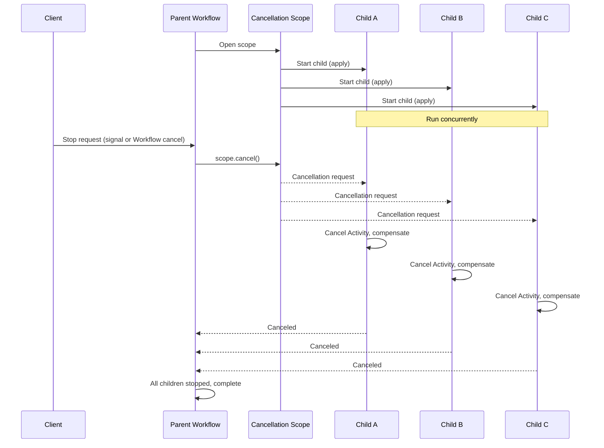

<h1>Cancellation Propagation </h1>

:::info TLDR
Start a group of concurrent operations — Activities, Child Workflows, or timers — inside one cancellation scope, then cancel the scope once to **propagate a graceful cancellation request to every operation at once**. Use this to abort a group together and let each one run its compensation before it exits, instead of terminating them and skipping all cleanup.
:::

## Overview

The Cancellation Propagation pattern groups concurrent operations under a single cancellable context so that one cancellation request propagates to every operation at once.
The scope can own any mix of the operations a Workflow starts: several Activities, several Child Workflows, timers, or a combination of all three. This page uses concurrent Child Workflows as the running example, but the same scope mechanics apply when the group is a set of Activities instead.
Each SDK represents a Workflow as a tree of cancellation scopes: the Workflow method runs in a root scope, and you create nested scopes to own the operations you may later need to stop.
Cancelling a scope delivers a cancellation request to the Child Workflows, Activities, and timers created inside it. Each one receives that request as a catchable error, releases its resources, undoes partial work, and then stops.

This is a cooperative stop, not a forced kill. The Workflow that owns the scope decides when to cancel, and each cancelled child decides how to wind down.

## Problem

When you start several Child Workflows concurrently, you often need to abort all of them together: an order is retracted while inventory, payment, and shipping reservations are still in flight; a fan-out job must stop the moment one branch fails; or a customer cancels a request that has already spread work across a dozen Workflows.

Stopping that work by terminating each Child Workflow is abrupt. Termination stops a Workflow Execution immediately with no chance to run cleanup code, so an inventory reservation is never released, a payment authorization is never voided, and a booking with a third party is left dangling. Tracking every child, sending a stop to each one, and coordinating their rollback by hand is error prone, and a crash midway through leaves the system in an inconsistent state.

You need a way to stop a group of concurrent Child Workflows that lets each one release what it holds and revert what it changed before it exits.

## Solution

You start the concurrent Child Workflows inside a cancellation scope. When the abort condition occurs, you cancel the scope once, and the SDK propagates a cancellation request to every child created within it. Each child catches the cancellation, runs its compensation logic, and reports a Cancelled status. The parent waits for all children to finish winding down before it completes.



The following describes each step in the diagram:

1. The parent opens a cancellation scope and starts three Child Workflows inside it, which run concurrently.
2. A stop request arrives, either as a Signal or as an external cancellation of the parent Workflow.
3. The parent cancels the scope. The SDK delivers a cancellation request to all three children at once.
4. Each child cancels its running Activity, runs its compensation logic, and reports a Cancelled status.
5. The parent waits for every child to finish winding down, then completes.

The following implementation starts the concurrent children, along with a reminder timer, in a cancellation scope and cancels the whole group when a `stop` Signal arrives. The timer is included to show that a scope propagates cancellation to timers as well as children. The `WAIT_CANCELLATION_COMPLETED` setting makes the parent wait for each child to finish its cleanup:

<DaytonaRunner pattern="cancellation-propagation" />

::: code-group
```python [Python]
# workflows.py
import asyncio
from temporalio import workflow
from temporalio.workflow import ChildWorkflowCancellationType

with workflow.unsafe.imports_passed_through():
    from child_workflows import FulfillmentStep
    from shared import Order

@workflow.defn
class FulfillOrderWorkflow:
    def __init__(self) -> None:
        self._stop = False

    @workflow.run
    async def run(self, order: Order) -> None:
        steps = ["reserve-inventory", "authorize-payment", "book-shipping"]

        # Each child runs in its own task; cancelling a task that executes a
        # child workflow sends a durable cancellation request to that child
        children = [
            asyncio.create_task(
                workflow.execute_child_workflow(
                    FulfillmentStep.run,
                    args=[order, step],
                    id=f"{workflow.info().workflow_id}-{step}",
                    cancellation_type=ChildWorkflowCancellationType.WAIT_CANCELLATION_COMPLETED,
                )
            )
            for step in steps
        ]

        # A scope owns any mix of operations: alongside the children, start a
        # timer that would fire a follow-up reminder later
        reminder = asyncio.create_task(asyncio.sleep(3600))

        # Wait until a stop is requested or every child has finished
        await workflow.wait_condition(
            lambda: self._stop or all(child.done() for child in children)
        )

        # Cancel the whole group when a stop is requested: children and the
        # pending timer alike
        if self._stop:
            for child in children:
                child.cancel()
            reminder.cancel()

        # asyncio.gather with return_exceptions=True waits for every child to
        # finish its cleanup and collects each cancellation result, so none is
        # left unretrieved; the cancelled timer resolves alongside them
        await asyncio.gather(*children, reminder, return_exceptions=True)

    @workflow.signal
    def stop(self) -> None:
        self._stop = True
```

```go [Go]
// workflow.go
func FulfillOrder(ctx workflow.Context, order Order) error {
	ctx = workflow.WithChildOptions(ctx, workflow.ChildWorkflowOptions{
		WaitForCancellation: true,
	})

	// Shared cancellable context that every child is started with
	childCtx, cancel := workflow.WithCancel(ctx)
	defer cancel()

	// A scope owns any mix of operations: alongside the children, start a timer
	// on the same context that would fire a follow-up reminder later
	reminderTimer := workflow.NewTimer(childCtx, time.Hour)

	steps := []string{"reserve-inventory", "authorize-payment", "book-shipping"}
	futures := make([]workflow.ChildWorkflowFuture, len(steps))
	for i, step := range steps {
		futures[i] = workflow.ExecuteChildWorkflow(childCtx, FulfillmentStep, order, step)
	}

	// Cancel the whole group as soon as a stop Signal arrives
	workflow.Go(ctx, func(gctx workflow.Context) {
		workflow.GetSignalChannel(gctx, "stop").Receive(gctx, nil)
		cancel()
	})

	// Wait for every child; a cancelled child returns a CanceledError
	var firstErr error
	for _, f := range futures {
		if err := f.Get(ctx, nil); err != nil && !temporal.IsCanceledError(err) {
			firstErr = err
		}
	}

	// The timer created on the cancellable context is cancelled with the group
	_ = reminderTimer.Get(ctx, nil)
	return firstErr
}
```

```java [Java]
// FulfillOrderWorkflowImpl.java
public class FulfillOrderWorkflowImpl implements FulfillOrderWorkflow {

  private boolean stopRequested = false;

  @Override
  public void fulfill(Order order) {
    List<String> steps = List.of("reserve-inventory", "authorize-payment", "book-shipping");
    List<Promise<Void>> results = new ArrayList<>();

    // A scope owns any mix of operations: alongside the children, start a timer
    // inside it that would fire a follow-up reminder later
    Promise<Void>[] reminder = new Promise[1];

    // Start every child inside one cancellation scope
    CancellationScope scope =
        Workflow.newCancellationScope(
            () -> {
              reminder[0] = Workflow.newTimer(Duration.ofHours(1));
              for (String step : steps) {
                FulfillmentStep child =
                    Workflow.newChildWorkflowStub(
                        FulfillmentStep.class,
                        ChildWorkflowOptions.newBuilder()
                            .setCancellationType(
                                ChildWorkflowCancellationType.WAIT_CANCELLATION_COMPLETED)
                            .build());
                results.add(Async.procedure(child::apply, order, step));
              }
            });
    scope.run();

    // Cancel the whole group when a stop is requested
    Promise<Void> all = Promise.allOf(results);
    Workflow.await(() -> stopRequested || all.isCompleted());
    if (stopRequested) {
      scope.cancel("Order stopped");
    }

    // Wait for every child to finish its cleanup
    for (Promise<Void> result : results) {
      try {
        result.get();
      } catch (ChildWorkflowFailure e) {
        if (!(e.getCause() instanceof CanceledFailure)) {
          throw e;
        }
      }
    }

    // The timer created in the scope is cancelled along with the children
    try {
      reminder[0].get();
    } catch (CanceledFailure e) {
      // Expected: the pending reminder was cancelled with the scope
    }
  }

  @Override
  public void stop() {
    stopRequested = true;
  }
}
```

```typescript [TypeScript]
// workflows.ts
import {
  executeChild,
  CancellationScope,
  ChildWorkflowCancellationType,
  isCancellation,
  setHandler,
  sleep,
  condition,
  defineSignal,
} from '@temporalio/workflow';
import { fulfillmentStep } from './child-workflows';
import type { Order } from './shared';

export const stopSignal = defineSignal('stop');

export async function fulfillOrder(order: Order): Promise<void> {
  let stopRequested = false;
  setHandler(stopSignal, () => {
    stopRequested = true;
  });

  const steps = ['reserve-inventory', 'authorize-payment', 'book-shipping'];
  const scope = new CancellationScope();

  // A scope owns any mix of operations: alongside the children, start a timer
  // inside it that would fire a follow-up reminder later. The catch handler is
  // attached now so the cancellation is never left unhandled.
  let reminder!: Promise<void>;

  // Start every child inside the scope
  const children = scope.run(() => {
    reminder = sleep('1 hour').catch((err) => {
      if (!isCancellation(err)) throw err;
    });
    return Promise.all(
      steps.map((step) =>
        executeChild(fulfillmentStep, {
          args: [order, step],
          cancellationType: ChildWorkflowCancellationType.WAIT_CANCELLATION_COMPLETED,
        })
      )
    );
  });

  // Cancel the whole group when a stop is requested
  await Promise.race([
    children.catch(() => undefined),
    condition(() => stopRequested).then(() => scope.cancel()),
  ]);

  // Wait for every child to finish its cleanup
  try {
    await children;
  } catch (err) {
    if (!isCancellation(err)) throw err;
  }

  // The timer created in the scope is cancelled along with the children
  await reminder;
}
```
:::

Each SDK creates the scope and propagates cancellation differently:

- **Go** derives a child context with `workflow.WithCancel(ctx)` and starts every child with that context. Calling the returned `cancel` function delivers a cancellation request to all of them. `WaitForCancellation: true` makes `Future.Get` block until each child has finished cleanup.
- **TypeScript** creates a `CancellationScope` and starts the children inside `scope.run()`. Calling `scope.cancel()` cancels every operation created in that scope. `ChildWorkflowCancellationType.WAIT_CANCELLATION_COMPLETED` makes the promise resolve only after the child confirms cancellation.
- **Python** runs each `execute_child_workflow` call in its own `asyncio` task. Cancelling a task that executes a child workflow sends a cancellation request to that child, and `asyncio.gather(..., return_exceptions=True)` then waits for every child to finish its cleanup. `ChildWorkflowCancellationType.WAIT_CANCELLATION_COMPLETED` waits for the child's cleanup.
- **Java** starts the children inside `Workflow.newCancellationScope`. Calling `scope.cancel()` cancels every operation in the scope, and `ChildWorkflowCancellationType.WAIT_CANCELLATION_COMPLETED` makes the result Promise resolve after the child completes cancellation.

In every SDK the reminder timer is created in the same scope or cancellable context as the children, so the one cancellation reaches it too: the timer resolves with a cancellation error instead of firing. The same holds for Activities started directly in the scope.

## Cancellation versus termination

The advantage of this pattern comes from cancelling rather than terminating the children. The two are different operations with very different guarantees.

**Cancellation** is a graceful request, comparable to `kill -15` (`SIGTERM`) for a process. The Temporal Service records a `WorkflowExecutionCancelRequested` event and schedules a Workflow Task. The Workflow code receives the request as a catchable error and can release resources, notify other services, and undo partial work before it exits. A cancelled Workflow that handles the request and lets it propagate ends in a `Canceled` state; one that finishes its work anyway can still end as `Completed`.

**Termination** is a forced stop, comparable to `kill -9`. The Temporal Service records a `WorkflowExecutionTerminated` event and stops the Workflow Execution immediately. No Workflow Task is scheduled, and the Workflow code gets no opportunity to run cleanup. Any running Activities are abandoned; the Workers executing them only notice when they next heartbeat or complete, by which point the Workflow is already gone.

For a group of concurrent Child Workflows holding real resources, that difference is decisive:

| Aspect | Cancellation | Termination |
| :--- | :--- | :--- |
| Cleanup and compensation | Runs before the Workflow exits | Never runs |
| Running Activities | Receive a cancellation request and can stop cleanly | Abandoned; keep running until they heartbeat or finish |
| Resulting status | `Canceled` (or `Completed` if handled) | `Terminated` |
| Propagation to children | Follows the scope tree automatically | Must terminate each child yourself |
| Recorded in history | Request event, then a Workflow Task | Single terminate event, no further processing |
| Reversibility | The Workflow can ignore or adapt to the request | Immediate and unconditional |

Terminate only when a Workflow is stuck, unresponsive, or in an irrecoverable state and cancellation cannot make progress. For every case where the children can still run code, cancellation through a scope is the correct choice because it leaves the system consistent.

## Implementation

### Hold the reservation in a cancellable Activity

Each child keeps its reservation open by running a long-running Activity that heartbeats until it is cancelled. The heartbeat is what lets the cancellation reach a running Activity: the Server delivers the cancellation on the heartbeat response, so an Activity that never heartbeats keeps running until its `StartToCloseTimeout` expires.

The following Activity holds the reservation, heartbeats on each iteration, and stops when it is cancelled:

::: code-group
```python [Python]
# activities.py
import asyncio
from temporalio import activity

@activity.defn
async def hold_reservation(order: Order, step: str) -> None:
    try:
        while True:
            activity.heartbeat(step)
            await asyncio.sleep(1)
    except asyncio.CancelledError:
        activity.logger.info(f"Reservation for {step} released on cancellation")
        raise
```

```go [Go]
// activities.go
func HoldReservation(ctx context.Context, order Order, step string) error {
	for {
		select {
		case <-ctx.Done():
			activity.GetLogger(ctx).Info("Reservation released on cancellation", "step", step)
			return ctx.Err()
		case <-time.After(time.Second):
			activity.RecordHeartbeat(ctx, step)
		}
	}
}
```

```java [Java]
// FulfillmentActivitiesImpl.java
@Override
public void holdReservation(Order order, String step) {
  try {
    while (true) {
      Thread.sleep(1000);
      // heartbeat throws ActivityCanceledException once cancellation is requested
      Activity.getExecutionContext().heartbeat(step);
    }
  } catch (ActivityCanceledException e) {
    Workflow.getLogger(this.getClass()).info("Reservation for {} released", step);
    throw e;
  } catch (InterruptedException e) {
    Thread.currentThread().interrupt();
  }
}
```

```typescript [TypeScript]
// activities.ts
import { CancelledFailure, Context } from '@temporalio/activity';

export async function holdReservation(order: Order, step: string): Promise<void> {
  const ctx = Context.current();
  try {
    for (let i = 0; ; i++) {
      // Context.sleep is cancellation-aware: it rejects with CancelledFailure on cancel
      ctx.heartbeat(i);
      await ctx.sleep(1000);
    }
  } catch (err) {
    if (err instanceof CancelledFailure) {
      // Reservation released on cancellation
    }
    throw err;
  }
}
```
:::

### Compensate inside a cancelled child

The child runs the hold Activity, and when the cancellation reaches it, catches the cancellation and runs its compensation. The catch: once a scope is cancelled, you cannot start new Activities in that same scope, because they are cancelled the moment they are created. Compensation must run in a fresh, disconnected scope that the cancellation does not reach.

The following child applies its step, holds the reservation, and compensates in a disconnected scope when cancellation arrives:

::: code-group
```python [Python]
# child_workflows.py
import asyncio
from datetime import timedelta
from temporalio import workflow
from temporalio.workflow import ActivityCancellationType

with workflow.unsafe.imports_passed_through():
    from activities import apply, compensate, hold_reservation
    from shared import Order

@workflow.defn
class FulfillmentStep:
    @workflow.run
    async def run(self, order: Order, step: str) -> None:
        await workflow.execute_activity(
            apply, args=[order, step], start_to_close_timeout=timedelta(minutes=1)
        )

        # Run the hold Activity in its own task so this workflow method can still
        # schedule compensation after the cancellation is delivered.
        hold = asyncio.create_task(
            workflow.execute_activity(
                hold_reservation,
                args=[order, step],
                start_to_close_timeout=timedelta(minutes=5),
                heartbeat_timeout=timedelta(seconds=10),
                cancellation_type=ActivityCancellationType.WAIT_CANCELLATION_COMPLETED,
            )
        )

        try:
            await asyncio.shield(hold)  # cancellation lands here, not inside the task
        except asyncio.CancelledError:
            hold.cancel()  # cancel the reservation Activity and let it release
            try:
                await hold
            except Exception:
                pass
            await workflow.execute_activity(
                compensate, args=[order, step], start_to_close_timeout=timedelta(minutes=1)
            )
            raise  # Re-raise so the child reports Canceled
```

```go [Go]
// fulfillment_step.go
func FulfillmentStep(ctx workflow.Context, order Order, step string) error {
	ao := workflow.ActivityOptions{StartToCloseTimeout: time.Minute}
	ctx = workflow.WithActivityOptions(ctx, ao)

	if err := workflow.ExecuteActivity(ctx, Apply, order, step).Get(ctx, nil); err != nil {
		return err
	}

	// Hold the reservation in the long-running Activity. WaitForCancellation makes
	// Get block until the Activity acknowledges the cancellation and cleans up.
	holdCtx := workflow.WithActivityOptions(ctx, workflow.ActivityOptions{
		StartToCloseTimeout: 5 * time.Minute,
		HeartbeatTimeout:    10 * time.Second,
		WaitForCancellation: true,
	})
	err := workflow.ExecuteActivity(holdCtx, HoldReservation, order, step).Get(holdCtx, nil)
	if temporal.IsCanceledError(err) {
		// Compensate on a disconnected context; the original ctx is already cancelled
		disconnected, cancel := workflow.NewDisconnectedContext(ctx)
		defer cancel()
		disconnected = workflow.WithActivityOptions(disconnected, ao)
		_ = workflow.ExecuteActivity(disconnected, Compensate, order, step).Get(disconnected, nil)
		return err // Re-raise so the child reports Canceled
	}
	return err
}
```

```java [Java]
// FulfillmentStepImpl.java
public class FulfillmentStepImpl implements FulfillmentStep {

  private final FulfillmentActivities activities =
      Workflow.newActivityStub(
          FulfillmentActivities.class,
          ActivityOptions.newBuilder().setStartToCloseTimeout(Duration.ofMinutes(1)).build());

  // The hold Activity heartbeats and waits for cancellation to complete.
  private final FulfillmentActivities holdActivities =
      Workflow.newActivityStub(
          FulfillmentActivities.class,
          ActivityOptions.newBuilder()
              .setStartToCloseTimeout(Duration.ofMinutes(5))
              .setHeartbeatTimeout(Duration.ofSeconds(10))
              .setCancellationType(ActivityCancellationType.WAIT_CANCELLATION_COMPLETED)
              .build());

  @Override
  public void apply(Order order, String step) {
    activities.apply(order, step);
    try {
      // Cancelling the scope propagates into this running Activity
      holdActivities.holdReservation(order, step);
    } catch (ActivityFailure e) {
      if (!(e.getCause() instanceof CanceledFailure)) {
        throw e;
      }
      // Compensate in a detached scope so the Activity can still run
      Workflow.newDetachedCancellationScope(() -> activities.compensate(order, step)).run();
      throw e; // Re-raise so the child reports Canceled
    }
  }
}
```

```typescript [TypeScript]
// child-workflows.ts
import {
  proxyActivities,
  CancellationScope,
  ActivityCancellationType,
  isCancellation,
} from '@temporalio/workflow';
import type * as activities from './activities';
import type { Order } from './shared';

const { apply, compensate } = proxyActivities<typeof activities>({
  startToCloseTimeout: '1m',
});

const { holdReservation } = proxyActivities<typeof activities>({
  startToCloseTimeout: '5m',
  heartbeatTimeout: '10s',
  cancellationType: ActivityCancellationType.WAIT_CANCELLATION_COMPLETED,
});

export async function fulfillmentStep(order: Order, step: string): Promise<void> {
  await apply(order, step);

  try {
    // Cancelling the scope propagates into this running Activity
    await holdReservation(order, step);
  } catch (err) {
    if (!isCancellation(err)) throw err;
    // Compensate in a non-cancellable scope so the Activity can still run
    await CancellationScope.nonCancellable(() => compensate(order, step));
    throw err; // Re-raise so the child reports Canceled
  }
}
```
:::

Cancelling the scope propagates into the running hold Activity, which rejects with a cancellation error. The child catches it, then runs compensation in a scope that the cancellation does not reach:

- **Go** creates one with `workflow.NewDisconnectedContext(ctx)`. The original context is already cancelled, so the compensation Activity runs on the disconnected context instead.
- **TypeScript** uses `CancellationScope.nonCancellable()`, which shields the compensation Activity from the surrounding cancellation.
- **Python** runs the hold Activity in its own task and awaits it through `asyncio.shield`, so the workflow method can still schedule the compensation Activity after the cancellation is delivered.
- **Java** uses `Workflow.newDetachedCancellationScope()`, which runs the compensation outside the cancelled scope tree.

In every case, the child re-raises the cancellation after compensating so that it reports a `Canceled` status rather than silently completing.

### Choose how children and Activities stop

Cancellation propagates in two hops: the scope delivers a request to each **Child Workflow**, and each child in turn delivers a request to the **Activities** it is running. You control the two hops with two separate cancellation types — `ChildWorkflowCancellationType` on the child and `ActivityCancellationType` on the Activity — and they do not offer the same set of values. At each hop the type decides whether the caller waits for cleanup, returns as soon as the request is sent, or lets the work continue.

#### How the scope stops each child

`ChildWorkflowCancellationType` is set on each child, through the option shown in the parent code above. Its default is `WAIT_CANCELLATION_COMPLETED`, which is why the parent can rely on every child having compensated before it returns.

| `ChildWorkflowCancellationType` | Behavior | When to use |
| :--- | :--- | :--- |
| `WAIT_CANCELLATION_COMPLETED` (default) | Requests cancellation and waits for the child to acknowledge and finish its compensation before the parent's result resolves | The parent must know each child's cleanup completed, for example before releasing a shared resource |
| `WAIT_CANCELLATION_REQUESTED` | Waits only until the Service confirms the child received the request, not until its cleanup completes | You need delivery confirmation without blocking on the child's compensation |
| `TRY_CANCEL` | Sends the request and resolves the parent's result immediately with a cancellation error | You want the request delivered but do not need to wait for the child |
| `ABANDON` | Sends no request; the parent's result resolves as cancelled while the child keeps running | The child should outlive the cancellation |

#### How each child stops its Activities

`ActivityCancellationType` is set on each Activity stub inside the child, through the option shown in the child code above. Its default is `TRY_CANCEL`, and it has no `WAIT_CANCELLATION_REQUESTED` value: an Activity has no "request received" milestone to wait on, because the request only reaches it on a heartbeat.

| `ActivityCancellationType` | Behavior | When to use |
| :--- | :--- | :--- |
| `WAIT_CANCELLATION_COMPLETED` | Requests cancellation and waits for the Activity to acknowledge on its next heartbeat and finish before the child's call resolves | The child must know the Activity released what it held, as the hold Activity does above |
| `TRY_CANCEL` (default) | Sends the request and resolves the child's call immediately with a cancellation error while the Activity winds down | You want the request delivered but do not need to wait |
| `ABANDON` | Sends no request; the child's call resolves as cancelled while the Activity runs to completion or times out | The Activity cannot be interrupted or should finish on its own |

Two constraints apply across both hops:

- **A cancellable Activity must heartbeat.** The request reaches a running Activity only on a heartbeat response, so an Activity that should stop must call `heartbeat` regularly and set a Heartbeat Timeout. Without heartbeats it keeps running until its `StartToCloseTimeout` expires no matter which cancellation type you chose, and `WAIT_CANCELLATION_COMPLETED` then blocks the caller for that whole duration.
- **Go uses a boolean, not an enum.** Go selects the wait behavior with `WaitForCancellation: true` in both `ChildWorkflowOptions` and `ActivityOptions`; the default `false` matches `TRY_CANCEL`. Go has no per-call `ABANDON` flag for a child — it expresses that through a `ParentClosePolicy` of `ABANDON` instead. The other SDKs use the `ChildWorkflowCancellationType` and `ActivityCancellationType` enums shown in the code above.

## Trigger cancellation with Parent Close Policy

The implementation above triggers the group cancellation with a `stop` Signal: the parent listens for the Signal, sets a flag, and calls `scope.cancel()`. `ParentClosePolicy` offers a different trigger that needs no Signal and no in-Workflow orchestration.

Every Child Workflow carries a `ParentClosePolicy` that tells the Temporal Service what to do with the child when the parent Workflow reaches a Closed state — for example when it completes, fails, or times out. Set it to `REQUEST_CANCEL` and the Service sends each child the same graceful, catchable cancellation request that a scope delivers, so each child still runs its compensation before it exits. To stop the group you cancel the parent Workflow itself — from the CLI, a client, or a grandparent Workflow — rather than signaling it: the parent's cancellation propagates to the children, and `REQUEST_CANCEL` guarantees the request still reaches any child the parent was not actively awaiting. Start the children asynchronously and confirm each has started before the parent closes, otherwise a child that never started cannot receive the request.

::: code-group
```python [Python]
# workflows.py
from temporalio import workflow
from temporalio.workflow import ParentClosePolicy

# No stop Signal, no wait_condition, no scope.cancel(): start each child with
# REQUEST_CANCEL, then cancel the parent Workflow to wind the group down.
children = [
    asyncio.create_task(
        workflow.execute_child_workflow(
            FulfillmentStep.run,
            args=[order, step],
            id=f"{workflow.info().workflow_id}-{step}",
            parent_close_policy=ParentClosePolicy.REQUEST_CANCEL,
        )
    )
    for step in steps
]
await asyncio.gather(*children)
```

```go [Go]
// workflow.go
import enumspb "go.temporal.io/api/enums/v1"

// No stop Signal and no cancel scope: start each child with REQUEST_CANCEL,
// then cancel the parent Workflow to wind the group down.
ctx = workflow.WithChildOptions(ctx, workflow.ChildWorkflowOptions{
    ParentClosePolicy: enumspb.PARENT_CLOSE_POLICY_REQUEST_CANCEL,
})
futures := make([]workflow.ChildWorkflowFuture, len(steps))
for i, step := range steps {
    futures[i] = workflow.ExecuteChildWorkflow(ctx, FulfillmentStep, order, step)
}
for _, f := range futures {
    _ = f.Get(ctx, nil)
}
```

```java [Java]
// FulfillOrderWorkflowImpl.java
// No stop Signal and no cancel scope: start each child with REQUEST_CANCEL,
// then cancel the parent Workflow to wind the group down.
for (String step : steps) {
  FulfillmentStep child =
      Workflow.newChildWorkflowStub(
          FulfillmentStep.class,
          ChildWorkflowOptions.newBuilder()
              .setParentClosePolicy(ParentClosePolicy.PARENT_CLOSE_POLICY_REQUEST_CANCEL)
              .build());
  results.add(Async.procedure(child::apply, order, step));
}
Promise.allOf(results).get();
```

```typescript [TypeScript]
// workflows.ts
import { startChild, ParentClosePolicy } from '@temporalio/workflow';

// No stop Signal, no CancellationScope: start each child with REQUEST_CANCEL,
// then cancel the parent Workflow to wind the group down.
await Promise.all(
  steps.map((step) =>
    startChild(fulfillmentStep, {
      args: [order, step],
      parentClosePolicy: ParentClosePolicy.PARENT_CLOSE_POLICY_REQUEST_CANCEL,
    })
  )
);
```
:::

Choosing between the two triggers is a question of who drives the stop and whether the parent stays involved:

- **Reach for the Signal and scope** when the parent must stay in control after the stop: to wait for `WAIT_CANCELLATION_COMPLETED`, collect each child's result, run follow-up logic, report an aggregate status, or cancel one nested subgroup while the rest of the Workflow keeps running. The parent is still executing, so it coordinates the wind-down.
- **Reach for `ParentClosePolicy`** when the natural stop is "the parent is finished or cancelled" and each child can clean up on its own. You drop the Signal, the `wait_condition`, and the explicit `scope.cancel()`, at the cost of coordination: propagation happens only as the parent closes and is driven by the Service, so the parent is already gone and cannot wait for or gather the children's cleanup. It is also all-or-nothing — the policy reaches every child started with it, not a subgroup you pick at runtime.

Match the policy value to intent: `REQUEST_CANCEL` for a graceful request the children can compensate against, `TERMINATE` (the default) when the children hold nothing that needs cleanup, and `ABANDON` when they should outlive the parent. See [Child Workflows](child-workflows.md) for the full treatment of `ParentClosePolicy`.

## When to use

The Cancellation Propagation pattern is a good fit for aborting a group of concurrent Child Workflows that hold reservations or external state, stopping the remaining branches of a fan-out when one branch fails, honoring an external cancellation of a parent Workflow by winding its children down cleanly, and enforcing a deadline across a set of concurrent operations with a scope that cancels itself after a timeout.

It is not a good fit when the children have no cleanup to perform and a `ParentClosePolicy` of TERMINATE already suffices, when a single first result is all you need (use [Pick First](pick-first.md)), or when the Workflow is stuck and unresponsive, where termination is the only option that makes progress.

## Benefits and trade-offs

Cancelling a scope stops every child in it with one call, so you do not track or cancel them individually.
Each child runs its own compensation before it exits, which keeps inventory, payments, and third-party bookings consistent.
Propagation follows the scope tree automatically, reaching Child Workflows, their Activities, and their timers.
The whole sequence is recorded in Workflow history, so you can see exactly what was cancelled and what cleanup ran.

The trade-offs to consider are that cancellation is cooperative: a child that ignores the request, or an Activity that never heartbeats, does not stop promptly.
Compensation must run in a disconnected or shielded scope, which is a step you can overlook.
Waiting for `WAIT_CANCELLATION_COMPLETED` adds latency while children clean up.
Partial work may already have happened, so compensation logic has to be correct and idempotent.

## Comparison with alternatives

| Approach | Runs cleanup | Propagates to children | Waits for cleanup | Use case |
| :--- | :--- | :--- | :--- | :--- |
| Cancellation scope | Yes | Yes, via the scope tree | Configurable | Abort a group and compensate |
| Terminate each child | No | Manual, one by one | No | Last resort for stuck Workflows |
| `ParentClosePolicy: REQUEST_CANCEL` | Yes | On parent close only | No | Children stop when the parent closes |
| `ParentClosePolicy: TERMINATE` | No | On parent close only | No | Children need no cleanup |

## Best practices

- **Own the concurrent work in one scope.** Start every child that should stop together inside the same cancellation scope so a single cancel reaches all of them.
- **Compensate in a disconnected scope.** Run cleanup Activities on a disconnected context, non-cancellable scope, detached scope, or shielded task, because the original scope is already cancelled.
- **Heartbeat in cancellable Activities.** An Activity only receives cancellation when it heartbeats, so heartbeat regularly and set a Heartbeat Timeout.
- **Choose the cancellation type deliberately.** Use `WAIT_CANCELLATION_COMPLETED` when you must know cleanup finished, and lighter types when you do not.
- **Re-raise the cancellation.** After compensating, re-raise the cancellation error so the Workflow reports a `Canceled` status instead of silently completing.
- **Make compensation idempotent.** A cancelled operation may have done partial work, so compensation must be safe to run against any partial state.
- **Prefer cancellation over termination.** Reserve termination for Workflows that are stuck and cannot make progress any other way.

## Common pitfalls

- **Starting cleanup Activities in the cancelled scope.** Once a scope is cancelled, new Activities created in it are cancelled immediately. Run compensation in a disconnected, non-cancellable, detached, or shielded scope instead.
- **Activities without heartbeats.** A cancelled Activity that does not heartbeat keeps running until its `StartToCloseTimeout` expires, so cancellation appears to be ignored.
- **Swallowing the cancellation.** A cancellation request is delivered only once. If a child catches it and does not re-raise, the child will not be asked again, and it becomes your responsibility to stop and report it.
- **Terminating instead of cancelling.** Terminating the children skips all cleanup, leaving reservations held and authorizations open. Cancel unless the Workflow is genuinely stuck.
- **Not waiting for cleanup.** If the parent returns without waiting for the children, it may complete before their compensation runs. Use `WAIT_CANCELLATION_COMPLETED` and await each child when the order of cleanup matters.
- **Cancelling a task that only started the child.** In Python, cancelling the task that starts a child (rather than the task executing it) cancels only the start, not the running child. Cancel the task returned by `execute_child_workflow` or the child handle.

## Related patterns

- **[Pick First (Race)](pick-first.md)**: Uses the same cancellation mechanism to stop the losing Activities after the first one wins.
- **[Child Workflows](child-workflows.md)**: Explains `ParentClosePolicy`, the coarser control over what happens to children when the parent closes.
- **[Parallel Execution](parallel-execution.md)**: Starts the concurrent work that a cancellation scope later stops.
- **[Saga Pattern](saga-pattern.md)**: Structures the compensation logic each cancelled child runs.

## Sample code

**Go:**
- [Cancellation](https://github.com/temporalio/samples-go/tree/main/cancellation) — Workflow cancellation with a disconnected context for cleanup.

**TypeScript:**
- [Child Workflows](https://github.com/temporalio/samples-typescript/tree/main/child-workflows) — Parent and child Workflows using `executeChild`.
- [Activities Cancellation and Heartbeating](https://github.com/temporalio/samples-typescript/tree/main/activities-cancellation-heartbeating) — Cancellation scopes with heartbeating Activities.

**Java:**
- [HelloCancellationScope](https://github.com/temporalio/samples-java/tree/main/core/src/main/java/io/temporal/samples/hello/HelloCancellationScope.java) — Racing operations in a cancellation scope and cancelling the rest.

**Python:**
- [hello_cancellation](https://github.com/temporalio/samples-python/blob/main/hello/hello_cancellation.py) — Handling cancellation and running cleanup Activities.
