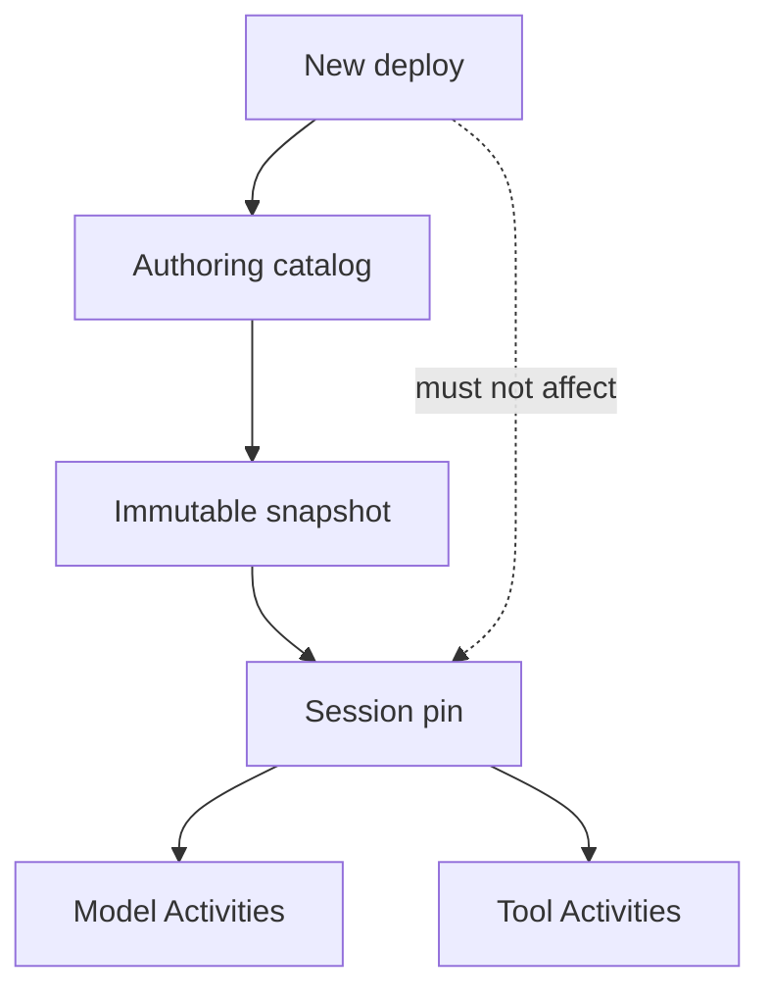

<h1>Catalog Snapshot Pinning </h1>

## Overview

The Catalog Snapshot Pinning pattern captures the instructions, Skill bodies, and Tool schemas a Session will use at start (or Turn start) as an immutable snapshot id, so redeploys and filesystem edits cannot silently change parked or long-running Sessions.
Primitives used: Agent Definition Versioning, Prompt Versioning, claim-check / content-addressed store, Session start pins, Eval-Backed Behavior Checks.

## Problem

[Agent Definition Versioning](/agent-definition-versioning) names a revision, but if Workers load “latest files from disk” at Activity time, a deploy mid-park still mutates behavior.
Skills and Tool JSON often live beside code and change without a Session-visible pin.

## Solution

At Session (or Turn) start:

1. Resolve the catalog (instructions, Skills, Tool schemas, safety labels).
2. Persist a **catalog snapshot** (content hash or immutable blob id) in Session state.
3. Pass `catalog_snapshot_id` into every Durable Model Call and Tool Activity.
4. Activities load *that* snapshot from an immutable store—not mutable workspace HEAD.

Binding revision (queues / Nexus) stays separate ([Agent Definition Versioning](/agent-definition-versioning)).



The following describes each step in the diagram:

1. Publish pipeline writes a content-addressed catalog snapshot.
2. Session start stores the snapshot id with definition/binding pins.
3. Steps resolve prompts/tools only through that snapshot.
4. Later deploys create new snapshots for new Sessions; open ones stay put.

```python
from dataclasses import dataclass
from datetime import timedelta

from temporalio import workflow

@dataclass
class SessionPins:
    catalog_snapshot_id: str  # e.g. "cat@sha256:…"
    definition_revision: str
    binding_revision: str

@workflow.defn
class AgentSessionWorkflow:
    @workflow.run
    async def run(self, session_id: str, pins: SessionPins, user_message: str) -> str:
        return await workflow.execute_activity(
            call_model,
            args=[pins.catalog_snapshot_id, user_message],
            start_to_close_timeout=timedelta(seconds=60),
        )
```

## Implementation

<DaytonaRunner pattern="catalog-snapshot-pinning" />

### What belongs in the snapshot

- System / developer instructions
- Skill procedure text (loaded or loadable ids + digests)
- Tool names + JSON schemas + safety profiles
- Guardrail rule ids (not necessarily full DLP models)

### What stays out

- Secrets and connection tokens
- Per-tenant runtime bindings (Task Queues)—use binding revision
- Mutable memory / todos—Session state, not catalog

### Migration

To upgrade an open Session: explicit event + new snapshot id (often via Continue-As-New), never silent HEAD follow.

### Evals

Fixtures pin `catalog_snapshot_id` so reruns match production ([Eval-Backed Behavior Checks](/eval-backed-behavior-checks)).

## When to use

Use for filesystem-authored or CMS-authored agents in production.
Skip only when the entire catalog is compiled into the Worker build and [Agent Worker Versioning](/agent-worker-versioning) is the only pin you need.

## Benefits and trade-offs

You get deploy-safe parked Sessions and reproducible evals.
You store immutable blobs and pass snapshot ids everywhere.

## Comparison with alternatives

| Approach | Mid-park deploy safety | Authoring UX |
| :--- | :--- | :--- |
| Catalog Snapshot Pinning | High | Publish snapshots |
| Load latest files in Activities | Low | Convenient, unsafe |
| Worker build only | High for code | Poor for prompt/Skill edits |

## Best practices

- **Hash the full resolved catalog**, not just prompt files.
- **Surface snapshot id on Queries and traces.**
- **Refuse Activities** that receive an unknown snapshot id.
- **Keep binding revision orthogonal.**

## Common pitfalls

- **Pinning a git SHA while Activities read live checkout.**
- **Omitting Tool schemas from the hash.**
- **Putting secrets into the snapshot blob.**
- **Equating snapshot with Worker build id.**

## Related patterns

- [Dynamic Capability Resolution](/dynamic-capability-resolution)
- [Agent Definition Versioning](/agent-definition-versioning)
- [Prompt Versioning](/prompt-versioning)
- [Agent Worker Versioning](/agent-worker-versioning)
- [Claim-Check Payloads](/claim-check-payloads)
- [Filesystem Authoring](/filesystem-authoring)
- [Eval-Backed Behavior Checks](/eval-backed-behavior-checks)
- [Binding Readiness Gate](/binding-readiness-gate)

## Sample code

- [`sandbox-runner/patterns/catalog-snapshot-pinning/python/`](https://github.com/temporal-sa/temporal-agentic-patterns/tree/main/sandbox-runner/patterns/catalog-snapshot-pinning/python)

## References

- [Temporal Docs: Versioning](https://docs.temporal.io/workflow-definition#workflow-versioning)
