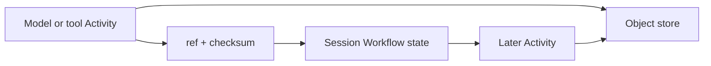

<h1>Claim-Check Payloads </h1>

## Overview

The Claim-Check Payloads pattern keeps large model prompts, completions, tool results, and multimodal bytes out of Temporal Event History.
Activities write the blob to object storage (or another store), return a small reference, and later Steps fetch by that reference only when needed.
Primitives used: Activity results as refs, Session pointers, Externalized Memory for indexes, Durable Model Call / Activity Tool boundaries.

## Problem

Agent workloads produce large strings and files.
Temporal limits individual payloads (on the order of 2 MiB) and transaction size; oversized Activity results terminate or fail the Workflow with no useful retry path.
Storing full conversation corpora in Workflow state also slows Queries and Continue-As-New.

## Solution

Treat history as a claim check: store the payload outside Temporal, persist a URI/key/checksum in the Activity result and Session state, and load bytes only inside Activities that need them.



The following describes each step in the diagram:

1. An Activity produces a large completion, document, or tool dump.
2. It writes the bytes to durable storage and returns `{ "uri": "...", "sha256": "...", "bytes": n }`.
3. The Workflow keeps the reference (and optional short summary) in Session memory and events.
4. Downstream Activities fetch by URI when they need the full payload.

```python
@activity.defn
async def call_model(prompt_ref: str) -> dict:
    prompt = await blob_store.get(prompt_ref)
    text = await provider.complete(prompt)  # may be large
    uri = await blob_store.put(text)
    return {"uri": uri, "preview": text[:500], "usage": {"total": 1200}}

# In the Workflow — history stays small
result = await workflow.execute_activity(
    call_model,
    prompt_ref,
    start_to_close_timeout=timedelta(seconds=120),
)
self._memory["last_completion_ref"] = result["uri"]
```

## Implementation

<DaytonaRunner pattern="claim-check-payloads" />


### What to externalize

Externalize full prompts when huge, raw completions, retrieved RAG corpora, images/audio/video, and bulky tool dumps.
Keep small summaries, tool IDs, token counts, and decision fields in history and events.

### Lifecycle

Set retention on the object store; Activities must fail clearly if a reference is missing.
Include checksums so retries can detect corruption or partial writes.

### Relation to Externalized Memory

Externalized Memory is for searchable indexes and corpora behind tools.
Claim-Check Payloads is the narrower rule for any Step result that would otherwise enter history.

## When to use

Use whenever a model or tool result can grow with production data (multi-doc synthesis, codebases, media).
Skip for short chat replies that stay well under payload limits.

## Benefits and trade-offs

You avoid non-recoverable history size failures and keep Sessions queryable.
You must manage store retention, access control, and fetch latency.

## Comparison with alternatives

| Approach | History size | Failure mode |
| :--- | :--- | :--- |
| Claim-Check Payloads | Small refs | Store miss (retryable/ops) |
| Full blob in Activity result | Grows with output | BlobSizeLimit / terminated Workflow |
| Truncate silently | Small | Lost content, bad answers |

## Best practices

- **Return preview + ref.** Operators and UIs can show a snippet without loading the blob.
- **Authorize store access in Activities.** Do not put signed long-lived secrets in Workflow arguments.
- **Pair with Continue-As-New Session.** Refs survive; do not rehydrate full blobs into CAN args.

## Common pitfalls

- **Logging full prompts into events.** Event payloads count toward size too.
- **Passing megabyte strings through Signals/Updates.**
- **Returning the full blob as an Activity result.** Hits BlobSizeLimit and can terminate the Workflow.

## Related patterns

- [Durable Model Call](/durable-model-call)
- [Externalized Memory](/externalized-memory)
- [Activity Tool](/activity-tool)
- [Session Memory](/session-memory)
- [Continue-As-New Session](/continue-as-new-session)

## Sample code

- [`sandbox-runner/patterns/claim-check-payloads/python/`](https://github.com/temporal-sa/temporal-agentic-patterns/tree/main/sandbox-runner/patterns/claim-check-payloads/python)

## References

- [Temporal Docs: Large payloads / Blob size limit](https://docs.temporal.io/encyclopedia/event-history#blob-size-limit)
- [Temporal Docs: Activities](https://docs.temporal.io/activities)
