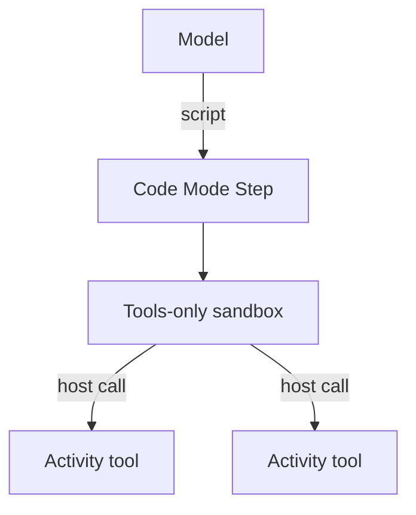

<h1>Code Mode Orchestrator </h1>

## Overview

The Code Mode Orchestrator pattern gives the model a single “run code” tool that executes a script over the agent's tools.
The script uses host functions and concurrency to orchestrate many tool calls in one Turn, while each host call stays a durable Activity Step.
Primitives used: SandboxScriptStep, Tools-Only Sandbox, ToolCallSteps for host calls, type-checked scripts.

## Problem

One-tool-at-a-time loops burn tokens and round trips when the agent must search, filter, and act across many calls.
Hand-written control flow in prompts is brittle.
You want real loops and concurrency without giving the model raw network access.

## Solution

Expose one Code Mode tool.
The model writes a short script that calls host tool APIs.
The runtime type-checks the script, runs it in a sandbox, and turns each host call into a normal Activity tool invocation with approvals and events.

The following describes each step in the diagram:

1. The model produces a script instead of a long tool menu selection sequence.
2. The Code Mode Step validates and runs the script in a tools-only sandbox.
3. Each host function call becomes a durable Activity tool Step with its own events and policy.

## Implementation

<DaytonaRunner pattern="code-mode-orchestrator" />

The sample stubs script execution and demonstrates host Activity calls (`host_search`, `host_summarize`) so the pattern runs without a model API key.

### Concurrency

Scripts may fan out independent host calls.
Temporal still applies per-call retries, timeouts, and approvals.

## When to use

Use Code Mode when a Turn needs multi-step control flow over tools.
Prefer ordinary tool calls for single-step actions.

## Benefits and trade-offs

You reduce round trips and express branching clearly.
You must invest in sandboxing, type stubs, and script size limits.

## Comparison with alternatives

| Approach | Control flow | Safety |
| :--- | :--- | :--- |
| Code Mode | Rich | Sandbox + host tools only |
| Multi-step tool loop | Limited | Per-tool gates |
| Raw code exec with network | Rich | Unsafe |

## Best practices

- **Tools-only sandboxes in production.** No direct filesystem or network from the script.
- **Type-check before run.** Fail fast on wrong arguments.
- **Budget script size and time.** Bound sandbox resources.

## Common pitfalls

- **Treating the sandbox as trusted.** Model-authored code is untrusted input.
- **Skipping host events.** Every host call must still appear on the session stream.
- **Double-running non-idempotent host tools after replay.** Host calls must be Activities with proper policies.

## Related patterns

- [Tools-Only Sandbox](/tools-only-sandbox)
- [Type-Checked Scripts](/type-checked-scripts)
- [Script Fan-Out](/script-fan-out)
- [Activity Tool](/activity-tool)

## Sample code

- [`sandbox-runner/patterns/code-mode-orchestrator/python/`](https://github.com/temporal-sa/temporal-agentic-patterns/tree/main/sandbox-runner/patterns/code-mode-orchestrator/python)

## References

- [Temporal Docs: Activities](https://docs.temporal.io/activities)
- [Temporal Docs: Child Workflows](https://docs.temporal.io/child-workflows)
