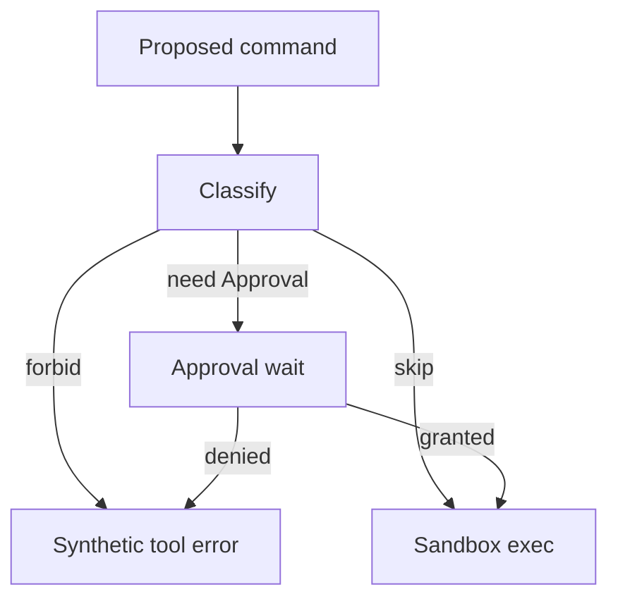

<h1>Command Safety Classification </h1>

## Overview

The Command Safety Classification pattern evaluates a proposed shell command against policy rules and heuristics before execution, producing skip / need Approval / forbid—so the Turn never runs forbidden argv and only parks when policy requires a human.
Primitives used: policy Activity or pure classifier, Approval wait, Sandbox Profile Tiers, Agent Tool Loop.

## Problem

Treating every shell Tool as equal either over-prompts humans or under-protects the host.
Argv shape (`rm -rf`, curl|sh, package installs) needs a durable classification Step before the exec Activity.

## Solution

1. Model proposes a shell Tool call.
2. Classify via rules + heuristics into skip, need Approval, or forbid.
3. Forbid returns a synthetic Tool error without exec.
4. Need Approval parks; skip proceeds under the Session Sandbox profile.
5. Emit the classification reason on audit / Approval events.



The following describes each step in the diagram:

1. The Turn receives a shell Tool proposal.
2. Classification returns requirement + reason.
3. Forbidden commands never reach the exec Activity.
4. Needed Approvals park; skip runs under the Sandbox profile.

```python
from datetime import timedelta
from temporalio import workflow

@workflow.defn
class AgentTurnWorkflow:
    def __init__(self) -> None:
        self._decision: str | None = None

    @workflow.signal
    def approve(self, decision: str) -> None:
        self._decision = decision

    @workflow.run
    async def run(self, command: str) -> str:
        c = await workflow.execute_activity(
            classify_command, command, start_to_close_timeout=timedelta(seconds=10)
        )
        if c["requirement"] == "forbid":
            return f"forbidden:{c['reason']}"
        if c["requirement"] == "need_approval":
            await workflow.wait_condition(lambda: self._decision is not None)
            if self._decision != "granted":
                return "approval_denied"
        return await workflow.execute_activity(
            exec_command, command, start_to_close_timeout=timedelta(seconds=30)
        )
```

## Implementation

<DaytonaRunner pattern="command-safety-classification" />

### Rules before heuristics

Prefer explicit allow/deny rules for known safe and dangerous patterns.
Use heuristics only when no rule matches.

### Read-only Tools

File-read Tools can skip classification that applies to shell argv.
Keep mutating file Tools on the Approval path under interactive modes.

## When to use

Use this for coding-agent shell Tools where argv risk varies widely.
Combine with [Sandbox Profile Tiers](/sandbox-profile-tiers) rather than replacing isolation.

## Benefits and trade-offs

You cut unnecessary Approvals for known-safe commands and block clearly dangerous ones.
Heuristics can false-positive or false-negative; rules need maintenance.

## Comparison with alternatives

| Approach | Strength |
| :--- | :--- |
| Argv classification | Fine-grained for shell |
| Tool-level Safety profiles | Coarse, schema-stable |
| Sandbox only | Catches writes; not exfil intent |

## Best practices

- **Record reason codes** for every classification.
- **Fail closed on unknown** when the Session is interactive and risk is high.
- **Version the rule pack** with the agent definition.

## Common pitfalls

- **Classifying inside the model prompt only.** Models are not a policy boundary.
- **Skipping Sandbox after skip classification.** Skip means skip Approval, not skip isolation.
- **Mutable rule files read from disk in Workflow code.** Load via Activity or pin in Worker build.

## Related patterns

- [Failure-Triggered Approval](/failure-triggered-approval)
- [Approval-Gated Tools](/approval-gated-tools)
- [Safety-Profiled Tools](/safety-profiled-tools)
- [Sandbox Profile Tiers](/sandbox-profile-tiers)
- [Guardrail Steps](/guardrail-steps)

## Sample code

- [Python sample](https://github.com/temporal-sa/temporal-agentic-patterns/tree/main/sandbox-runner/patterns/command-safety-classification/python)
- [Temporal Workflows](https://docs.temporal.io/workflows)

## References

- [Temporal Python SDK](https://docs.temporal.io/develop/python)
- [Activities](https://docs.temporal.io/activities)
