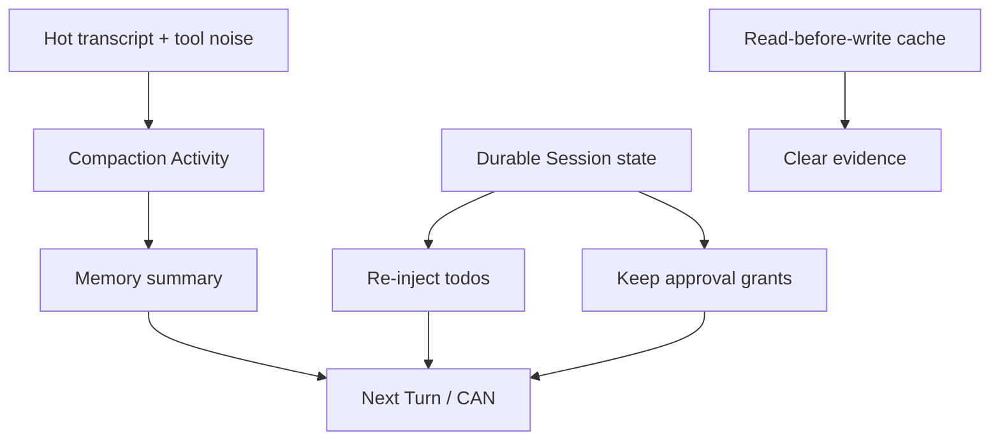

<h1>Compaction Tool-State Continuity </h1>

## Overview

The Compaction Tool-State Continuity pattern ensures that when [Context Compaction](/context-compaction) summarizes transcript, **framework Tool state**—todos, read-before-write evidence, Approval grants, open waits—is explicitly preserved, reset, or re-injected from durable Session fields rather than hoped to survive inside the summary text.
Primitives used: Context Compaction, Session Memory, Session-Scoped Approvals, Continue-As-New Session, Claim-Check Payloads.

## Problem

Summarizers drop operational detail.
If todos or “already read file X” flags live only in transcript prose, compaction invents a clean slate: the model re-reads forever, forgets open tasks, or loses Approval grants.
If you refuse to compact, history and context explode.

## Solution

At compaction boundaries:

1. Run the summarizer Activity on **transcript** only.
2. From durable Session state, **re-inject** active todos (and similar structured Tool state) as synthetic context messages or memory fields.
3. **Reset** ephemeral evidence that summary invalidates (for example read-before-write caches).
4. **Keep** Approval grants, ask-user waits, delivery ledger, and definition pins in Session state—not in the summary.



The following describes each step in the diagram:

1. Compaction summarizes conversational history.
2. Durable todo state is written back into the next context window.
3. Stale file-read evidence is cleared so Tools re-validate.
4. Approvals and waits remain Session fields across the boundary.

```python
from datetime import timedelta

from temporalio import workflow

@workflow.defn
class AgentSessionWorkflow:
    @workflow.run
    async def run(self, session_id: str, memory: dict, tool_state: dict) -> str:
        summary = await workflow.execute_activity(
            compact_transcript,
            memory["transcript"],
            start_to_close_timeout=timedelta(seconds=120),
        )
        memory["transcript"] = [summary]
        # Preserve structured tool state outside the summary.
        tool_state["read_files"] = {}  # reset ephemeral evidence
        if tool_state.get("todos"):
            memory["transcript"].append(
                {"role": "user", "content": f"Active todos: {tool_state['todos']}"}
            )
        # tool_state["approved_tools"] unchanged — Session-Scoped Approvals
        workflow.continue_as_new(args=[session_id, memory, tool_state])
```

## Implementation

<DaytonaRunner pattern="compaction-tool-state-continuity" />

### What to preserve

| State | Action on compaction |
| :--- | :--- |
| Todo / commitment list | Re-inject from durable key |
| Session-Scoped Approval grants | Keep in Session state |
| Open ask-user / approval waits | Keep; compact only when safe ([Context Compaction](/context-compaction)) |
| Definition / catalog pins | Keep |
| Read-before-write / similar evidence | Reset |
| Raw Skill bodies | Drop ([On-Demand Skill Load](/on-demand-skill-load)) |

### Custom Tools

If a Tool stores critical state only in transcript lines, add a compaction hook that copies it into Session state before summarize—or accept that compaction will lose it.

### Cost

Meter summarizer calls ([Cost & Token Accounting](/cost-token-accounting)).
Count live Steps for thresholds so replay does not re-trigger compaction.

## When to use

Use whenever compaction runs in agents with todos, Approval grants, or Tool evidence caches.
Skip only for throwaway demos with no Tool state.

## Benefits and trade-offs

You keep context bounded without wiping operational truth.
You must maintain a explicit Tool-state schema and compaction hooks.

## Comparison with alternatives

| Approach | Context size | Tool continuity |
| :--- | :--- | :--- |
| Compaction + Tool-state continuity | Bounded | Explicit |
| Compaction transcript-only | Bounded | Fragile |
| No compaction | Unbounded | Accidental |

## Best practices

- **Separate transcript from Tool state** in Session memory.
- **Re-inject todos after every compaction.**
- **Reset invalidated evidence** deliberately.
- **Never put secrets** into re-injection messages.

## Common pitfalls

- Compacting mid-Turn with in-flight Tools.
- Assuming the summarizer keeps todo JSON intact.
- Losing Approval grants because they lived only in chat.
- Thresholds based on historical event counts that re-fire on replay.

## Related patterns

- [Context Compaction](/context-compaction)
- [Session Memory](/session-memory)
- [Session-Scoped Approvals](/session-scoped-approvals)
- [Continue-As-New Session](/continue-as-new-session)
- [Claim-Check Payloads](/claim-check-payloads)
- [On-Demand Skill Load](/on-demand-skill-load)
- [Cost & Token Accounting](/cost-token-accounting)

## Sample code

- [`sandbox-runner/patterns/compaction-tool-state-continuity/python/`](https://github.com/temporal-sa/temporal-agentic-patterns/tree/main/sandbox-runner/patterns/compaction-tool-state-continuity/python)

## References

- [Temporal Docs: Continue-As-New](https://docs.temporal.io/workflows#continue-as-new)
- [Temporal Docs: Activities](https://docs.temporal.io/activities)
