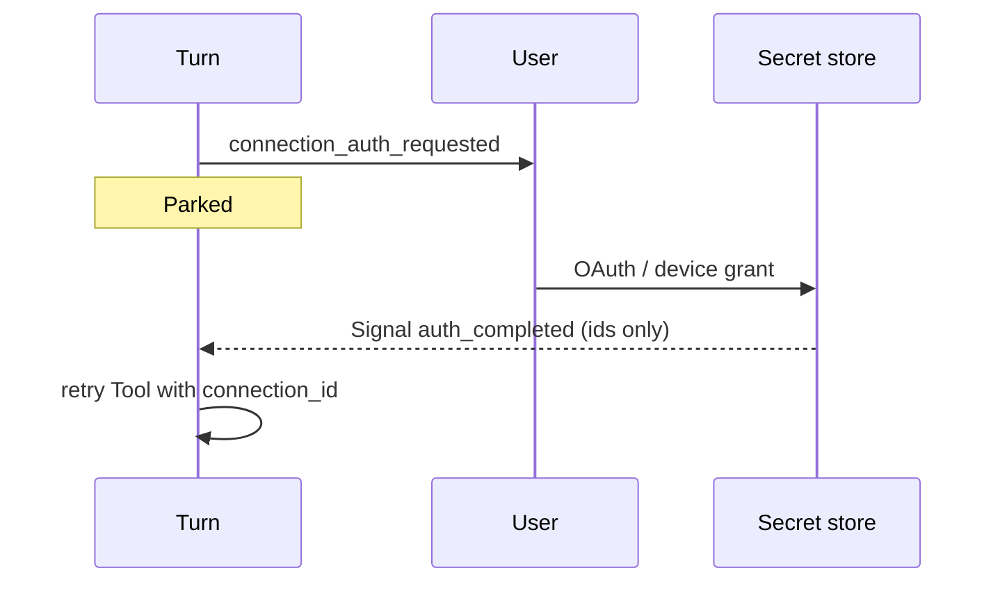

<h1>Connection Auth Wait </h1>

## Overview

The Connection Auth Wait pattern parks a Turn when a Tool needs an interactive credential grant (OAuth, device login, API key paste), resumes with a durable completion Signal/Update, and keeps tokens out of Workflow history and model context.
Primitives used: Wait / `wait_condition`, channel redirect or Callback Tool, claim-check for secrets, Approval-like events without tool-approval semantics, Idempotent Delivery on resume.

## Problem

Tools that call third-party APIs often need user consent or fresh tokens.
Putting secrets in Workflow arguments, Search Attributes, or prompts leaks them via history and logs.
Failing the Turn and asking the user to “try again later” loses in-flight tool-loop state.
Faking OAuth as Approval-Gated Tools confuses “authorize side effect” with “grant connection.”

## Solution

When a Tool discovers missing/expired connection auth:

1. Emit `connection_auth_requested` with connection id, scopes, and a resume correlation id (no secrets).
2. Park the Turn on `wait_condition` (optional SLA timer).
3. Channel opens browser/device flow; a **channel Activity or external callback** stores tokens in a secret store.
4. Resume Update/Signal carries `{connection_id, auth_delivery_id, status}` only—Activities fetch secrets by id.
5. Retry the Tool with the connection id; never echo tokens to the model.



The following describes each step in the diagram:

1. The Tool Step finds auth missing and requests a connection wait.
2. The Turn parks without completing.
3. The user completes grant into a secret store outside Temporal history.
4. A resume message (ids only) unparks the Turn; the Tool retries with `connection_id`.

```python
from datetime import timedelta

from temporalio import workflow

@workflow.defn
class AgentTurnWorkflow:
    def __init__(self) -> None:
        self._auth_done: dict | None = None

    @workflow.signal
    def connection_auth_completed(self, connection_id: str, status: str) -> None:
        self._auth_done = {"connection_id": connection_id, "status": status}

    @workflow.run
    async def run(self, session_id: str, connection_id: str) -> str:
        # Tool returned needs_auth...
        await workflow.wait_condition(lambda: self._auth_done is not None)
        if not self._auth_done or self._auth_done["status"] != "granted":
            return "auth_denied"
        return await workflow.execute_activity(
            call_connected_tool,
            args=[connection_id],  # Activity loads token from secret store
            start_to_close_timeout=timedelta(seconds=60),
        )
```

## Implementation

<DaytonaRunner pattern="connection-auth-wait" />

### Secret hygiene

- Tokens only in secret store / Worker env broker
- Events carry connection id, scopes, status
- Model context gets “connected” / “denied”, never raw credentials
- Prefer [Claim-Check Payloads](/claim-check-payloads) if any sensitive metadata must move

### vs Approval / Ask-User

| Wait | Question |
| :--- | :--- |
| Approval | May this Tool side effect run? |
| Ask-User | What clarifying input should the model use? |
| Connection Auth | Grant credentials for a connection |

### Idempotent resume

Resume with `auth_delivery_id` so double browser callbacks do not confuse the wait ([Idempotent Delivery](/idempotent-delivery)).

### Timeouts

Use [Updatable Approval Timer](/updatable-approval-timer)-style SLAs; on timeout emit `connection_auth_timed_out` and fail or re-ask.

## When to use

Use for OAuth, device codes, and “paste API key” Tools.
Skip when Workers use only service-account secrets with no user grant.

## Benefits and trade-offs

You keep interactive auth durable and secret-safe inside the Turn.
You must operate a secret store and channel grant UX.

## Comparison with alternatives

| Approach | Secrets in history | Keeps Turn |
| :--- | :--- | :--- |
| Connection Auth Wait | No | Yes |
| Put token in Signal payload | Yes | Yes |
| Fail Turn / restart Session | No | No |
| Fake as Approval | Confusing | Yes |

## Best practices

- **Ids in Signals; secrets in store.**
- **Separate event types** from approvals.
- **Scope grants** (connection id + scopes) in events for audit.
- **Re-check auth at Tool apply** after long parks ([Delivery Authorization Timing](/delivery-authorization-timing)).

## Common pitfalls

- **Token in Workflow args or Search Attributes.**
- **Showing refresh tokens to the model.**
- **No timeout** on abandoned OAuth tabs.
- **Using Approval deny semantics** for auth failure.

## Related patterns

- [Ask-User Wait](/ask-user-wait)
- [Approval-Gated Tools](/approval-gated-tools)
- [Callback Tool](/callback-tool)
- [Claim-Check Payloads](/claim-check-payloads)
- [Idempotent Delivery](/idempotent-delivery)
- [HTTP Channel Agent](/http-channel-agent)
- [Network & Resource Sandboxing](/network-resource-sandboxing)
- [MCP / OpenAPI Tooling](/mcp-openapi-tooling)

## Sample code

- [`sandbox-runner/patterns/connection-auth-wait/python/`](https://github.com/temporal-sa/temporal-agentic-patterns/tree/main/sandbox-runner/patterns/connection-auth-wait/python)

## References

- [Temporal Docs: Signals](https://docs.temporal.io/encyclopedia/workflow-message-passing#sending-signals)
- [Temporal Docs: Encryption / codecs](https://docs.temporal.io/production-deployment/data-encryption)
