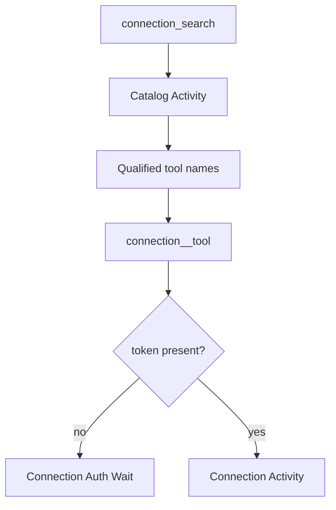

<h1>Connection Discovery </h1>

## Overview

The Connection Discovery pattern exposes a built-in `connection_search` Tool that returns redacted descriptors and qualified Tool names, loading connection Tools into the Turn only after search—so credentials and full catalogs never sit in the model context by default.
Primitives used: connection catalog, search Activity, qualified Tool names, Connection Auth Wait, Dynamic Capability Resolution.

## Problem

Dumping every integration Tool into the prompt overwhelms the model and leaks connector surface area.
Hard-coding one Tool per API forces redeploys for every new connection.

## Solution

1. If the Session has connections, register `connection_search`.
2. The model searches with a query; an Activity returns matching descriptors (no secrets).
3. Matched Tools become callable by qualified name for the rest of the Turn or Session policy window.
4. Invocations run as Activities; missing auth parks via Connection Auth Wait.
5. Compaction may drop loaded descriptors while keeping connection ids.



The following describes each step in the diagram:

1. The Turn offers search rather than the full connector catalog.
2. Search returns redacted descriptors and qualified names.
3. Later calls use those names as Tools.
4. Auth gaps park without putting secrets in history.

```python
from datetime import timedelta
from temporalio import workflow

@workflow.defn
class AgentTurnWorkflow:
    def __init__(self) -> None:
        self._loaded: set[str] = set()

    @workflow.run
    async def run(self, query: str, tool_name: str) -> str:
        matches = await workflow.execute_activity(
            connection_search, query, start_to_close_timeout=timedelta(seconds=15)
        )
        self._loaded.update(m["name"] for m in matches)
        if tool_name not in self._loaded:
            return "tool_not_loaded"
        return await workflow.execute_activity(
            invoke_connection_tool, tool_name, start_to_close_timeout=timedelta(seconds=30)
        )
```

## Implementation

<DaytonaRunner pattern="connection-discovery" />

### Redaction

Descriptors include name, summary, and parameter schemas—never access tokens.
Store tokens in a secret store keyed by connection id.

### Allow/block lists

Filter search results by principal and tenant before returning to the model.

## When to use

Use this when agents integrate many third-party connections and only need a few per Turn.
Prefer static Tool lists for single-API agents.

## Benefits and trade-offs

You keep prompts small and secrets out of context.
You add a search Step and must teach the model to search before calling.

## Comparison with alternatives

| Approach | Catalog size |
| :--- | :--- |
| Connection discovery | Large, searched |
| Static Tools | Small, always present |
| MCP / OpenAPI dump | Large, always present |

## Best practices

- **Qualify names** (`linear__list_issues`) to avoid collisions.
- **Combine with** [Dynamic Capability Resolution](/dynamic-capability-resolution) for principal filters.
- **Approve connection Tools** per Safety profile.

## Common pitfalls

- **Returning raw OAuth tokens in search hits.**
- **Allowing invoke without prior search** when policy requires progressive disclosure.
- **Skipping Connection Auth Wait** and failing the Turn on missing tokens.

## Related patterns

- [Connection Auth Wait](/connection-auth-wait)
- [MCP / OpenAPI Tooling](/mcp-openapi-tooling)
- [Dynamic Capability Resolution](/dynamic-capability-resolution)
- [On-Demand Skill Load](/on-demand-skill-load)
- [Catalog Snapshot Pinning](/catalog-snapshot-pinning)

## Sample code

- [Python sample](https://github.com/temporal-sa/temporal-agentic-patterns/tree/main/sandbox-runner/patterns/connection-discovery/python)
- [Temporal Activities](https://docs.temporal.io/activities)

## References

- [Temporal Python SDK](https://docs.temporal.io/develop/python)
- [Workflows](https://docs.temporal.io/workflows)
