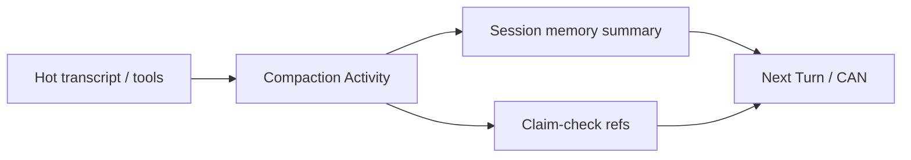

<h1>Context Compaction </h1>

## Overview

The Context Compaction pattern runs a durable Step that summarizes or spills Session context before the next Turn or Continue-As-New, so prompts and Workflow history stay bounded without dropping the Session identity.
Primitives used: Session Memory, Durable Model Call (summarizer), Claim-Check Payloads, Continue-As-New Session.

## Problem

Long Sessions accumulate transcripts, tool outputs, and skill text until model context windows and Temporal history both hurt.
Truncating silently loses facts; stuffing everything into Continue-As-New arguments hits payload limits.

## Solution

At safe boundaries (after Turn end, before Continue-As-New, or when token/history thresholds fire):

1. Run a compaction Activity (often a small Durable Model Call) that produces a structured memory summary.
2. Replace or shrink the hot context; spill raw blobs via claim-check refs.
3. Carry the compact snapshot into the next Turn or Continue-As-New.



The following describes each step in the diagram:

1. Thresholds detect oversized context or history pressure.
2. A compaction Activity summarizes facts and open commitments.
3. Large raw payloads become external refs.
4. The next Turn (or new run after Continue-As-New) loads summary + refs only.

```python
from datetime import timedelta

from temporalio import workflow

@workflow.defn
class AgentSessionWorkflow:
    @workflow.run
    async def run(self, session_id: str, memory: dict, user_message: str) -> str:
        # ... run turn ...
        if len(memory.get("turns", [])) > 20 or workflow.info().is_continue_as_new_suggested():
            memory = await workflow.execute_activity(
                compact_session_memory,
                memory,
                start_to_close_timeout=timedelta(seconds=120),
            )
            workflow.continue_as_new(args=[session_id, memory, ""])
        return "ok"
```

## Implementation

<DaytonaRunner pattern="context-compaction" />

### Safe boundaries

Compact only when no Turn child is open and no approval/ask-user wait is pending—or include those waits explicitly in the snapshot ([Continue-As-New Session](/continue-as-new-session)).

### What to keep hot

- Open todos / commitments
- Active approval and ask-user waits
- Definition and binding revisions
- Recent turns (small window)
- Claim-check refs for large tool outputs

### Progressive disclosure

Keep long procedures out of always-on instructions; load them on demand as tool/skill text in a Turn, then drop them on compaction so they do not become permanent history weight.

### Cost

Compaction model calls cost tokens—meter them in [Cost & Token Accounting](/cost-token-accounting) and avoid compacting every message.

## When to use

Use for long-lived Sessions and Entity Agents.
Skip for short Tasks that finish under context limits.

## Benefits and trade-offs

You sustain long conversations with bounded prompts and history.
You accept summarization loss and must validate critical facts survive compaction.

## Comparison with alternatives

| Approach | History | Fidelity |
| :--- | :--- | :--- |
| Context Compaction | Bounded | Summary + refs |
| Full transcript always | Unbounded | Highest |
| Hard truncate | Bounded | Silent loss |
| Claim-check only | Smaller payloads | No semantic summary |

## Best practices

- **Structure summaries** (facts, open items, user prefs)—not prose-only blobs.
- **Never compact away delivery ledger entries** still needed for idempotency.
- **Eval compaction** with fixtures that assert must-keep facts.
- **Pin summarizer prompt** via [Agent Definition Versioning](/agent-definition-versioning).

## Common pitfalls

- **Compacting mid-Turn** while tools are in flight.
- **Putting full transcripts into Continue-As-New args.**
- **Summarizing away safety constraints** ("never email customers").
- **Compacting on every Turn**—latency and cost spikes.

## Related patterns

- [Compaction Tool-State Continuity](/compaction-tool-state-continuity)
- [Session Memory](/session-memory)
- [Continue-As-New Session](/continue-as-new-session)
- [Claim-Check Payloads](/claim-check-payloads)
- [Externalized Memory](/externalized-memory)
- [Durable Model Call](/durable-model-call)
- [Cost & Token Accounting](/cost-token-accounting)

## Sample code

- [`sandbox-runner/patterns/context-compaction/python/`](https://github.com/temporal-sa/temporal-agentic-patterns/tree/main/sandbox-runner/patterns/context-compaction/python)

## References

- [Temporal Docs: Continue-As-New](https://docs.temporal.io/workflow-execution/continue-as-new)
- [Temporal Docs: Large payloads](https://docs.temporal.io/encyclopedia/event-history#blob-size-limit)
