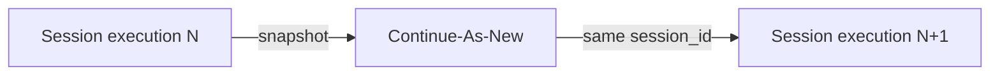

<h1>Continue-As-New Session </h1>

## Overview

The Continue-As-New Session pattern applies Continue-As-New to long-running agent sessions to prevent unbounded history.
The session periodically snapshots conversation state, approval policy, and memory, then restarts with a fresh history while preserving `session_id`.
Primitives used: Session, Continue-As-New, state snapshot, stable session identity.

## Problem

Agent sessions can run for days with many turns, tool calls, and approvals.
Workflow history grows until Temporal limits or performance degrade.
Stopping the session loses the stable ID channels rely on.

## Solution

When history is large (or on a turn boundary), call Continue-As-New with a compact snapshot: memory summary, approval overrides, open waits, and cursors.
Keep the same Workflow ID / `session_id` so Signals and channel bindings still address the session.



The following describes each step in the diagram:

1. Execution N accumulates turns and events until Continue-As-New is suggested or a policy threshold is hit.
2. The Workflow builds a minimal snapshot of session state.
3. Continue-As-New starts execution N+1 with that snapshot and the same session identity.

```python
# Inside the Session Workflow run loop
if workflow.info().is_continue_as_new_suggested():
    workflow.continue_as_new(args=[session_id, snapshot])
```

## Implementation

Drain pending Signals before Continue-As-New so you do not drop in-flight approvals or messages.
Carry pending waits explicitly in the snapshot when needed.

### What to snapshot

- Memory summary (not full raw transcript unless required)
- Approval policy and session-scoped allow lists
- Open callback or approval wait descriptors
- Event-stream cursor or sequence number if you externalize events

## When to use

Use this pattern for long-lived sessions and entity agents.
Skip it for short sessions that complete under a few hundred events.

## Benefits and trade-offs

You keep sessions alive indefinitely with bounded history.
You must design snapshot schemas carefully and version them.

## Comparison with alternatives

| Approach | History | Identity |
| :--- | :--- | :--- |
| Continue-As-New Session | Reset | Stable |
| New session per day | Reset | Broken continuity |
| Externalize everything | Smaller Workflow | More moving parts |

## Best practices

- **Continue on turn boundaries.** Avoid Continue-As-New mid-tool when possible.
- **Use the SDK suggestion.** Prefer `is_continue_as_new_suggested()` over fixed counts alone.
- **Version snapshots.** Old executions may continue into new code.

## Common pitfalls

- **Passing the entire transcript.** Arguments become the first events of the new run.
- **Dropping Signals.** Drain handlers before continuing.
- **Changing session_id.** Channels will orphan the previous execution.

## Related patterns

- [Session Workflow](/session-workflow)
- [Entity Agent](/entity-agent)
- [Session Memory](/session-memory)

## Sample code

See [Session Workflow](/session-workflow) for the base session sample; add Continue-As-New at turn boundaries when history grows.

## References

- [Temporal Docs: Continue-As-New](https://docs.temporal.io/workflow-execution/continue-as-new)
