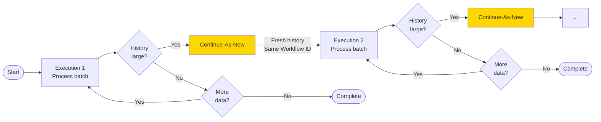

# Continue-As-New Pattern

## Overview

The Continue-As-New pattern allows long-running workflows to reset their event history by completing the current execution and immediately starting a new one with fresh state. This prevents workflows from hitting Temporal's event history limits while maintaining logical continuity, making it essential for periodic tasks, infinite loops, and workflows that process unbounded data streams. By archiving old event history and starting fresh, Continue-As-New also reduces active storage costs—only the current execution's history remains in active storage while previous runs are moved to cheaper archived storage (retained).

## Problem

In long-running workflows, you often need to:
- Execute periodic tasks indefinitely (hourly reports, daily cleanups)
- Process unbounded streams of data without accumulating history
- Implement infinite loops that run for months or years
- Avoid hitting the 50,000 event history limit
- Maintain workflow state across logical restarts

Without Continue-As-New, you must:
- Manually stop and restart workflows, losing continuity
- Risk hitting history limits and workflow failures
- Implement external orchestration to manage workflow lifecycle
- Accept degraded performance as history grows large

## Solution

Continue-As-New completes the current workflow execution and atomically starts a new one with the same Workflow ID. The new execution begins with a fresh event history while preserving logical continuity. State is passed as arguments to the new execution.



```java
@WorkflowInterface
public interface DataProcessorWorkflow {
  @WorkflowMethod
  void processData(String cursor, int totalProcessed);
}

public class DataProcessorWorkflowImpl implements DataProcessorWorkflow {
  private static final int BATCH_SIZE = 100;
  
  @Override
  public void processData(String cursor, int totalProcessed) {
    List<Record> batch = activities.fetchBatch(cursor, BATCH_SIZE);
    
    for (Record record : batch) {
      activities.process(record);
      totalProcessed++;
      cursor = record.getId();
    }
    
    if (batch.size() == BATCH_SIZE) {
      // More data to process - continue as new with updated state
      DataProcessorWorkflow continueAsNew = 
          Workflow.newContinueAsNewStub(DataProcessorWorkflow.class);
      continueAsNew.processData(cursor, totalProcessed);
    }
    // Otherwise complete normally
  }
}
```

## Implementation

### Passing State Across Runs

```java
@WorkflowInterface
public interface DataProcessorWorkflow {
  @WorkflowMethod
  void processData(String cursor, int totalProcessed);
}

public class DataProcessorWorkflowImpl implements DataProcessorWorkflow {
  private static final int BATCH_SIZE = 100;
  
  @Override
  public void processData(String cursor, int totalProcessed) {
    List<Record> batch = activities.fetchBatch(cursor, BATCH_SIZE);
    
    for (Record record : batch) {
      activities.process(record);
      totalProcessed++;
      cursor = record.getId();
    }
    
    if (batch.size() == BATCH_SIZE) {
      // More data to process
      DataProcessorWorkflow continueAsNew = 
          Workflow.newContinueAsNewStub(DataProcessorWorkflow.class);
      continueAsNew.processData(cursor, totalProcessed);
    }
    // Otherwise complete normally
  }
}
```

### Using shouldContinueAsNew

```java
public class DataProcessorWorkflowImpl implements DataProcessorWorkflow {
  
  @Override
  public void processData(String cursor, int totalProcessed) {
    List<Record> batch = activities.fetchBatch(cursor, BATCH_SIZE);
    
    for (Record record : batch) {
      activities.process(record);
      totalProcessed++;
      cursor = record.getId();
      
      // Check if history is getting large
      if (Workflow.getInfo().shouldContinueAsNew()) {
        DataProcessorWorkflow continueAsNew = 
            Workflow.newContinueAsNewStub(DataProcessorWorkflow.class);
        continueAsNew.processData(cursor, totalProcessed);
        return;
      }
    }
    
    // Continue processing or complete
  }
}
```

## Key Components

1. **Workflow.newContinueAsNewStub()**: Creates a stub for continuing the workflow
2. **State Parameters**: Arguments passed to the new execution
3. **Workflow.getInfo().shouldContinueAsNew()**: Checks if history size suggests continuing as new
4. **Iteration Limit**: Number of loops before continuing as new
5. **Exit Condition**: Logic to stop continuing (signals, counters, completion)
6. **ContinueAsNewOptions**: Optional configuration for the new execution

## When to Use

**Ideal for:**
- Periodic workflows running indefinitely (cron-like behavior)
- Processing unbounded data streams
- Long-running workflows with repetitive patterns
- Workflows that accumulate state over many iterations
- Preventing event history from growing too large

**Not ideal for:**
- Short-lived workflows (< 1000 events)
- Workflows that naturally complete
- One-time batch processing
- Workflows requiring full history for audit

## Benefits

- **Unlimited Duration**: Run workflows indefinitely without history limits
- **Performance**: Fresh history keeps workflow execution fast
- **Cost Reduction**: Reduces active storage costs by archiving old event history. More aggressive iteration limits mean more frequent archiving, keeping active storage minimal and reducing costs
- **Atomic Transition**: No gap between old and new execution
- **State Preservation**: Pass state as arguments to new execution
- **Same Workflow ID**: Maintains logical continuity for queries and signals

## Trade-offs

- **History Reset**: Previous execution history is archived separately
- **Manual State Management**: Must explicitly pass state as arguments
- **Query Limitations**: Queries only see current execution state
- **Debugging Complexity**: Must trace across multiple execution runs
- **No Automatic Rollback**: Cannot undo Continue-As-New once triggered

## How It Works

1. Workflow executes normally, accumulating events in history
2. Before hitting limits, workflow calls `Workflow.newContinueAsNewStub()`
3. Workflow invokes the stub method with state parameters
4. Current execution completes with ContinueAsNew command
5. Temporal immediately starts new execution with same Workflow ID
6. New execution begins with fresh history and passed parameters
7. Process repeats as needed

## Comparison with Alternatives

| Approach | History Reset | State Continuity | Use Case |
|----------|---------------|------------------|----------|
| Continue-As-New | Yes | Manual | Long-running periodic |
| Child Workflows | Per child | Automatic | Parallel processing |
| Cron Schedule | Yes | None | Fixed schedule tasks |
| Manual Restart | Yes | None | One-time workflows |

## Related Patterns

- **Cron Workflows**: Scheduled execution with Continue-As-New
- **Saga Pattern**: Long-running transactions with compensation
- **Child Workflows**: Decomposing work into sub-workflows
- **Signal Handling**: Controlling Continue-As-New behavior

## Sample Code

- [Full Java Sample](https://github.com/temporalio/samples-java/tree/main/core/src/main/java/io/temporal/samples/hello/HelloPeriodic.java) - Periodic greeting workflow with Continue-As-New

## Best Practices

1. **Use shouldContinueAsNew**: Check `Workflow.getInfo().shouldContinueAsNew()` to automatically detect when history is large
2. **Set More Aggressive Iteration Limits**: Continue as new every 100-1000 iterations to prevent history buildup and reduce storage costs. Smaller histories mean lower active storage costs since old executions are archived to cheaper storage tiers. Balance frequency with the overhead of creating new executions
3. **Pass Minimal State**: Only pass necessary state to keep arguments small
4. **Add Exit Signals**: Allow graceful termination via signals
5. **Log Transitions**: Log when continuing as new for observability
6. **Version Carefully**: Ensure new code can handle state from old executions
7. **Monitor History Size**: Track event count and continue before hitting limits
8. **Use Typed Stubs**: Prefer `newContinueAsNewStub()` over untyped `continueAsNew()`
9. **Consider Cron**: For fixed schedules, use Cron Schedules instead
10. **Test State Transfer**: Verify state correctly passes between executions
