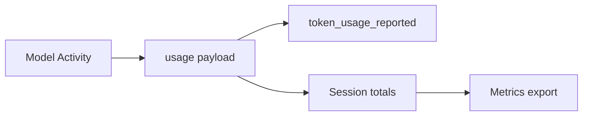

<h1>Cost & Token Accounting </h1>

## Overview

The Cost & Token Accounting pattern aggregates token usage and cost per model call, per turn, and per session, and emits them as events and metrics.
Use it to identify expensive agents, tools, or prompts.
Primitives used: token_usage_reported events, Durable Model Call outputs, metrics.

## Problem

Without per-call usage on the event stream, finance and engineering cannot attribute spend to sessions or features.

## Solution

Require Durable Model Call Activities to return usage.
Emit `token_usage_reported` and roll up counters on the Session.
Export metrics labeled by `agent_id` and model name.



The following describes each step in the diagram:

1. A model Activity returns token counts (and optional cost).
2. The Turn emits a usage event.
3. The Session increments totals.
4. Dashboards aggregate by agent, model, and session.

```python
usage = result["usage"]
self._tokens_in += usage["input"]
self._tokens_out += usage["output"]
events.append({
    "type": "token_usage_reported",
    "turn_id": turn_id,
    "usage": usage,
})
```

## Implementation

### Cost calculation

Prefer recording raw tokens in events and applying price tables in analytics, unless the provider returns cost directly.

### Tool costs

Extend the same pattern for billable tools when applicable.

### Retry storms

Failed and retried calls still cost money. Pair usage rollups with [Agent Step Retry Alerting](/agent-step-retry-alerting) so attempt spikes page before invoices do.
Include `attempt` (or a stable `step_attempt_id`) on usage events so slow-phase retries do not look like unique calls.

## When to use

Use whenever model calls are in the critical path of production agents.
Demo samples may omit real usage fields.

## Benefits and trade-offs

You see expensive turns before invoices surprise you.
You must keep price tables and model names accurate.

## Comparison with alternatives

| Grain | Question answered |
| :--- | :--- |
| Call | Which prompt blew up? |
| Turn | Which user message was costly? |
| Session | Which conversation should we cap? |

## Best practices

- **Always bind usage to turn_id and session_id.**
- **Enforce hard ceilings with [Session Spend Caps](/session-spend-caps)**—alerts alone do not stop spend.
- **Include model name in events.**

## Common pitfalls

- **Counting only successful calls.** Failed calls still cost money.
- **Aggregating only in logs without session rollups.**
- **Emitting `token_usage` on every Activity attempt without an attempt key.** Retries double-count the same call.
- **Alerting without Workflow caps.** Invoices still grow until someone reacts.

## Related patterns

- [Session Spend Caps](/session-spend-caps)
- [Durable Model Call](/durable-model-call)
- [Standardized Event Stream](/standardized-event-stream)
- [Agent Tracing](/agent-tracing)
- [Agent Step Retry Alerting](/agent-step-retry-alerting)
- [Fast/Slow Tool Retries](/fast-slow-tool-retries)

## Sample code

See related runnable samples under `sandbox-runner/patterns/` when this pattern builds on Session Workflow, Activity Tool, or Code Mode.

## References

- [Temporal Docs: Metrics](https://docs.temporal.io/production-deployment/metrics)
