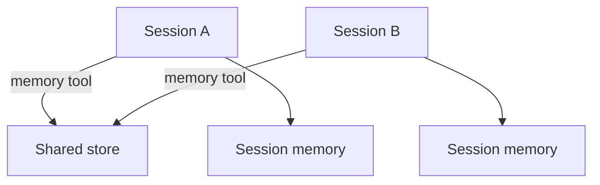

<h1>Cross-Session Memory </h1>

## Overview

The Cross-Session Memory pattern shares bounded, structured memory across sessions (for example per-user or per-team knowledge), while each session retains its own local context and approvals.
Access is always mediated by the agent’s tools and policies.
Primitives used: External memory tools, Session Memory composition, Safety/Approval on writes.

## Problem

Some knowledge should outlive a single session, but writing it ad hoc from Activities without policy creates silent cross-talk and tenancy bugs.

## Solution

Provide explicit memory tools (read/write) backed by Activities.
Sessions pull relevant slices into Session Memory at turn start and write back only through those tools under approval rules.



The following describes each step in the diagram:

1. A Session loads shared memory via a tool Activity.
2. It merges a bounded slice into local Session Memory.
3. Writes go back through a gated memory tool.
4. Other sessions see updates only through the same tools.

```python
shared = await workflow.execute_activity(
    memory_read,
    args=[user_id, "preferences"],
    start_to_close_timeout=timedelta(seconds=30),
)
self._memory["shared"] = shared
```

## Implementation

### Tenancy

Keys must include tenant/user/team IDs.
Tools enforce authorization using worker-side identity, not model claims alone.

## When to use

Use for preferences, org knowledge, or long-term facts.
Keep purely conversational scratch state in Session Memory only.

## Benefits and trade-offs

You share knowledge without merging sessions.
You must operate a store and write policies.

## Comparison with alternatives

| Memory | Lifetime | Sharing |
| :--- | :--- | :--- |
| Session | One session | No |
| Cross-Session | Across sessions | Yes, mediated |
| Externalized index | Long | Via tools |

## Best practices

- **Gate writes.** Shared memory is a side effect.
- **Bound payloads.** Prefer structured records over free-text dumps.
- **Audit reads/writes in the event stream.**

## Common pitfalls

- **Letting the model invent store keys that cross tenants.**
- **Writing shared memory from Workflow code without an Activity.**

## Related patterns

- [Session Memory](/session-memory)
- [Externalized Memory](/externalized-memory)
- [Approval-Gated Tools](/approval-gated-tools)

## Sample code

See related runnable samples under `sandbox-runner/patterns/` when this pattern builds on Session Workflow, Activity Tool, or Code Mode.

## References

- [Temporal Docs: Activities](https://docs.temporal.io/activities)
