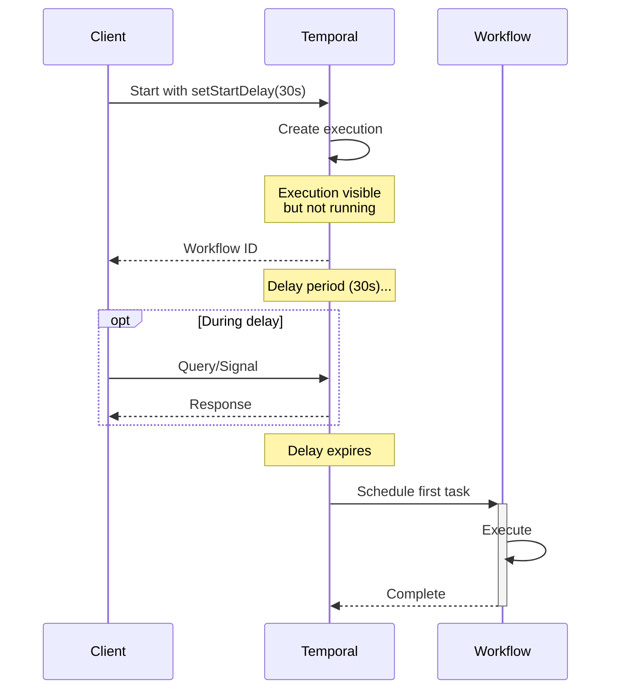

# Delayed Start Pattern

## Overview

The Delayed Start pattern enables workflows to be created immediately but begin execution after a specified delay. The workflow execution is registered in Temporal right away, but the first workflow task is scheduled to run only after the delay period expires, making it ideal for scheduled operations, grace periods, and deferred processing.

## Problem

In business processes, you often need workflows that:
- Start execution at a future time (scheduled maintenance, delayed notifications)
- Are created immediately for tracking but execute later
- Avoid external scheduling systems or cron jobs for one-time delays
- Maintain workflow identity and queryability before execution begins

Without delayed start, you must:
- Use external schedulers to trigger workflow creation later
- Start workflows immediately and sleep as the first operation (wastes resources)
- Implement complex queueing systems for deferred execution
- Use Temporal Schedules for simple one-time delays (overkill)

## Solution

The Delayed Start uses `setStartDelay()` in WorkflowOptions to defer the first workflow task. The workflow execution is created immediately with a `firstWorkflowTaskBackoff` set to the delay duration, but no workflow code runs until the delay expires.



```java
DelayedStartWorkflow workflow = client.newWorkflowStub(
    DelayedStartWorkflow.class,
    WorkflowOptions.newBuilder()
        .setWorkflowId(WORKFLOW_ID)
        .setTaskQueue(TASK_QUEUE)
        .setStartDelay(Duration.ofSeconds(30))
        .build());

workflow.start(); // Created now, executes in 30 seconds
```

## Implementation

### Basic Delayed Notification

```java
@WorkflowInterface
public interface NotificationWorkflow {
  @WorkflowMethod
  void sendNotification(String message);
}

public class NotificationWorkflowImpl implements NotificationWorkflow {
  @Override
  public void sendNotification(String message) {
    // Workflow code runs only after delay expires
    Workflow.getLogger(NotificationWorkflowImpl.class)
        .info("Sending notification: " + message);
  }
}

// Start workflow with 1-hour delay
NotificationWorkflow workflow = client.newWorkflowStub(
    NotificationWorkflow.class,
    WorkflowOptions.newBuilder()
        .setTaskQueue(TASK_QUEUE)
        .setStartDelay(Duration.ofHours(1))
        .build());

workflow.sendNotification("Your trial expires soon");
```

### Advanced: Cancellable Delayed Execution

```java
@WorkflowInterface
public interface DelayedOrderWorkflow {
  @WorkflowMethod
  void processOrder(String orderId);
  
  @SignalMethod
  void cancel();
  
  @QueryMethod
  String getStatus();
}

public class DelayedOrderWorkflowImpl implements DelayedOrderWorkflow {
  private boolean cancelled = false;
  private String status = "SCHEDULED";
  
  @Override
  public void processOrder(String orderId) {
    // Check if cancelled during delay period
    if (cancelled) {
      status = "CANCELLED";
      return;
    }
    
    status = "PROCESSING";
    // Process order logic
    status = "COMPLETED";
  }
  
  @Override
  public void cancel() {
    cancelled = true;
  }
  
  @Override
  public String getStatus() {
    return status;
  }
}

// Create with delay
WorkflowStub stub = client.newWorkflowStub(
    DelayedOrderWorkflow.class,
    WorkflowOptions.newBuilder()
        .setWorkflowId("order-123")
        .setTaskQueue(TASK_QUEUE)
        .setStartDelay(Duration.ofMinutes(15))
        .build());

stub.start("order-123");

// Can query or signal before execution starts
String status = stub.query("getStatus", String.class); // "SCHEDULED"
stub.signal("cancel"); // Cancel before it runs
```

## Key Components

1. **setStartDelay()**: WorkflowOptions method that sets the delay duration
2. **firstWorkflowTaskBackoff**: Internal attribute set by Temporal to defer first task
3. **Immediate Creation**: Workflow execution is created and visible immediately
4. **Deferred Execution**: Workflow code doesn't run until delay expires
5. **Query/Signal Support**: Can interact with workflow during delay period

## When to Use

**Ideal for:**
- Scheduled one-time operations (send reminder in 24 hours)
- Grace periods before processing (cancel subscription in 7 days)
- Delayed notifications and alerts
- Deferred batch processing
- Trial expiration workflows

**Not ideal for:**
- Recurring schedules (use Temporal Schedules)
- Immediate execution with internal delays (use Workflow.sleep())
- Complex scheduling logic (use Schedules with cron)
- Sub-second delays (minimal benefit)

## Benefits

- **Immediate Visibility**: Workflow is queryable before execution starts
- **Resource Efficient**: No worker resources consumed during delay
- **Cancellable**: Can signal or cancel workflow before it runs
- **Simple API**: Single configuration option, no external schedulers
- **Deterministic**: Delay is managed by Temporal, not external systems

## Trade-offs

- **Fixed Delay**: Cannot dynamically adjust delay after creation (use Updatable Timer for that)
- **One-Time Only**: For recurring schedules, use Temporal Schedules
- **Minimum Delay**: Very short delays (milliseconds) provide minimal benefit
- **No Conditional Start**: Delay is time-based only, not condition-based

## How It Works

1. Client calls `workflow.start()` with `setStartDelay()` configured
2. Temporal creates workflow execution immediately
3. Execution has `firstWorkflowTaskBackoff` set to delay duration
4. Workflow appears in UI/queries but shows no task history yet
5. After delay expires, first workflow task is scheduled
6. Worker picks up task and workflow code begins execution

## Comparison with Alternatives

| Approach | Immediate Visibility | Resource Usage | Cancellable | Use Case |
|----------|---------------------|----------------|-------------|----------|
| Delayed Start | Yes | None during delay | Yes | One-time future execution |
| Workflow.sleep() | Yes | Worker resources | Yes | Internal delays |
| Temporal Schedules | Yes | None | Yes | Recurring schedules |
| External Scheduler | No | External system | Depends | Complex scheduling |

## Related Patterns

- **Temporal Schedules**: For recurring workflow execution
- **Updatable Timer**: For dynamically adjustable delays within workflows
- **Signal-Based Event Handling**: Interacting with workflows before execution
- **Workflow Timers**: Using explicit timers for timeout control

## Sample Code

- [Full Java Sample](https://github.com/temporalio/samples-java/tree/main/core/src/main/java/io/temporal/samples/hello/HelloDelayedStart.java) - Complete implementation with delayed start

## Best Practices

1. **Use for One-Time Delays**: For recurring schedules, use Temporal Schedules instead
2. **Set Workflow ID**: Always set explicit workflow ID for tracking and cancellation
3. **Add Query Methods**: Expose status via queries to check state during delay
4. **Enable Cancellation**: Add signal handlers to cancel before execution
5. **Validate Delay Duration**: Ensure delay is reasonable (not too short or too long)
6. **Monitor Backoff**: Check `firstWorkflowTaskBackoff` in history for verification
7. **Consider Time Zones**: Use absolute timestamps if delay depends on specific time
8. **Document Behavior**: Clearly indicate workflow won't execute immediately
