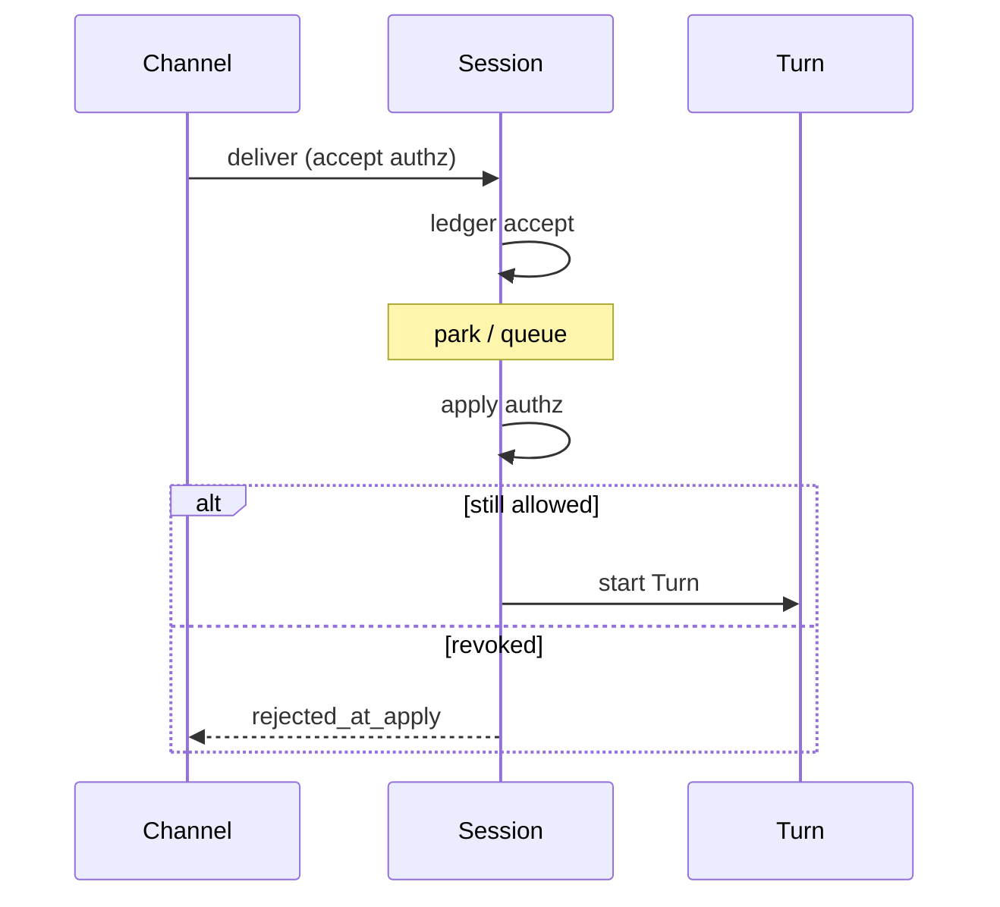

<h1>Delivery Authorization Timing </h1>

## Overview

The Delivery Authorization Timing pattern defines *when* principal and tenant checks run for a Delivery—at **accept**, at **apply** (Turn start), or **both**—so long parks, Continue-As-New, and delayed queues cannot run Turns under a revoked or downgraded actor.
Primitives used: Validated Session Ingress, Idempotent Delivery ledger, Session owner/actor pins, Ask-User / Approval waits, Identity.

## Problem

Channels often authorize once at HTTP accept, then park for minutes or days before a Turn applies the payload.
If the user is disabled, token revoked, or tenant membership removed during the wait, an already-accepted Delivery can still execute.
Authorizing only at apply without an accept check wastes ledger space and confuses clients with late failures.

## Solution

Pick an explicit policy and document it:

| Mode | Accept | Apply | Use when |
| :--- | :--- | :--- | :--- |
| Accept-only | Full authz | Trust ledger | Short parks, trusted internal |
| Apply-only | Cheap shape checks | Full authz | Rare |
| Accept + apply (recommended) | Authz + ledger | Re-check principal/tenant | Production multi-tenant |

Store `actor_id` / `tenant_id` with the Delivery on accept.
At apply, re-validate that the actor may still act on the Session; on failure mark Delivery `rejected_at_apply` without running tools.



The following describes each step in the diagram:

1. Accept-time authz decides whether the Delivery enters the ledger.
2. The Session may park (HITL, backlog, Continue-As-New).
3. Apply-time authz runs before the Turn starts model/tool Steps.
4. Revoked principals fail closed without side effects.

```python
from dataclasses import dataclass
from temporalio import workflow

@dataclass
class Delivery:
    delivery_id: str
    text: str
    actor_id: str
    tenant_id: str

@workflow.defn
class AgentSessionWorkflow:
    def __init__(self) -> None:
        self._owner = ""
        self._queue: list[Delivery] = []
        self._revoked: set[str] = set()

    @workflow.signal
    def revoke_actor(self, actor_id: str) -> None:
        self._revoked.add(actor_id)

    @workflow.update
    async def deliver(self, d: Delivery) -> str:
        # Accept-time: ownership (channel also verified resume token)
        if d.tenant_id != self._owner and d.actor_id != self._owner:
            raise ValueError("forbidden")
        self._queue.append(d)
        return "accepted"

    async def _apply_next(self) -> str | None:
        if not self._queue:
            return None
        d = self._queue.pop(0)
        if d.actor_id in self._revoked:
            return "rejected_at_apply"
        # start Turn with d.text ...
        return "applied"
```

## Implementation

<DaytonaRunner pattern="delivery-authorization-timing" />

### What to re-check at apply

- Actor still member of tenant / still owns Session
- Resume capability not revoked ([Split Resume and Observe Handles](/split-resume-observe-handles))
- Optional: risk tier changes that disable tools

### Idempotent Delivery

Keep the ledger outcome (`accepted` → later `rejected_at_apply` or `applied`) so retries see a stable story ([Idempotent Delivery](/idempotent-delivery)).

### HITL waits

Approvals and ask-user answers are Deliveries too—apply the same timing rules to who may answer.

## When to use

Use accept+apply for any Session that can park longer than a token TTL or admin revocation window.
Accept-only only for ephemeral demos.

## Benefits and trade-offs

You close the “authorized yesterday, runs today” gap.
You must implement revoke signals or revalidation Activities and handle late reject UX.

## Comparison with alternatives

| Policy | Revocation-safe | Client simplicity |
| :--- | :--- | :--- |
| Accept + apply | High | Medium (late reject) |
| Accept-only | Low | High |
| Apply-only | Medium | Poor early UX |

## Best practices

- **Pin actor_id on the ledger entry.**
- **Fail closed at apply** when unsure.
- **Surface `rejected_at_apply` on the event stream.**
- **Re-auth answers to ask/approval waits.**

## Common pitfalls

- **Authz only in the API**, never re-checked in Workflow.
- **Assuming Signal-with-Start implies ongoing authz.**
- **Dropping actor_id across Continue-As-New.**
- **Treating duplicate delivery retries as new apply authz bypasses.**

## Related patterns

- [Validated Session Ingress](/validated-session-ingress)
- [Idempotent Delivery](/idempotent-delivery)
- [Split Resume and Observe Handles](/split-resume-observe-handles)
- [Identity](/identity)
- [Ask-User Wait](/ask-user-wait)
- [Approval-Gated Tools](/approval-gated-tools)
- [Continue-As-New Session](/continue-as-new-session)

## Sample code

- [`sandbox-runner/patterns/delivery-authorization-timing/python/`](https://github.com/temporal-sa/temporal-agentic-patterns/tree/main/sandbox-runner/patterns/delivery-authorization-timing/python)

## References

- [Temporal Docs: Updates](https://docs.temporal.io/encyclopedia/workflow-message-passing#sending-updates)
