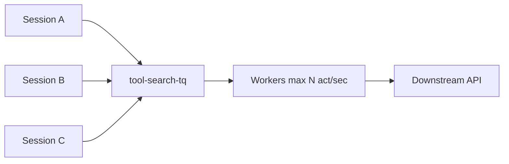

<h1>Downstream Tool Rate Limiting </h1>

## Overview

The Downstream Tool Rate Limiting pattern caps how fast agent tool Activities hit an external API by routing those Activities to a dedicated Task Queue whose Workers set `max_task_queue_activities_per_second`.
Use it for search, ticketing, payments, and other shared tools—not only for LLM 429 handling.
Primitives used: Activity Tool Task Queue override, Worker `max_task_queue_activities_per_second`, Fairness / Priority (optional).

## Problem

Many Sessions can schedule the same tool Activity at once and overwhelm a downstream quota even when each Activity retries politely.
[Rate-Limit Aware Model Calls](/rate-limit-aware-model-calls) reacts after a 429; it does not prevent bursts across Workflows.
Per-Activity sleep or in-process locks do not coordinate across Worker replicas.

## Solution

Put rate-limited tool Activities on a dedicated Task Queue.
Configure Workers on that queue with a throughput cap that matches the downstream budget.
Workflows keep using the main agent queue for Session/Turn Workflow Tasks and override `task_queue` only for the throttled tool Activities.



The following describes each step in the diagram:

1. Many Sessions schedule the same search (or other) tool Activity onto `tool-search-tq`.
2. Temporal holds excess tasks on that queue.
3. Workers dispatch at most N Activity tasks per second across replicas.
4. The downstream API sees a controlled request rate.

```python
from datetime import timedelta

from temporalio import workflow
from temporalio.worker import Worker

# Dedicated Worker for the throttled tool queue
async def run_search_tool_worker(client) -> None:
    worker = Worker(
        client,
        task_queue="tool-search-tq",
        activities=[search_web],
        max_task_queue_activities_per_second=5.0,
    )
    await worker.run()

# Inside a Turn Workflow
result = await workflow.execute_activity(
    search_web,
    query,
    task_queue="tool-search-tq",
    start_to_close_timeout=timedelta(seconds=60),
)
```

## Implementation

### Separate model and tool queues

Common topology:

| Queue | Work |
| :--- | :--- |
| `agent-sessions` | Session / Turn Workflow Tasks |
| `agent-model` | Durable Model Call Activities (optional own cap) |
| `tool-<name>` | Specific downstream tool Activities |

Split queues when budgets differ (cheap search vs expensive write API).

### Combine with 429-aware retries

Queue caps prevent most bursts.
Still parse Retry-After inside Activities for provider-declared cool-downs ([Rate-Limit Aware Model Calls](/rate-limit-aware-model-calls) applies the same idea to tools).

### Multi-tenant agents

Pair queue caps with [Fairness](/fairness) keys so one tenant cannot fill the entire capped queue.
Use [Priority Task Queues](/priority-task-queues) so interactive Turns outrank batch eval Sessions when both share a tool queue.

### Backpressure visibility

Watch queue lag and `ScheduleToStart` latency for the tool queue.
Raise alerts when lag grows instead of silently lengthening every Turn.

## When to use

Use when many concurrent Sessions share one external tool quota.
Prefer provider 429 + next_retry_delay alone for rare spikes on low-concurrency agents.
Prefer Fairness when the issue is tenant share on a shared Worker pool rather than a hard downstream RPS budget.

## Benefits and trade-offs

You get cluster-wide enforcement without custom distributed locks.
You operate extra Workers/queues and accept queueing delay when demand exceeds the cap.

## Comparison with alternatives

| Approach | Scope | When it fires |
| :--- | :--- | :--- |
| Downstream Tool Rate Limiting | All Workflows on the queue | Before dispatch |
| Rate-Limit Aware retries | Single Activity attempts | After 429 |
| In-process semaphore | One Worker process | Local only |

## Best practices

- **Cap to the real budget.** Include headroom for retries and non-agent callers of the same API.
- **One queue per distinct budget.** Do not mix unrelated APIs on one cap.
- **Set ScheduleToStartTimeout** on interactive tool calls so users see failures instead of infinite queue waits.
- **Keep Workflow Tasks off the capped queue.** Only throttle the Activities that hit the API.

## Common pitfalls

- **Capping the Session Workflow Task Queue.** You slow scheduling and Signals, not only tool IO.
- **Relying only on client-side sleeps.** Other Workers ignore them.
- **AllowAll scheduled Turns into a tiny tool cap.** Schedules pile tasks; use Skip/Buffer and Fairness.
- **Ignoring interactive latency.** A fair global cap can starve chat unless Priority is set.

## Related patterns

- [Activity Tool](/activity-tool)
- [Rate-Limit Aware Model Calls](/rate-limit-aware-model-calls)
- [Fairness](/fairness)
- [Priority Task Queues](/priority-task-queues)
- [Best-Effort Parallel Tools](/best-effort-parallel-tools)
- [Scheduled Agent Turns](/scheduled-agent-turns)

## Sample code

Compose with the [Activity Tool](/activity-tool) sample by moving the tool Activity to a dedicated Worker with `max_task_queue_activities_per_second` set.

## References

- [Temporal Docs: Worker performance / Task Queue rate limits](https://docs.temporal.io/develop/worker-performance)
- [Temporal Docs: Task Queues](https://docs.temporal.io/task-queue)
- [Temporal Docs: Activity options](https://docs.temporal.io/activities)
