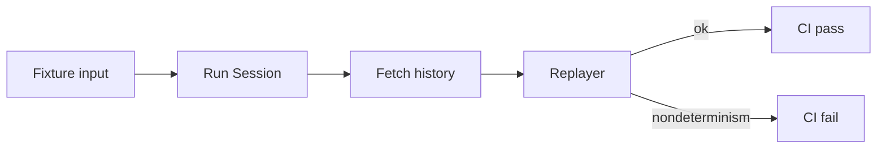

<h1>Durability Crash-Test CI </h1>

## Overview

The Durability Crash-Test CI pattern runs a fixture Session to completion in CI, exports history, and replays it with the same Workflow definitions—failing the merge when nondeterminism appears.
Primitives used: time-skipping test environment or dedicated CI Temporal, history export, Workflow Replayer, agent fixture input.

## Problem

Agent Workflows accumulate model, Tool, and wait Steps that are easy to break with non-deterministic code.
Unit tests that never replay history miss the failure mode Temporal surfaces in production Worker upgrades.

## Solution

1. CI starts a Temporal test environment (or ephemeral cluster) and Worker for the agent.
2. Start a Session Workflow with a fixed fixture input.
3. Await completion; fetch history.
4. Replay with the same Workflow and Activity stubs/defs.
5. Gate the merge on replay success.



The following describes each step in the diagram:

1. CI boots an isolated Temporal environment.
2. A fixture Session runs to a terminal state.
3. History is exported.
4. Replay validates determinism of the Workflow code under test.

```python
from temporalio.client import Client
from temporalio.worker import Replayer

async def crash_test(client: Client, workflow_id: str) -> str:
    handle = client.get_workflow_handle(workflow_id)
    await handle.result()
    history = await handle.fetch_history()
    await Replayer(workflows=[AgentSessionWorkflow]).replay_workflow(history)
    return "replay:ok"
```

## Implementation

<DaytonaRunner pattern="durability-crash-test-ci" />

### What to fixture

Use deterministic fake model/Tool Activities in CI.
Exercise at least one park/resume path (Approval or Ask-User) so waits are in history.

### Relation to evals

[Eval-Backed Behavior Checks](/eval-backed-behavior-checks) assert product behavior.
Crash-test asserts Temporal determinism. Run both.

## When to use

Use this on every PR that changes Session/Turn Workflow code or Tool dispatch.
Skip only for pure docs changes.

## Benefits and trade-offs

You catch nondeterminism before production Worker fleets diverge.
Fixtures need maintenance as agents grow; flaky fakes undermine trust.

## Comparison with alternatives

| Gate | Catches |
| :--- | :--- |
| Crash-test replay | Nondeterministic Workflow code |
| Behavior evals | Wrong Tool choices / answers |
| Type checks | Schema drift |

## Best practices

- **Pin SDK and Replay versions** in CI.
- **Fail on any replay warning** your SDK treats as unsafe.
- **Keep fixtures small** but cover waits and Continue-As-New if used.

## Common pitfalls

- **Replaying against different Workflow code than the run.** Gate must use the PR revision.
- **Calling real model providers in crash-test.** Non-determinism and cost.
- **Ignoring Activity side effects in fixtures** that the Workflow branches on without recorded results.

## Related patterns

- [Eval-Backed Behavior Checks](/eval-backed-behavior-checks)
- [Patched Agent Workflow Evolution](/patched-agent-workflow-evolution)
- [Agent Worker Versioning](/agent-worker-versioning)
- [Agent Tracing](/agent-tracing)

## Sample code

- [Python sample](https://github.com/temporal-sa/temporal-agentic-patterns/tree/main/sandbox-runner/patterns/durability-crash-test-ci/python)
- [Temporal Python testing](https://docs.temporal.io/develop/python/testing-suite)

## References

- [Temporal testing suite](https://docs.temporal.io/develop/python/testing-suite)
- [Workflows](https://docs.temporal.io/workflows)
