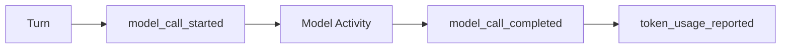

<h1>Durable Model Call </h1>

## Overview

The Durable Model Call pattern treats each LLM or model invocation as a first-class Activity with clear step boundaries and telemetry.
Inputs and outputs are recorded in the event stream; retries and timeouts follow the same policies as other tools.
Primitives used: ModelCallStep, model_call_* events, token_usage_reported.

## Problem

Calling a model SDK inside the Workflow breaks determinism.
Calling it in an Activity without event boundaries makes cost, retries, and partial failures hard to observe.

## Solution

Wrap each provider call in an Activity.
Emit `model_call_started` / `model_call_completed` / `model_call_failed` with provider, model name, timing, and token usage.
Keep prompts and credentials out of the Workflow code path except as Activity inputs.



The following describes each step in the diagram:

1. The Turn decides a model call is required and emits start metadata.
2. An Activity invokes the provider SDK with timeouts and retries.
3. On success, the Turn records output summary and token usage.
4. On failure, the Turn records error classification and decides retry or escalate.

```python
@activity.defn
async def call_model(prompt: str, model: str) -> dict:
    # Provider SDK runs only inside the Activity.
    text, usage = await provider.complete(prompt, model=model)
    return {"text": text, "usage": usage}
```

## Implementation

<DaytonaRunner pattern="durable-model-call" />

### Stubbing for demos

Catalog samples may return deterministic stub text so Daytona runs without API keys.
Production Activities call the real provider.

### Payload size

Prefer storing large prompts or completions outside Workflow history when needed; keep summaries on the event stream.

## When to use

Use Durable Model Calls for every production LLM invocation in an agent Turn.
Avoid in-Workflow SDK calls entirely.

## Benefits and trade-offs

You gain retries, heartbeats, and cost visibility.
Each call schedules an Activity; batching may be needed for tiny calls.

## Comparison with alternatives

| Approach | Deterministic Workflow | Telemetry |
| :--- | :--- | :--- |
| Durable Model Call | Yes | Per call |
| SDK in Workflow | No | Broken replay |
| Fire-and-forget thread | No | Weak |

## Best practices

- **Record token usage events.** Feed Cost & Token Accounting.
- **Classify retryable errors.** Rate limits vs invalid requests differ.
- **Heartbeat streaming calls.** Long generations need progress.

## Common pitfalls

- **Putting API keys in Workflow arguments permanently.** Prefer worker-side env config.
- **Omitting model name in events.** Breaks cost attribution.
- **Retrying non-idempotent side-effect tools after a model retry.** Separate policies.

## Related patterns

- [Activity Tool](/activity-tool)
- [Agent Tool Loop](/agent-tool-loop)
- [Provider Retry Delegation](/provider-retry-delegation)
- [Model Error Classification](/model-error-classification)
- [Structured Model Output](/structured-model-output)
- [Cost & Token Accounting](/cost-token-accounting)
- [Standardized Event Stream](/standardized-event-stream)

## Sample code

- [`sandbox-runner/patterns/durable-model-call/python/`](https://github.com/temporal-sa/temporal-agentic-patterns/tree/main/sandbox-runner/patterns/durable-model-call/python)

## References

- [Temporal Docs: Activities](https://docs.temporal.io/activities)
