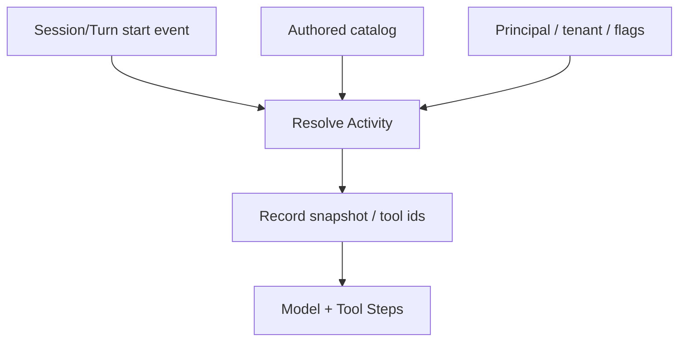

<h1>Dynamic Capability Resolution </h1>

## Overview

The Dynamic Capability Resolution pattern resolves Tools, Skills, and instructions at Session or Turn start from caller identity, tenant, channel metadata, or feature flags—then records the resolved set (often as a catalog snapshot) so replay and later parks stay consistent.
Primitives used: Session/Turn start Activities, Catalog Snapshot Pinning, Agent Definition Versioning, Safety Profiles per Agent, Validated Session Ingress.

## Problem

A single static tool list cannot express “admin vs viewer” or “tenant A vs tenant B” without shipping every Tool to every Session.
Resolving live from mutable disk or closures that do not survive replay makes the next Workflow Task diverge after a Worker restart.

## Solution

1. At `session.started` / `turn.started`, run a resolution Activity with principal + tenant + channel context.
2. Merge authored catalog with dynamic overlays (dynamic same-name overrides authored; colliding dynamic names fail closed).
3. Persist the resolved catalog as a snapshot id (or explicit Tool/Skill id list) on the Session.
4. Model and Tool Steps use only that recorded set for the rest of the Turn (or Session, per policy).



The following describes each step in the diagram:

1. Start carries identity and channel metadata.
2. Resolution merges authored and dynamic sources.
3. The Workflow stores an immutable snapshot of what the model may see.
4. Steps consume the snapshot—not live HEAD.

```python
from datetime import timedelta

from temporalio import workflow

@workflow.defn
class AgentSessionWorkflow:
    @workflow.run
    async def run(self, session_id: str, principal: dict, user_message: str) -> str:
        resolved = await workflow.execute_activity(
            resolve_capabilities,
            args=[principal],
            start_to_close_timeout=timedelta(seconds=30),
        )
        # resolved: {catalog_snapshot_id, tool_names, skill_names}
        return await workflow.execute_activity(
            call_model,
            args=[resolved["catalog_snapshot_id"], user_message],
            start_to_close_timeout=timedelta(seconds=60),
        )
```

## Implementation

<DaytonaRunner pattern="dynamic-capability-resolution" />

### What can resolve when

| Surface | Session start | Turn start | Mid-Step |
| :--- | :--- | :--- | :--- |
| Tools | Yes | Yes | Avoid (prefer Turn boundary) |
| Skills / instructions | Yes | Yes | No |

### Replay rules

Dynamic Tool `execute` paths must be Activity-backed or otherwise reconstructible from history.
Do not capture non-deterministic closures that only exist in the first Worker process.

### Pair with pinning

Resolution chooses *which* catalog; [Catalog Snapshot Pinning](/catalog-snapshot-pinning) freezes *bytes* so a redeploy mid-park cannot change them.
Without a snapshot, “dynamic” becomes “whatever the next deploy thinks.”

## When to use

Use for multi-tenant products, role-based Tool sets, and channel-specific Skills.
Skip for single-catalog demos with one principal.

## Benefits and trade-offs

You tailor capabilities per caller without forking Workflow types.
You must run resolution Activities, store snapshots, and define override/collision rules.

## Comparison with alternatives

| Approach | Per-caller | Durable across park |
| :--- | :--- | :--- |
| Dynamic Capability Resolution + snapshot | Yes | Yes |
| Static authored catalog only | No | Yes if pinned |
| Live disk each Step | Yes | No |

## Best practices

- **Resolve at Session or Turn boundaries**, not every token.
- **Fail on name collisions** between dynamic sources.
- **Record tool ids / snapshot id** on Queries for ops.
- **Apply safety profiles** after resolution ([Safety-Profiled Tools](/safety-profiled-tools)).

## Common pitfalls

- Resolving Skills on every Step start.
- Non-inline / non-Activity execute that works once then breaks on replay.
- Assuming parked Sessions keep old Tool schemas without a snapshot.
- Letting channel metadata alone authorize dangerous Tools without [Validated Session Ingress](/validated-session-ingress).

## Related patterns

- [Catalog Snapshot Pinning](/catalog-snapshot-pinning)
- [Agent Definition Versioning](/agent-definition-versioning)
- [On-Demand Skill Load](/on-demand-skill-load)
- [Safety-Profiled Tools](/safety-profiled-tools)
- [Security Profiles per Agent](/security-profiles-per-agent)
- [MCP / OpenAPI Tooling](/mcp-openapi-tooling)
- [Validated Session Ingress](/validated-session-ingress)

## Sample code

- [`sandbox-runner/patterns/dynamic-capability-resolution/python/`](https://github.com/temporal-sa/temporal-agentic-patterns/tree/main/sandbox-runner/patterns/dynamic-capability-resolution/python)

## References

- [Temporal Docs: Activities](https://docs.temporal.io/activities)
- [Temporal Docs: Workflow deterministic constraints](https://docs.temporal.io/workflows#deterministic-constraints)
