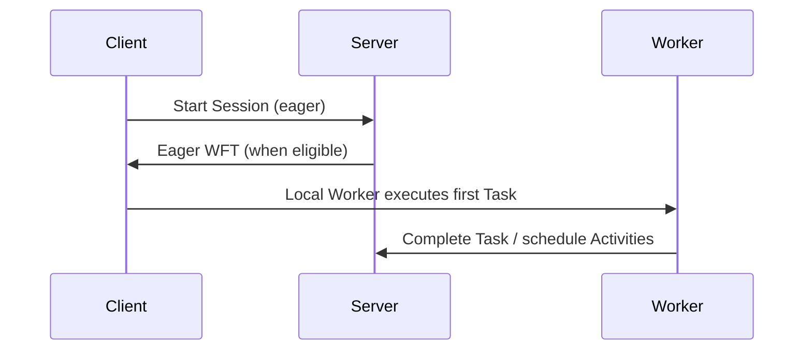

<h1>Eager Interactive Session Start </h1>

## Overview

The Eager Interactive Session Start pattern uses Temporal Eager Workflow Start so the first Task of a new interactive Session can skip a Matching round-trip when the starter and a compatible Worker are co-located—cutting first-Turn latency for chat UX.
Primitives used: `request_eager_start`, Session with Signal-and-Start / Update-With-Start, Local Activity Tools for tiny first Steps, Worker availability.

## Problem

Cold interactive Sessions pay start + first Workflow Task scheduling latency before any tokens stream.
For chat, that delay is user-visible even when a Worker is idle on the same process or host.

## Solution

When creating a new Session from a client that can receive eager tasks:

1. Start the Workflow with `request_eager_start=True` (and any start Signal/Update).
2. Keep a Worker running in the starter process or an adjacent process eligible for eager dispatch.
3. Run the first tiny Steps as Local Activities when safe ([Local Activity Tools](/local-activity-tools)); keep model/tool IO as regular Activities.
4. Fall back to normal dispatch when eager is not granted—behavior stays correct.



The following describes each step in the diagram:

1. The channel API starts a Session with eager requested.
2. When eligible, Temporal returns the first Workflow Task to that client/Worker path.
3. The Session begins Turns sooner; later tasks use normal polling.

```python
handle = await client.start_workflow(
    AgentSessionWorkflow.run,
    args=[session_id],
    id=session_id,
    task_queue=TASK_QUEUE,
    start_signal="user_message",
    start_signal_args=[text],
    request_eager_start=True,
)
```

## Implementation

<DaytonaRunner pattern="eager-interactive-session-start" />

### Eligibility

Eager start requires a Worker that can process the Task (same Task Queue, compatible build).
It is an optimization—never depend on it for correctness.

### Pairing with Update-With-Start

Validated ingress ([Validated Session Ingress](/validated-session-ingress)) still applies; eager only accelerates task delivery after accept.

### What not to eager-path

Do not move provider SDK calls into the API process "because eager."
Model/tool work stays in Activities on Workers.

## When to use

Use for user-facing Session creation where p50/p99 start latency matters.
Skip for batch/scheduled Starts where latency is secondary.

## Benefits and trade-offs

You reduce first-paint latency for new Sessions when Workers are warm nearby.
You must run Workers where starts happen (or accept that eager often no-ops).

## Comparison with alternatives

| Approach | First Task latency | Correctness |
| :--- | :--- | :--- |
| Eager Interactive Session Start | Lower when eligible | Unchanged |
| Normal start | Matching path | Unchanged |
| Inline model in API | Lowest (unsafe) | Loses durability |

## Best practices

- **Treat eager as optional acceleration.**
- **Colocate Workers with the start path** for chat APIs.
- **Keep Durable Model Calls as Activities.**
- **Measure eager grant rate** in metrics.

## Common pitfalls

- **Assuming every start is eager**—most still poll normally.
- **Starting without a Worker** on that queue—eager cannot help.
- **Embedding the agent loop in the API** to chase latency.

## Related patterns

- [Session with Signal-and-Start](/session-signal-and-start)
- [Validated Session Ingress](/validated-session-ingress)
- [Local Activity Tools](/local-activity-tools)
- [HTTP Channel Agent](/http-channel-agent)
- [Progress Streaming](/progress-streaming)

## Sample code

- [`sandbox-runner/patterns/eager-interactive-session-start/python/`](https://github.com/temporal-sa/temporal-agentic-patterns/tree/main/sandbox-runner/patterns/eager-interactive-session-start/python)

## References

- [Temporal Docs: Eager Workflow Start](https://docs.temporal.io/develop/python/temporal-client#eager-workflow-start)
