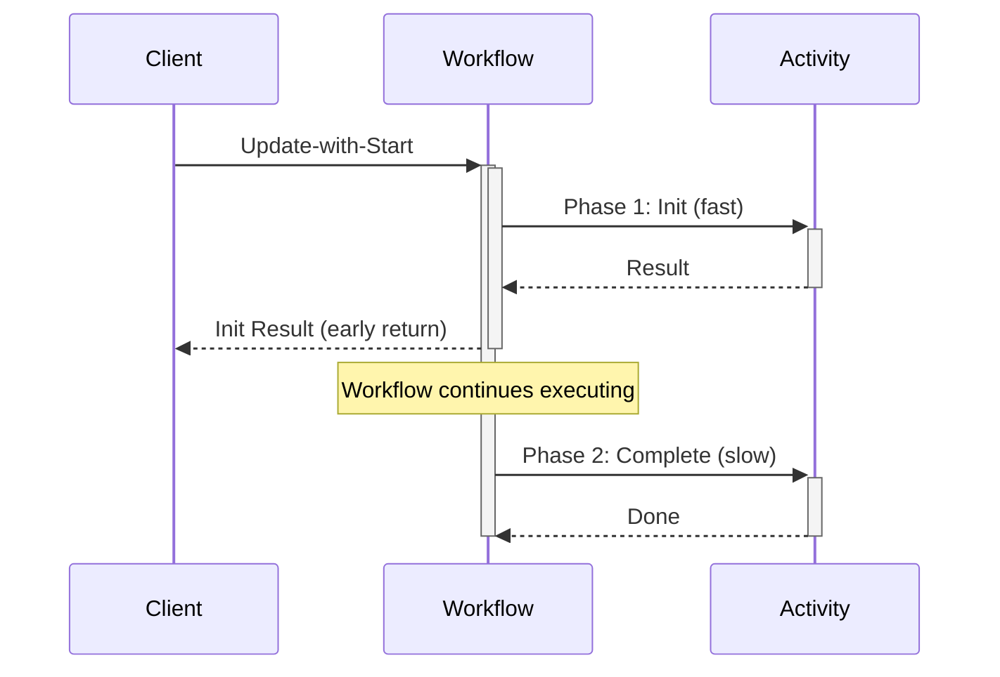

# Early Return (Update with Start)

## Overview
Return initialization results to the caller immediately while continuing asynchronous processing in the background.

## Problem
Clients need immediate feedback on whether an operation can proceed, but the full operation takes significant time to complete. Blocking the client for the entire operation duration creates poor user experience and ties up resources.

## Solution
Uses Update-with-Start to split operations into two phases: a fast synchronous initialization phase that validates and returns results immediately, and a slower asynchronous completion phase that runs in the background. The workflow uses local activities for quick initialization, signals completion via update handlers, then either completes or cancels the operation based on initialization success.



::: code-group
```go [Go]
// Workflow Implementation
func Workflow(ctx workflow.Context, txRequest TransactionRequest) (*Transaction, error) {
    var tx *Transaction
    var initDone bool
    var initErr error

    // Register update handler that waits for initialization
    workflow.SetUpdateHandler(ctx, UpdateName,
        func(ctx workflow.Context) (*Transaction, error) {
            workflow.Await(ctx, func() bool { return initDone })
            return tx, initErr
        },
    )

    // Phase 1: Fast synchronous initialization (local activity)
    localOpts := workflow.WithLocalActivityOptions(ctx, workflow.LocalActivityOptions{
        ScheduleToCloseTimeout: 5 * time.Second,
    })
    initErr = workflow.ExecuteLocalActivity(localOpts, txRequest.Init).Get(ctx, &tx)
    initDone = true // Signal update handler

    // Phase 2: Slow asynchronous completion
    activityCtx := workflow.WithActivityOptions(ctx, workflow.ActivityOptions{
        StartToCloseTimeout: 30 * time.Second,
    })

    if initErr != nil {
        // Cancel on initialization failure
        return nil, workflow.ExecuteActivity(activityCtx, CancelTransaction, tx).Get(ctx, nil)
    }

    // Complete on initialization success
    return tx, workflow.ExecuteActivity(activityCtx, CompleteTransaction, tx).Get(ctx, nil)
}

// Client Usage
updateHandle, err := client.UpdateWithStartWorkflow(ctx, 
    client.UpdateWithStartWorkflowOptions{
        UpdateOptions: client.UpdateWorkflowOptions{
            WorkflowID:   "transaction-123",
            UpdateName:   UpdateName,
        },
        StartWorkflowOptions: client.StartWorkflowOptions{
            ID:        "transaction-123",
            TaskQueue: "transactions",
        },
    },
    "Workflow",
    txRequest,
)

// Get initialization result immediately
var tx Transaction
err = updateHandle.Get(ctx, &tx)
if err != nil {
    return err
}

// Use transaction ID immediately while workflow continues
fmt.Printf("Transaction initialized: %s\n", tx.ID)
```

```typescript [TypeScript]
// Workflow Implementation
import { defineUpdate, setHandler, condition } from '@temporalio/workflow';
import * as activities from './activities';

const { initTransaction, completeTransaction, cancelTransaction } = 
  proxyLocalActivities<typeof activities>({
    startToCloseTimeout: '5s',
  });

export const returnInitResultUpdate = defineUpdate<Transaction>('returnInitResult');

export async function transactionWorkflow(txRequest: TransactionRequest): Promise<Transaction> {
  let tx: Transaction | undefined;
  let initDone = false;
  let initError: Error | undefined;

  // Register update handler that waits for initialization
  setHandler(returnInitResultUpdate, async () => {
    await condition(() => initDone);
    if (initError) {
      throw initError;
    }
    return tx!;
  });

  // Phase 1: Fast synchronous initialization (local activity)
  try {
    tx = await initTransaction(txRequest);
  } catch (err) {
    initError = err as Error;
  } finally {
    initDone = true; // Signal update handler
  }

  // Phase 2: Slow asynchronous completion
  if (initError) {
    await cancelTransaction(tx!);
    throw initError;
  }

  await completeTransaction(tx);
  return tx;
}

// Client Usage
const handle = await client.workflow.startWithUpdate(transactionWorkflow, {
  workflowId: 'transaction-123',
  taskQueue: 'transactions',
  update: returnInitResultUpdate,
  args: [txRequest],
});

// Get initialization result immediately
const tx = await handle.updateResult();

// Use transaction ID immediately while workflow continues
console.log(`Transaction initialized: ${tx.id}`);
```

```java [Java]
// Workflow Implementation
public class TransactionWorkflowImpl implements TransactionWorkflow {
    private boolean initDone = false;
    private Transaction tx;
    private Exception initError = null;

    @Override
    public TxResult processTransaction(TransactionRequest txRequest) {
        this.tx = activities.mintTransactionId(txRequest);

        // Phase 1: Fast synchronous initialization
        try {
            this.tx = activities.initTransaction(this.tx);
        } catch (Exception e) {
            initError = e;
        } finally {
            initDone = true; // Signal update handler
        }

        // Phase 2: Slow asynchronous completion
        if (initError != null) {
            activities.cancelTransaction(this.tx);
            return new TxResult("", "Transaction cancelled.");
        } else {
            activities.completeTransaction(this.tx);
            return new TxResult(this.tx.getId(), "Transaction completed successfully.");
        }
    }

    @Override
    public TxResult returnInitResult() {
        Workflow.await(() -> initDone); // Wait for initialization
        if (initError != null) {
            throw Workflow.wrap(initError);
        }
        return new TxResult(tx.getId(), "Initialization successful");
    }
}

// Client Usage
WorkflowUpdateHandle<TxResult> updateHandle = 
    client.updateWithStart(
        "returnInitResult",
        WorkflowUpdateStage.COMPLETED,
        TxResult.class,
        WorkflowOptions.newBuilder()
            .setWorkflowId("transaction-123")
            .setTaskQueue("transactions")
            .build(),
        "processTransaction",
        txRequest
    );

// Get initialization result immediately
TxResult result = updateHandle.getResultAsync().get();

// Use transaction ID immediately while workflow continues
System.out.println("Transaction initialized: " + result.getId());
```
:::

**Sample Repositories:**
[Go Sample](https://github.com/temporalio/samples-go/tree/main/early-return) | [TypeScript Sample](https://github.com/temporalio/samples-typescript/tree/main/early-return) | [Java Sample](https://github.com/temporalio/samples-java/tree/main/core/src/main/java/io/temporal/samples/earlyreturn)

**Key Points:**
- **Update-with-Start**: Single API call starts workflow and returns initialization result
- **Workflow**: Uses update handler with condition/await to block until initialization completes
- **Client**: Gets immediate result while workflow continues executing in background
- **All SDKs**: Same pattern with language-specific syntax differences

## Applicability
Use this pattern when:
- Clients need immediate feedback but operations take time to complete
- Validation or initialization can be done quickly (< 5 seconds)
- The operation can be safely cancelled if initialization fails
- You want to avoid blocking clients during long-running processing
- The initialization result determines whether to proceed or abort

## Additional Use Cases

**1. E-commerce Payment Processing**
```go
// Return payment authorization immediately while processing settlement
func PaymentWorkflow(ctx workflow.Context, payment PaymentRequest) (*PaymentAuth, error) {
    var auth *PaymentAuth
    var authDone bool
    
    workflow.SetUpdateHandler(ctx, "GetAuthResult",
        func(ctx workflow.Context) (*PaymentAuth, error) {
            workflow.Await(ctx, func() bool { return authDone })
            return auth, nil
        },
    )
    
    // Fast authorization check (local activity)
    localCtx := workflow.WithLocalActivityOptions(ctx, workflow.LocalActivityOptions{
        ScheduleToCloseTimeout: 3 * time.Second,
    })
    err := workflow.ExecuteLocalActivity(localCtx, AuthorizePayment, payment).Get(ctx, &auth)
    authDone = true
    
    if err != nil {
        return nil, workflow.ExecuteActivity(ctx, CancelPayment, payment).Get(ctx, nil)
    }
    
    // Background settlement processing
    return auth, workflow.ExecuteActivity(ctx, SettlePayment, auth).Get(ctx, nil)
}
```

**2. User Onboarding & KYC Verification**
- Quick identity validation returns user ID immediately
- Background processes handle document verification, credit checks, and account setup
- Client can proceed with basic user experience while onboarding completes

**3. Resource Provisioning (Cloud/Infrastructure)**
- Fast resource validation checks quotas, permissions, and availability
- Returns validation result with resource IDs immediately
- Background provisioning handles VMs, databases, and networking setup
- Cleanup resources automatically if validation fails

**4. Document Processing & Approval Workflows**
- Immediate receipt confirmation with document ID
- Background OCR processing, content analysis, and routing to approvers
- Users can track progress without waiting for full processing

**5. Order Processing with Inventory Check**
- Fast inventory availability check returns order confirmation
- Background fulfillment includes picking, packing, and shipping
- Customer gets immediate order confirmation while processing continues

**6. Multi-step Financial Transactions**
- Quick fraud detection and initial authorization
- Background compliance checks, risk assessment, and final settlement
- Critical for high-frequency trading or payment processing

**7. Content Publishing & Moderation**
- Immediate publish with content ID after basic validation
- Background content analysis, moderation, and optimization
- Authors can share content immediately while safety checks continue

**Performance Benefits:**
- Latency reduction of 40-50% compared to synchronous processing
- Can achieve up to 91% improvement when combined with Local Activities
- Measured improvements from 850ms to 265ms in payment processing scenarios

## Pros
- ✅ Immediate client feedback via Update-with-Start in single round trip
- ✅ Non-blocking - clients don't wait for full operation completion
- ✅ Local activities avoid extra server roundtrips during initialization
- ✅ Clear separation between validation and execution phases
- ✅ Automatic cancellation handling on initialization failure

## Cons
- ❌ Requires careful timeout tuning for local activities
- ❌ Concurrent update limit (10 per workflow) can bottleneck high-throughput scenarios requiring multiple simultaneous updates
- ❌ Clients must handle asynchronous completion separately
- ❌ Initialization must complete within a single workflow task
- ❌ Limited to operations that can be split into fast/slow phases

## Relations with Other Patterns
- Uses **Local Activities** for fast initialization without server roundtrips
- Can combine with **Saga Pattern** to add compensation for failed completions
- Often paired with **Signals** or **Queries** for clients to check completion status
- May use **Async Activity Completion** for external system integration in phase 2
