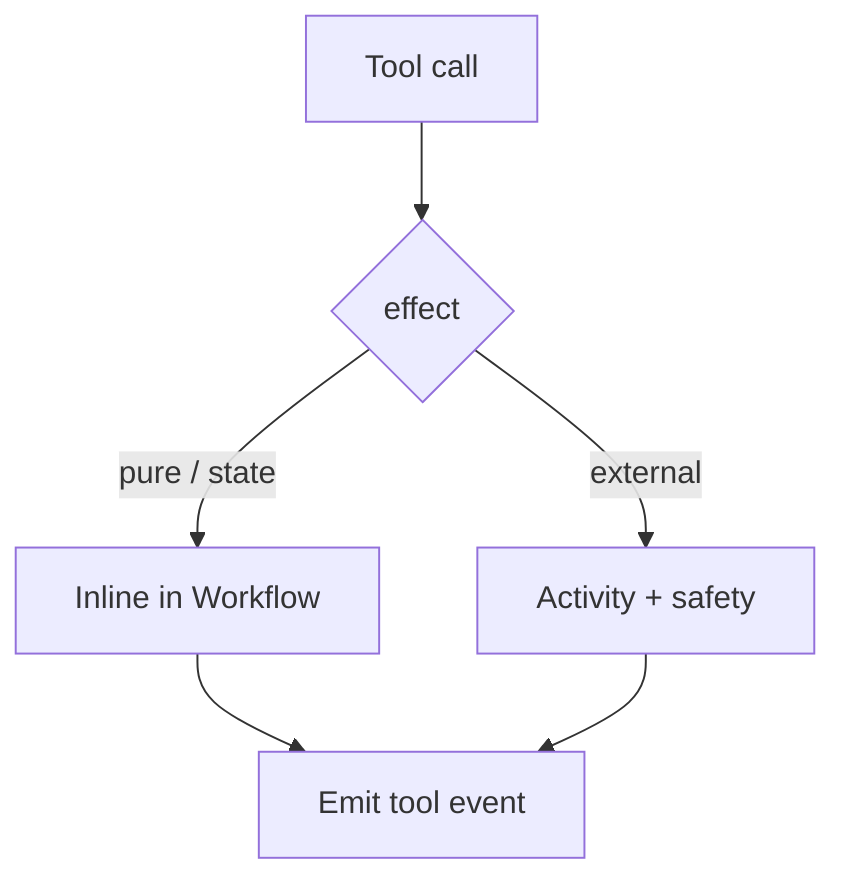

<h1>Effect-Classified Tools </h1>

## Overview

The Effect-Classified Tools pattern requires every Tool to declare `pure`, `state`, or `external` so the runtime knows whether the call may run inline in the Workflow zone or must be an Activity with explicit safety for side effects.
Primitives used: Tool registry metadata, Activity dispatch for `external`, inline handlers for `pure`/`state`, Agent Tool Loop.

## Problem

Without an effect axis, authors mix host IO into Workflow code (breaking determinism) or wrap pure transforms in Activities (adding latency and history noise).
Retry and saga policy also differ by effect class.

## Solution

1. Register Tools with a required `effect` field.
2. Reject `external` Tools that lack idempotency / saga / at-least-once declarations at startup.
3. Dispatch: `pure` and `state` run inline; `external` uses `execute_activity`.
4. Cache Activity results for replay continuity across the Turn.
5. Emit Tool events that include `effect`.



The following describes each step in the diagram:

1. The registry supplies effect metadata with each Tool.
2. Inline effects stay in the Workflow zone.
3. External effects always cross an Activity boundary.
4. Events record the effect class for observability.

```python
from datetime import timedelta
from temporalio import workflow

TOOLS = {
    "normalize": {"effect": "pure"},
    "remember": {"effect": "state"},
    "ship": {"effect": "external"},
}

@workflow.defn
class AgentTurnWorkflow:
    def __init__(self) -> None:
        self._memory: list[str] = []

    @workflow.run
    async def run(self, tool: str, arg: str) -> str:
        effect = TOOLS[tool]["effect"]
        if effect == "pure":
            return arg.strip().lower()
        if effect == "state":
            self._memory.append(arg)
            return f"stored:{len(self._memory)}"
        return await workflow.execute_activity(
            ship_external, arg, start_to_close_timeout=timedelta(seconds=30)
        )
```

## Implementation

<DaytonaRunner pattern="effect-classified-tools" />

### Effect vs Safety profile

`effect` answers *where* the Tool runs (determinism boundary).
[Safety-Profiled Tools](/safety-profiled-tools) answer *how risky* retries and Approvals are.
Declare both.

### Startup validation

Fail Worker boot if an `external` Tool omits safety metadata your runtime requires.

## When to use

Use this when building a Tool runtime that mixes pure transforms, Session state updates, and host IO.
Skip a formal taxonomy only for tiny demos with a handful of Activity Tools.

## Benefits and trade-offs

You keep Workflows deterministic and make retry policy obvious.
Authors must classify correctly; mis-tagged `pure` Tools that touch IO break replay.

## Comparison with alternatives

| Axis | Classes |
| :--- | :--- |
| Effect (this pattern) | pure / state / external |
| Safety profile | inherently safe / idempotent / non-idempotent |

## Best practices

- **Treat unknown effect as invalid**, not as external by default without review.
- **Keep `state` bounded** (Session memory size).
- **Document saga hooks** for non-idempotent external Tools.

## Common pitfalls

- **Running HTTP inside `pure`.** Replay diverges.
- **Using Local Activities to fix missing external tags.** Local still has different failure semantics.
- **Omitting effect on events.** Debugging becomes guesswork.

## Related patterns

- [Activity Tool](/activity-tool)
- [Local Activity Tools](/local-activity-tools)
- [Workflow Tool](/workflow-tool)
- [Safety-Profiled Tools](/safety-profiled-tools)
- [Tool Compensation](/tool-compensation)

## Sample code

- [Python sample](https://github.com/temporal-sa/temporal-agentic-patterns/tree/main/sandbox-runner/patterns/effect-classified-tools/python)
- [Temporal Activities](https://docs.temporal.io/activities)

## References

- [Temporal Python SDK](https://docs.temporal.io/develop/python)
- [Workflows](https://docs.temporal.io/workflows)
