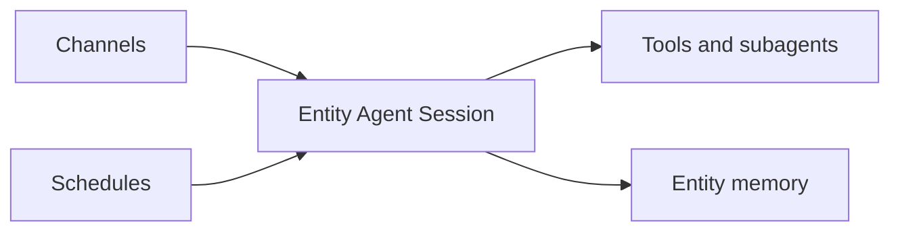

<h1>Entity Agent </h1>

## Overview

The Entity Agent pattern models a long-lived business entity as an agent.
One Workflow per entity (account, workspace, user) owns its tools, policies, and subagents.
All agentic work for that entity routes through the same Workflow for the entity lifetime.
Primitives used: Session bound to entity ID, Entity Workflow lifetime, Continue-As-New Session.

## Problem

If each request spins a new agent session, entity policies, memory, and in-flight approvals scatter.
Operators cannot ask one durable address what the entity agent is doing.

## Solution

Set `session_id` (or Workflow ID) to the entity ID.
Route every channel message, schedule, and subagent call for that entity through the same Session Workflow.
Use Continue-As-New to keep history bounded over months or years.



The following describes each step in the diagram:

1. An entity ID (account, workspace) becomes the durable Session ID.
2. All inputs for that entity signal or update the same Workflow.
3. The agent applies entity-scoped policies, memory, and tools.
4. Continue-As-New preserves identity while resetting history.

```python
# Workflow ID == entity id
await client.start_workflow(
    EntityAgentWorkflow.run,
    args=[account_id],
    id=f"account-{account_id}",
    task_queue=TASK_QUEUE,
    start_signal="user_message",
    start_signal_args=[text],
)
```

## Implementation

### Routing

HTTP and messaging channels must derive the entity ID deterministically so retries hit the same Workflow.

### Lifecycle

Define when the entity agent completes (account closed) versus idles durably forever.
For interactive chat Sessions that should release sandboxes, use [Session Idle Eviction](/session-idle-eviction); Entity Agents usually park (Continue-As-New) rather than auto-complete.

## When to use

Use Entity Agents for per-account or per-workspace assistants with ongoing state.
Use short Session Workflows for one-off jobs without an entity lifetime.

## Benefits and trade-offs

You get one source of truth for entity agent state and policy.
You must operate long-lived Workflows carefully (Continue-As-New, visibility).

## Comparison with alternatives

| Approach | Continuity | Addressability |
| :--- | :--- | :--- |
| Entity Agent | High | Stable entity ID |
| New session per chat | Low | Ephemeral |
| Shared global agent | Medium | Contended |

## Best practices

- **Align IDs with the business key.** Avoid random UUIDs for entity sessions.
- **Scope tools to the entity.** Prevent cross-tenant data access in tool arguments.
- **Idle durably.** Prefer signals over busy loops while waiting.

## Common pitfalls

- **One Workflow for all entities.** Creates a hotspot and mixes tenancy.
- **Never Continue-As-New.** History grows without bound.
- **Caching Run IDs in clients.** Breaks after Continue-As-New.
- **Completing the entity Workflow on idle instead of parking.** Idle entities should wait on Signals; completing drops the durable address.

## Related patterns

- [Session Workflow](/session-workflow)
- [Continue-As-New Session](/continue-as-new-session)
- [Session Idle Eviction](/session-idle-eviction)
- [Session with Signal-and-Start](/session-signal-and-start)
- [Scheduled Agent Turns](/scheduled-agent-turns)

## Sample code

See related runnable samples under `sandbox-runner/patterns/` when this pattern builds on Session Workflow, Activity Tool, or Code Mode.

## References

- [Temporal Docs: Workflow ID](https://docs.temporal.io/workflow-execution/workflowid-runid)
- [Temporal Docs: Continue-As-New](https://docs.temporal.io/workflow-execution/continue-as-new)
