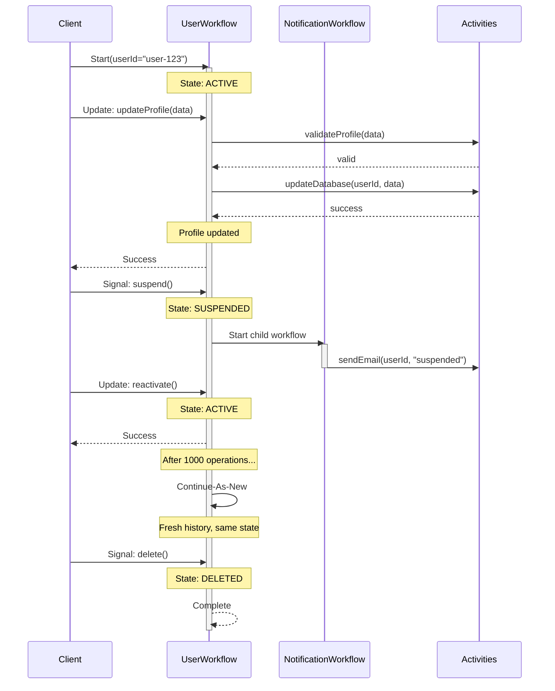

# Entity Workflow Pattern

## Overview

The Entity Workflow pattern models long-lived business entities (users, accounts, devices, orders) as individual workflows that persist for the entity's entire lifetime—potentially months or years. Each entity gets its own workflow instance identified by the entity ID, handling all state transitions and operations for that entity through signals and updates.

## Problem

Many business domains have entities that:
- Exist for extended periods (user accounts, IoT devices, customer relationships)
- Undergo multiple state transitions over their lifetime
- Need to maintain consistent state across operations
- Require audit trails of all changes
- Must handle concurrent operations safely

Traditional approaches struggle with:
- **Database-centric**: Complex locking, race conditions, scattered business logic
- **Event Sourcing**: Requires rebuilding state from events, complex infrastructure
- **Stateless Services**: No built-in consistency, must coordinate state externally
- **Short-lived Workflows**: Don't model the full entity lifecycle

## Solution

Create one workflow per entity, using the entity ID as the workflow ID. The workflow runs for the entity's entire lifetime, maintaining state in workflow variables and handling operations via signals and updates. Use Continue-As-New periodically to prevent unbounded history growth.



## Implementation

::: code-group

```java [Java]
@WorkflowInterface
public interface UserAccountWorkflow {
  @WorkflowMethod
  void run(String userId);
  
  @UpdateMethod
  void updateProfile(ProfileData data);
  
  @UpdateMethod
  void changeEmail(String newEmail);
  
  @SignalMethod
  void suspend();
  
  @SignalMethod
  void reactivate();
  
  @SignalMethod
  void delete();
  
  @QueryMethod
  UserState getState();
}

public class UserAccountWorkflowImpl implements UserAccountWorkflow {
  private String userId;
  private UserState state = new UserState();
  private boolean deleted = false;
  private int operationCount = 0;
  private static final int CONTINUE_AS_NEW_THRESHOLD = 1000;
  
  @Override
  public void run(String userId) {
    this.userId = userId;
    state.setStatus("ACTIVE");
    state.setCreatedAt(Workflow.currentTimeMillis());
    
    // Run until deleted
    Workflow.await(() -> deleted);
    
    state.setStatus("DELETED");
    state.setDeletedAt(Workflow.currentTimeMillis());
  }
  
  @Override
  public void updateProfile(ProfileData data) {
    validateNotDeleted();
    
    // Validate via activity
    Activities.validateProfile(data);
    
    state.setProfile(data);
    state.setUpdatedAt(Workflow.currentTimeMillis());
    
    checkContinueAsNew();
  }
  
  @Override
  public void changeEmail(String newEmail) {
    validateNotDeleted();
    
    // Send verification email via activity
    Activities.sendVerificationEmail(userId, newEmail);
    
    state.setPendingEmail(newEmail);
    state.setUpdatedAt(Workflow.currentTimeMillis());
    
    checkContinueAsNew();
  }
  
  @Override
  public void suspend() {
    if (!deleted && !"SUSPENDED".equals(state.getStatus())) {
      state.setStatus("SUSPENDED");
      state.setUpdatedAt(Workflow.currentTimeMillis());
      checkContinueAsNew();
    }
  }
  
  @Override
  public void reactivate() {
    if (!deleted && "SUSPENDED".equals(state.getStatus())) {
      state.setStatus("ACTIVE");
      state.setUpdatedAt(Workflow.currentTimeMillis());
      checkContinueAsNew();
    }
  }
  
  @Override
  public void delete() {
    deleted = true;
  }
  
  @Override
  public UserState getState() {
    return state;
  }
  
  private void validateNotDeleted() {
    if (deleted) {
      throw new IllegalStateException("User account is deleted");
    }
  }
  
  private void checkContinueAsNew() {
    operationCount++;
    if (operationCount >= CONTINUE_AS_NEW_THRESHOLD) {
      Workflow.continueAsNew(userId, state);
    }
  }
}
```

```go [Go]
type UserAccountWorkflow struct{}

type UserState struct {
	Status      string
	Profile     ProfileData
	PendingEmail string
	CreatedAt   time.Time
	UpdatedAt   time.Time
}

func (w *UserAccountWorkflow) Run(ctx workflow.Context, userId string) error {
	state := UserState{
		Status:    "ACTIVE",
		CreatedAt: workflow.Now(ctx),
	}
	deleted := false
	operationCount := 0
	
	err := workflow.SetUpdateHandler(ctx, "updateProfile", func(ctx workflow.Context, data ProfileData) error {
		if deleted {
			return errors.New("user account is deleted")
		}
		
		// Validate via activity
		if err := workflow.ExecuteActivity(ctx, ValidateProfile, data).Get(ctx, nil); err != nil {
			return err
		}
		
		state.Profile = data
		state.UpdatedAt = workflow.Now(ctx)
		operationCount++
		
		if operationCount >= 1000 {
			return workflow.NewContinueAsNewError(ctx, w.Run, userId)
		}
		return nil
	})
	if err != nil {
		return err
	}
	
	err = workflow.SetUpdateHandler(ctx, "suspend", func(ctx workflow.Context) error {
		if !deleted && state.Status != "SUSPENDED" {
			state.Status = "SUSPENDED"
			state.UpdatedAt = workflow.Now(ctx)
			operationCount++
		}
		return nil
	})
	if err != nil {
		return err
	}
	
	workflow.GetSignalChannel(ctx, "delete").Receive(ctx, nil)
	deleted = true
	state.Status = "DELETED"
	
	return nil
}
```

```typescript [TypeScript]
import { condition, defineUpdate, defineSignal, defineQuery, setHandler } from '@temporalio/workflow';

interface UserState {
  status: string;
  profile?: ProfileData;
  pendingEmail?: string;
  createdAt: number;
  updatedAt: number;
}

export const updateProfileUpdate = defineUpdate<ProfileData, void>('updateProfile');
export const suspendSignal = defineSignal('suspend');
export const deleteSignal = defineSignal('delete');
export const getStateQuery = defineQuery<UserState>('getState');

export async function userAccountWorkflow(userId: string): Promise<void> {
  const state: UserState = {
    status: 'ACTIVE',
    createdAt: Date.now(),
    updatedAt: Date.now(),
  };
  
  let deleted = false;
  let operationCount = 0;
  
  setHandler(updateProfileUpdate, async (data: ProfileData) => {
    if (deleted) {
      throw new Error('User account is deleted');
    }
    
    // Validate via activity
    await activities.validateProfile(data);
    
    state.profile = data;
    state.updatedAt = Date.now();
    operationCount++;
    
    if (operationCount >= 1000) {
      await continueAsNew<typeof userAccountWorkflow>(userId);
    }
  });
  
  setHandler(suspendSignal, () => {
    if (!deleted && state.status !== 'SUSPENDED') {
      state.status = 'SUSPENDED';
      state.updatedAt = Date.now();
      operationCount++;
    }
  });
  
  setHandler(deleteSignal, () => {
    deleted = true;
  });
  
  setHandler(getStateQuery, () => state);
  
  await condition(() => deleted);
  state.status = 'DELETED';
}
```

:::

## Key Components

1. **Entity ID as Workflow ID**: Ensures one workflow per entity, enables idempotent starts
2. **Long-Running Loop**: Workflow runs until entity is deleted/decommissioned
3. **State in Variables**: All entity state stored in workflow variables
4. **Signals for Events**: Asynchronous state changes (telemetry, notifications)
5. **Updates for Operations**: Synchronous operations with validation and results
6. **Queries for State**: Read current entity state without modification
7. **Continue-As-New**: Prevents unbounded history after many operations
8. **Activities for Side Effects**: External calls (emails, storage, APIs)

## When to Use

**Ideal for:**
- User accounts and profiles
- IoT devices and sensors
- Customer relationships (CRM)
- Shopping carts and orders
- Financial accounts
- Subscription management
- Device provisioning and lifecycle
- Multi-tenant resources

**Not ideal for:**
- Short-lived processes (use regular workflows)
- Stateless operations (use activities)
- High-frequency updates (>100/sec per entity)
- Entities with simple CRUD (use database)

## Benefits

- **Consistency**: All operations on entity go through single workflow—no race conditions
- **Audit Trail**: Complete history of all state changes in workflow history
- **Business Logic Centralization**: All entity logic in one place
- **Durable State**: State survives process crashes and restarts
- **Temporal Guarantees**: Exactly-once execution, automatic retries
- **Query Support**: Inspect current state without side effects
- **Event Handling**: React to signals and updates deterministically

## Trade-offs

- **History Growth**: Must use Continue-As-New to prevent unbounded history
- **Throughput Limits**: Single workflow handles all operations for one entity
- **Memory Usage**: State kept in workflow memory (use activities for large data)
- **Workflow Count**: One workflow per entity (consider costs at scale)
- **Cold Start**: First operation after idle may have latency

## How It Works

1. **Start**: Client starts workflow with entity ID as workflow ID
2. **Idempotent**: If workflow exists, start is ignored (idempotent)
3. **State Management**: Workflow maintains entity state in variables
4. **Operations**: Signals and updates modify state deterministically
5. **Queries**: Read state without blocking or modifying
6. **Continue-As-New**: After N operations, continue with fresh history
7. **Completion**: Workflow completes when entity is deleted/decommissioned

## Best Practices

1. **Use Entity ID as Workflow ID**: Ensures uniqueness and idempotent starts
2. **Implement Continue-As-New**: Prevent unbounded history (every 500-1000 operations)
3. **Validate in Updates**: Use updates for operations requiring validation
4. **Use Signals for Events**: Async notifications that don't need responses
5. **Keep State Minimal**: Store large data externally, reference in workflow
6. **Add Queries**: Expose state for monitoring and debugging
7. **Handle Deletion**: Implement explicit deletion/decommission signal
8. **Version Carefully**: Use worker versioning for workflow code changes
9. **Set Timeouts**: Use workflow execution timeout as safety net
10. **Monitor History Size**: Alert when approaching Continue-As-New threshold

## Comparison with Alternatives

| Approach | Consistency | Audit Trail | Complexity | Scalability |
|----------|-------------|-------------|------------|-------------|
| Entity Workflow | Strong | Complete | Low | High (per entity) |
| Database + Locks | Eventual | Manual | High | Very High |
| Event Sourcing | Strong | Complete | High | High |
| Stateless Service | Weak | Manual | Medium | Very High |

## Related Patterns

- **[Continue-As-New](continue-as-new.md)**: Essential for preventing unbounded history
- **[Request-Response via Updates](request-response-via-updates.md)**: Synchronous operations with validation
- **Signal-With-Start**: Idempotent workflow start with initial signal
- **Query for State Inspection**: Reading entity state

## References

- [Temporal Blog: Very Long-Running Workflows](https://temporal.io/blog/very-long-running-workflows)
- [Temporal Docs: Continue-As-New](https://docs.temporal.io/workflows#continue-as-new)
