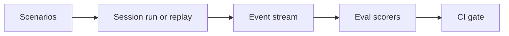

<h1>Eval-Backed Behavior Checks </h1>

## Overview

The Eval-Backed Behavior Checks pattern runs model-backed or rule-backed evals against recorded sessions or synthetic scenarios.
Evals look for regressions (unsafe actions, wrong answers, missing approvals) and integrate with CI/CD as part of agent rollout.
Primitives used: recorded Event Stream, eval suite under `evals/`, CI gates.

## Problem

Agents change behavior when prompts, tools, or models change.
Unit tests alone cannot catch missing approvals or unsafe tool use.

## Solution

Keep scenario fixtures and scorers next to the agent.
Replay or simulate sessions, score the event stream, and fail the build on regressions.



The following describes each step in the diagram:

1. Authors add scenarios that expect approvals, refusals, or answers.
2. CI runs the agent (often with stub models) or replays recorded streams.
3. Scorers inspect events for required patterns.
4. Failures block rollout.

```python
def test_payment_requires_approval(events):
    assert any(e["type"] == "approval_requested" for e in events)
    assert not any(
        e["type"] == "tool_call_completed" and e["tool_id"] == "charge"
        for e in events
        if not approval_granted_before(e, events)
    )
```

## Implementation

### Stub models

Prefer deterministic stub models in CI for speed and stability; run a smaller suite against live models nightly if needed.

### Event-first scoring

Score the Standardized Event Stream so evals stay UI-agnostic.

## When to use

Use before promoting agent changes that touch tools, policies, or prompts.
Skip only for experimental spikes that never ship.

## Benefits and trade-offs

You catch safety regressions early.
You maintain fixtures as product behavior evolves.

## Comparison with alternatives

| Check type | Strength |
| :--- | :--- |
| Event rule scorers | Stable, fast |
| Model-as-judge | Flexible, flaky |
| Manual QA only | Slow |

## Best practices

- **Assert approvals for dangerous tools.**
- **Keep golden event sequences small and focused.**
- **Version fixtures with tool schema changes.**

## Common pitfalls

- **Scoring free-text only.** Prefer events.
- **Live-model CI without flake budgets.**

## Related patterns

- [Standardized Event Stream](/standardized-event-stream)
- [Approval-Gated Tools](/approval-gated-tools)
- [Filesystem Authoring](/filesystem-authoring)

## Sample code

See related runnable samples under `sandbox-runner/patterns/` when this pattern builds on Session Workflow, Activity Tool, or Code Mode.

## References

- [Temporal Docs: Testing](https://docs.temporal.io/develop/testing-suite)
