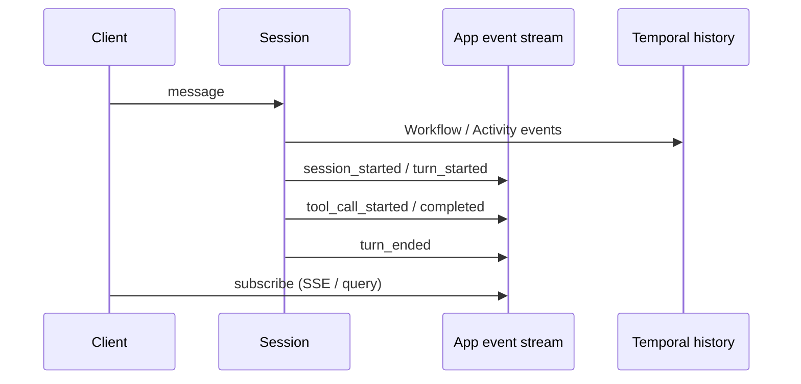

# Event Stream

## Overview

An event stream is the ordered, application-level record of Session, Turn, and Step lifecycle.
It is what UIs, audits, and evals consume—distinct from Temporal Workflow history, even though both are ordered.

## Problem

Temporal history is complete for replay, but it is verbose, worker-oriented, and awkward for product UIs.
Ad-hoc logs omit IDs, reorder under concurrency, or vanish when a process dies.
You need a stable contract of agent events that observers can tail without reading Temporal history.

## Solution

Append typed events as the Session executes, with shared metadata on every record:

The following describes each step in the diagram:

1. Client input starts or continues a Session Workflow; Temporal records Workflow and Activity history for durability and replay.
2. The Session appends application events (`session_started`, `turn_started`, step and tool events, approvals, `turn_ended`).
3. Each event carries `session_id`, `turn_id`, `step_id` (when applicable), sequence number, and a type-specific payload.
4. Clients subscribe to the app stream (SSE, NDJSON, or queries)—not to raw Temporal history—to render progress and audits.

Keep sequence numbers (or causal links) so late consumers can rebuild order even if delivery is at-least-once.

## When to use

Define an event stream for any Session that surfaces progress, powers evals, or needs an audit trail.
Skip a separate stream only for throwaway prototypes where Temporal history is enough.

## Benefits and trade-offs

A dedicated stream gives product and ops a stable schema without exposing Temporal internals.
The trade-off is storage and an append path you must keep consistent with Workflow state.

## Comparison with alternatives

| Approach | UI-friendly | Replay source of truth |
| :--- | :--- | :--- |
| App event stream + Temporal history | High | Temporal history |
| Temporal history only | Low | Temporal history |
| Unstructured logs | Medium | Neither |

## Best practices

- **Version the protocol.** Include `protocol_version` so consumers can evolve.
- **Emit start and end (or failure) for Turns and Steps.** Partial streams are hard to render.
- **Externalize long streams.** Keep sequence state in the Workflow; append payloads via Activities when history would bloat.
- **Mirror key fields as Search Attributes** for operations (`sessionId`, status).

## Common pitfalls

- **Treating Temporal history as the product API.** Schema and volume are wrong for clients.
- **Events without IDs.** Correlation across subagents and Continue-As-New fails.
- **Mutating past events.** Append-only streams keep audits honest.

## Related patterns

- [Standardized Event Stream](/standardized-event-stream)
- [Progress Streaming](/progress-streaming)
- [Agent Tracing](/agent-tracing)
- [Cost & Token Accounting](/cost-token-accounting)
- [Session Workflow](/session-workflow)

## Sample code

See [Standardized Event Stream](/standardized-event-stream) for event types and storage notes.

## References

- [Temporal Docs: Workflows](https://docs.temporal.io/workflows)
- [Temporal Docs: Event History](https://docs.temporal.io/encyclopedia/event-history)
