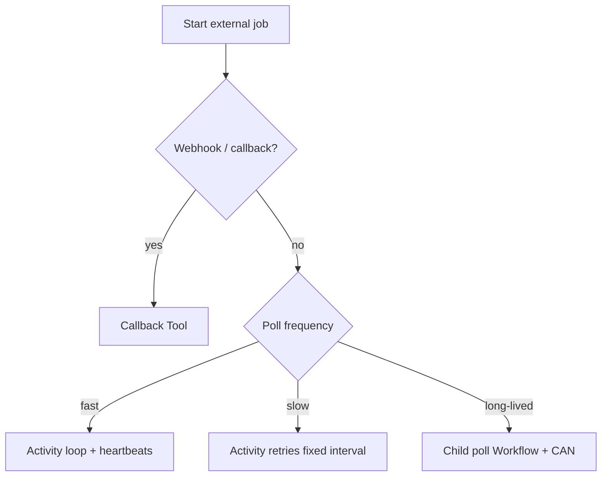

<h1>External Tool Polling </h1>

## Overview

The External Tool Polling pattern waits for an asynchronous external job (batch score, export, provider "job id") when the tool API has no webhook or Callback Tool path—using Activity-loop heartbeats for frequent polls or retry-backoff Activities for infrequent polls.
Primitives used: Activity Tool, Heartbeat Long Steps, optional Child Workflow poll loops, Callback Tool as the preferred alternative.

## Problem

Many agent tools start work and return a job id.
Without callbacks, the Turn must learn when the job finishes.
Naive Workflow `sleep` + Activity loops bloat history; hot-polling without heartbeats looks dead; unbounded polls never respect Turn cancel.

## Solution

Prefer [Callback Tool](/callback-tool) or provider webhooks when available.
When you must poll, pick a strategy by frequency:

1. **Frequent (≤ ~1s):** loop inside one Activity, heartbeat, honor cancel.
2. **Infrequent (≥ ~1m):** one Activity attempt per poll with RetryPolicy fixed interval (`backoff_coefficient=1`) until success or non-retryable failure.
3. **Long / evolving polls:** Child Workflow with Continue-As-New so the parent Turn stays small.



The following describes each step in the diagram:

1. The tool starts remote work and receives a job id.
2. If the provider can callback, wait on a Callback Tool instead of polling.
3. Otherwise choose fast in-Activity polling, slow retry-backoff polling, or a Child poll Workflow.
4. Completion returns to the Turn as a normal tool result; cancel stops heartbeats/retries.

```python
import asyncio
from datetime import timedelta

from temporalio import activity, workflow
from temporalio.common import RetryPolicy
from temporalio.exceptions import ApplicationError

@activity.defn
async def poll_job_until_done(job_id: str) -> dict:
    while True:
        if activity.is_cancelled():
            raise asyncio.CancelledError()
        status = await provider_get_job(job_id)
        activity.heartbeat(status.get("progress"))
        if status["state"] == "done":
            return status["result"]
        if status["state"] == "failed":
            raise ApplicationError("job failed", non_retryable=True)
        await asyncio.sleep(1)

# Infrequent alternative: single check per Activity attempt
@activity.defn
async def check_job_once(job_id: str) -> dict:
    status = await provider_get_job(job_id)
    if status["state"] != "done":
        raise ApplicationError("not ready", non_retryable=False)
    return status["result"]

# Turn uses RetryPolicy(initial_interval=timedelta(minutes=1), backoff_coefficient=1.0)
```

## Implementation

<DaytonaRunner pattern="external-tool-polling" />


### Progress and UX

Heartbeat progress percentages or phases; publish coarse updates on [Progress Streaming](/progress-streaming) (not every poll tick).

### Rate limits

Pair slow polls with [Downstream Tool Rate Limiting](/downstream-tool-rate-limiting) so many Sessions do not stampede `get_job`.

### Idempotency

Starting the remote job must be idempotent (job id keyed by `turn_id` / step id) so Activity retry does not create duplicate jobs.

### Prefer not to poll

If you control the other side, have it Signal/Update the Session or complete a Callback Tool when finished.

## When to use

Use when a tool's external API is job-based and cannot push completion.
Prefer Callback Tool for browser/client completion and webhooks for server-to-server completion.

## Benefits and trade-offs

You integrate stubborn async APIs without leaving the durable Turn.
You spend poll quota and must tune frequency vs latency vs history growth.

## Comparison with alternatives

| Approach | History impact | Best for |
| :--- | :--- | :--- |
| Callback Tool / webhook | Low | When push exists |
| Frequent Activity loop | One long Activity | Sub-second polls |
| Retry-backoff Activity | One event per poll | Minute+ polls |
| Child poll Workflow | Isolated history | Hours-long jobs |

## Best practices

- **Key job creation with step_id.**
- **Honor Turn cancel inside poll loops.**
- **Cap total poll wall time** with schedule_to_close or Turn timeout.
- **Record final job id and outcome** in the event stream.

## Common pitfalls

- **Workflow-level sleep loops** that add a history event every tick.
- **Polling without heartbeats** on long Activities.
- **Creating a new remote job on every poll retry.**
- **Hot-polling a rate-limited status API** from hundreds of Sessions.

## Related patterns

- [Callback Tool](/callback-tool)
- [Activity Tool](/activity-tool)
- [Heartbeat Long Steps](/heartbeat-long-steps)
- [Downstream Tool Rate Limiting](/downstream-tool-rate-limiting)
- [Progress Streaming](/progress-streaming)
- [Fast/Slow Tool Retries](/fast-slow-tool-retries)

## Sample code

- [`sandbox-runner/patterns/external-tool-polling/python/`](https://github.com/temporal-sa/temporal-agentic-patterns/tree/main/sandbox-runner/patterns/external-tool-polling/python)

## References

- [Temporal Docs: Activity heartbeats](https://docs.temporal.io/encyclopedia/detecting-activity-failures#activity-heartbeat)
- [Temporal Docs: Retry policies](https://docs.temporal.io/encyclopedia/retry-policies)
