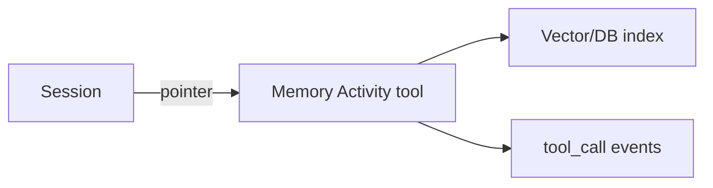

<h1>Externalized Memory </h1>

## Overview

The Externalized Memory pattern pushes large or specialized memory (search indexes, logs, vector stores) behind tools and Activities.
The agent never mutates external memory in-place without going through a durable, approval-aware tool call.
Primitives used: Activity Tools for memory IO, Session pointers, evented tool calls.

## Problem

Vector indexes and large corpora do not fit in Workflow state.
Direct SDK access from random code paths skips retries and approvals.

## Solution

Expose `memory_search`, `memory_upsert`, and similar as Activity tools.
Session state holds only handles, cursors, and small summaries.



The following describes each step in the diagram:

1. The Turn needs large-context retrieval or storage.
2. It calls a memory tool Activity with a schema-validated query or record.
3. The Activity talks to the external index.
4. The Session stores only the returned IDs or snippets it needs.

```python
hits = await workflow.execute_activity(
    memory_search,
    args=[collection, query, 5],
    start_to_close_timeout=timedelta(seconds=30),
)
self._memory["last_hits"] = [h["id"] for h in hits]
```

## Implementation

### Approvals

Treat upserts/deletes as non-idempotent or idempotent_side_effect with keys.

### Replay

Completed retrievals replay from Activity results; do not re-query inside the Workflow.

## When to use

Use for search indexes, document stores, and bulky artifacts.
Keep tiny summaries in Session Memory.

## Benefits and trade-offs

You scale memory beyond Workflow limits with durable calls.
External systems add their own failure modes.

## Comparison with alternatives

| Store location | Fits Workflow history | Policy surface |
| :--- | :--- | :--- |
| Externalized via tools | No need | Tool profiles |
| Inline Session state | Only if small | Limited |
| Hidden global client | Risky | None |

## Best practices

- **Return IDs + short snippets.**
- **Idempotency keys on upserts.**
- **Redact sensitive hits in events.**

## Common pitfalls

- **Embedding full documents in Activity results forever.**
- **Bypassing tools with a shared singleton client in Workflow imports.**

## Related patterns

- [Session Memory](/session-memory)
- [Activity Tool](/activity-tool)
- [Safety-Profiled Tools](/safety-profiled-tools)

## Sample code

See related runnable samples under `sandbox-runner/patterns/` when this pattern builds on Session Workflow, Activity Tool, or Code Mode.

## References

- [Temporal Docs: Activities](https://docs.temporal.io/activities)
