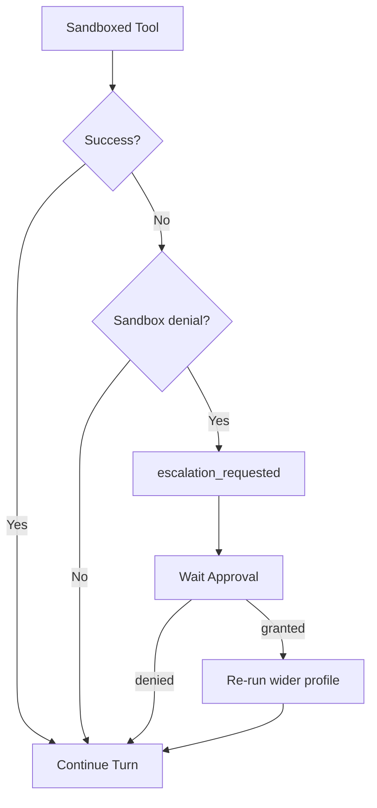

<h1>Failure-Triggered Approval </h1>

## Overview

The Failure-Triggered Approval pattern runs a Tool under a restricted Sandbox first and parks for human Approval only when the failure looks like a policy denial—then optionally re-runs without the Sandbox after grant.
Primitives used: Approval wait (Signal/Update), sandboxed Activity, failure classification, Agent Tool Loop.

## Problem

Pre-approving every shell command stalls coding agents.
Auto-running everything outside a Sandbox is unsafe.
You need a middle path: try under isolation, escalate only when isolation blocked the work.

## Solution

1. Execute the Tool Activity with a restricted Sandbox profile.
2. Classify the failure: Sandbox denial vs ordinary Tool error.
3. Ordinary errors return to the model as Tool results.
4. Sandbox denials emit escalation and park until grant or deny.
5. On grant, re-run the same Tool with a wider profile; on deny, feed the original error to the model.



The following describes each step in the diagram:

1. The Workflow runs the Tool under the Session Sandbox profile.
2. A classifier marks permission-denied style failures as escalations.
3. The Session parks without holding a Worker thread.
4. Grant re-runs once with a wider profile; deny returns the original failure to the model.

```python
from datetime import timedelta
from temporalio import workflow
from temporalio.exceptions import ApplicationError

@workflow.defn
class AgentTurnWorkflow:
    def __init__(self) -> None:
        self._decision: str | None = None

    @workflow.signal
    def escalation_response(self, decision: str) -> None:
        self._decision = decision

    @workflow.run
    async def run(self, command: str) -> str:
        result = await workflow.execute_activity(
            run_sandboxed, command, start_to_close_timeout=timedelta(seconds=30)
        )
        if result["ok"]:
            return result["output"]
        if not result["sandbox_denial"]:
            return f"tool_error:{result['output']}"
        await workflow.wait_condition(lambda: self._decision is not None)
        if self._decision != "granted":
            return f"escalation_denied:{result['output']}"
        return await workflow.execute_activity(
            run_unsandboxed, command, start_to_close_timeout=timedelta(seconds=30)
        )
```

## Implementation

<DaytonaRunner pattern="failure-triggered-approval" />

### Classify carefully

Match denial heuristics (permission denied, read-only filesystem, landlock) separately from ordinary exit codes.
Misclassifying application bugs as Sandbox denials trains operators to rubber-stamp escalations.

### One re-run

After grant, re-run once with a documented wider profile.
Do not loop escalate → grant → fail → escalate without a cap.

## When to use

Use this when interactive coding agents run many low-risk commands under isolation and only rarely need wider filesystem or network access.
Prefer pre-gate [Approval-Gated Tools](/approval-gated-tools) for payments and irreversible deletes.

## Benefits and trade-offs

You keep most Turns moving without HITL while still catching isolation blocks.
You risk over-trusting classifiers and granting wider access than intended.

## Comparison with alternatives

| Approach | When it fits |
| :--- | :--- |
| Failure-triggered | High volume sandboxed Tools; rare denials |
| Pre-gate Approval | Always-risky Tools |
| Never escalate | Task-mode / unattended Sessions |

## Best practices

- **Fail closed on timeout.** Missing decisions must not widen the Sandbox.
- **Include command + denial reason** on the escalation event.
- **Audit the wider re-run** with a distinct event type.

## Common pitfalls

- **Escalating ordinary failures.** Operators burn out and approve blindly.
- **Re-running with full access by default.** Prefer the smallest wider profile that unblocks the denial.
- **No Session mode check.** Task-mode Sessions should not park for escalations.

## Related patterns

- [Approval-Gated Tools](/approval-gated-tools)
- [Sandbox Profile Tiers](/sandbox-profile-tiers)
- [Command Safety Classification](/command-safety-classification)
- [Task-Mode Session](/task-mode-session)
- [Session-Scoped Approvals](/session-scoped-approvals)

## Sample code

- [Python sample](https://github.com/temporal-sa/temporal-agentic-patterns/tree/main/sandbox-runner/patterns/failure-triggered-approval/python)
- [Temporal Workflows](https://docs.temporal.io/workflows)

## References

- [Temporal Python SDK](https://docs.temporal.io/develop/python)
- [Activities](https://docs.temporal.io/activities)
