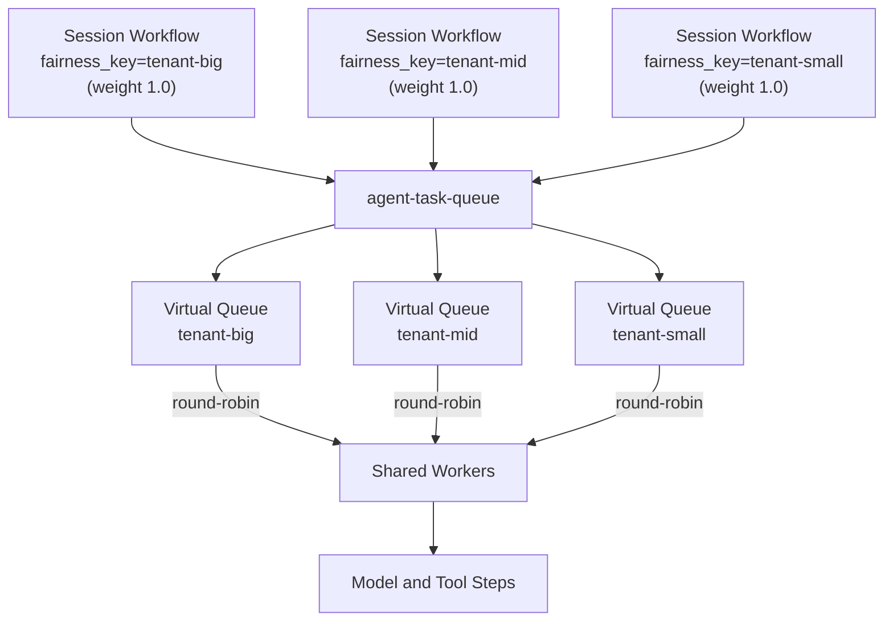

<h1>Fairness </h1>

## Overview

The Fairness pattern assigns a `fairness_key` and optional `fairness_weight` to Session Workflows, model Activities, and child subagents so each tenant receives a proportional share of Worker capacity on a shared Task Queue.
Primitives used: Session, Turn, Step, Child Workflow, Task Queue fairness.

## Problem

Multi-tenant agent platforms often run many Session Workflows on one Task Queue.
A single hot tenant can flood the queue with Turns, model Steps, and fan-out subagents, occupying every Worker slot while quieter tenants wait.
Dedicated queues per tenant waste idle capacity and force a new Worker deployment for every account.

## Solution

Attach Temporal's native Fairness fields when you start a Session Workflow, schedule a model or tool Activity, or spawn a child subagent.
The matching service keeps a virtual queue per fairness key and dispatches in weighted round-robin order.
One shared Worker pool serves all tenants; weights decide relative share, not hard isolation.

For example, weights of `5.0`, `3.0`, and `2.0` for `premium`, `basic`, and `free` tiers yield roughly 50% / 30% / 20% of dispatches among those keys, regardless of backlog depth.
Within one fairness key, tasks remain FIFO.



The following describes each step in the diagram:

1. Each Session starts with a `fairness_key` that identifies the tenant (or tier) and an optional `fairness_weight`.
2. The matching service routes Workflow and Activity tasks into the virtual queue for that key inside the single Task Queue.
3. Workers poll the Task Queue and receive tasks in weighted round-robin order across keys.
4. A flood of Turns from `tenant-big` does not prevent `tenant-mid` or `tenant-small` Sessions from receiving Worker capacity.

```python
from datetime import timedelta
from temporalio.common import Priority
from temporalio import workflow

# Start a multi-tenant Session with a fairness key
handle = await client.start_workflow(
    AgentSessionWorkflow.run,
    args=[tenant_id, user_message],
    id=f"session-{tenant_id}-{session_id}",
    task_queue="agent-task-queue",
    priority=Priority(
        fairness_key=tenant_id,
        fairness_weight=2.0,
    ),
)

# Inside the Session Workflow: model Steps inherit fairness unless overridden
@workflow.defn
class AgentSessionWorkflow:
    @workflow.run
    async def run(self, tenant_id: str, user_message: str) -> str:
        return await workflow.execute_activity(
            call_model,
            user_message,
            start_to_close_timeout=timedelta(minutes=2),
            priority=Priority(
                fairness_key=tenant_id,
                fairness_weight=2.0,
            ),
        )
```

## Implementation

### Enable Fairness

**Temporal Cloud:** Open the Namespace Overview in the UI and activate the Fairness toggle. Fairness is a paid Cloud feature.

**Self-hosted Temporal:** Set `matching.enableFairness` to `true` in [dynamic configuration](https://docs.temporal.io/temporal-service/configuration#dynamic-configuration) for the relevant Task Queues or Namespaces.

### Set fairness on Session start

Pass `Priority(fairness_key=..., fairness_weight=...)` in `start_workflow` options so every Turn in that Session inherits the key unless a child or Activity overrides it.

```python
from temporalio.common import Priority

handle = await client.start_workflow(
    AgentSessionWorkflow.run,
    args=[tenant_id, user_message],
    id=f"session-{session_id}",
    task_queue="agent-task-queue",
    priority=Priority(
        fairness_key=tenant_id,
        fairness_weight=tier_weight(tenant_id),
    ),
)
```

### Set fairness on model and tool Activities

Activities inherit the parent Session's fairness key and weight.
Override in Activity options when a Step should compete under a different key—for example, shared eval jobs under `eval` while interactive Turns keep the tenant key.
Each field (`priority_key`, `fairness_key`, `fairness_weight`) resolves independently: Task Queue weight overrides, then explicit options, then inheritance from the calling Workflow, then defaults.
Sessions that Continue-As-New inherit the current execution's priority values unless you pass new ones.
See [Inheritance](https://docs.temporal.io/develop/task-queue-priority-fairness#inheritance) in the Temporal docs.

```python
from datetime import timedelta
from temporalio import workflow
from temporalio.common import Priority

result = await workflow.execute_activity(
    call_model,
    prompt,
    start_to_close_timeout=timedelta(minutes=2),
    priority=Priority(
        fairness_key=tenant_id,
        fairness_weight=2.0,
    ),
)
```

### Set fairness on child subagents

When a parent Session fans out child subagents, set the same tenant key on each child so fan-out volume still competes under that tenant's share.

```python
from temporalio import workflow
from temporalio.common import Priority

handle = await workflow.start_child_workflow(
    ResearchSubagent.run,
    item,
    id=f"subagent-{tenant_id}-{item_id}",
    task_queue="agent-task-queue",
    priority=Priority(
        fairness_key=tenant_id,
        fairness_weight=1.0,
    ),
)
```

### Combine with Priority Task Queues

Priority chooses which sub-queue (1–5) a task enters; Fairness orders dispatch within each priority level.
Set both on the same `Priority` object when interactive Turns and batch Sessions share a queue across tenants.

```python
from temporalio.common import Priority

handle = await client.start_workflow(
    AgentSessionWorkflow.run,
    args=[tenant_id, user_message],
    id=f"session-{session_id}",
    task_queue="agent-task-queue",
    priority=Priority(
        priority_key=1,
        fairness_key=tenant_id,
        fairness_weight=2.0,
    ),
)
```

### Optional per-key rate limits

Use Task Queue config when you need absolute RPS caps in addition to proportional dispatch.
Per-key limits scale with fairness weight; pair this with [Rate-Limit Aware Model Calls](/rate-limit-aware-model-calls) so provider 429s back off without burning Worker slots.

## When to use

Use Fairness when multiple tenants share agent Workers and one account's Session flood must not starve others.
It fits dynamic tenant sets: new keys appear without new Worker deployments.
Prefer dedicated queues or stronger isolation when a tenant needs hard capacity guarantees rather than proportional soft sharing.

## Benefits and trade-offs

One Worker pool serves all tenants; idle capacity from quiet tenants helps busy ones.
Weights and per-key limits can change via Task Queue config without redeploying agent code.

Fairness requires explicit enablement on Cloud and self-hosted deployments.
Accuracy can degrade with a very large number of keys.
Weight applies at schedule time, not dispatch time: changing a weight does not reorder tasks already in the backlog.

## Comparison with alternatives

| Approach | Tenant isolation | Dynamic tenants | Shares idle capacity |
| :--- | :--- | :--- | :--- |
| Temporal FairnessKey (native) | Soft | Yes | Yes |
| [Priority Task Queues](/priority-task-queues) | Soft (by urgency) | Yes | Yes |
| Dedicated queue per tenant | Hard | No | No |
| Single shared queue (no control) | None | Yes | Yes |

## Best practices

- **Key Sessions by stable tenant identity.** Prefer account IDs or slugs over display names; keys on queued tasks cannot change retroactively.
- **Propagate the same key to subagents.** Fan-out without a key collapses into the empty-string group and can dilute isolation.
- **Combine Priority and Fairness.** Use Priority so interactive Turns beat batch evals; use Fairness so no tenant owns a priority level.
- **Monitor backlog by fairness key.** Sustained growth for one key means its weight share cannot drain its submission rate.

## Common pitfalls

- **Expecting Fairness to reorder an existing backlog.** Enabling Fairness drains the pre-existing backlog in original order first; fairness-aware dispatch applies to newly submitted tasks.
- **Treating Fairness as a hard rate limiter.** Proportional dispatch alone does not cap absolute throughput; add per-key RPS limits when you need caps.
- **Omitting fairness_key on hot paths.** Unkeyed tasks share an implicit empty-string key with weight 1.0 and compete as one group.
- **Assuming hard isolation.** Fairness controls dispatch share, not reserved Worker slots; a running Activity still occupies capacity until it completes.

## Related patterns

- [Priority Task Queues](/priority-task-queues)
- [Rate-Limit Aware Model Calls](/rate-limit-aware-model-calls)
- [Fan-Out Subagents](/fanout-subagents)
- [Session Workflow](/session-workflow)

## Sample code

See related runnable samples under `sandbox-runner/patterns/` when this pattern builds on Session Workflow, Activity Tool, or Code Mode.

Official SDK examples for fairness keys:

- [Task Queue Priority and Fairness — Temporal docs](https://docs.temporal.io/develop/task-queue-priority-fairness#task-queue-fairness)

## References

- [Temporal Docs: Task Queue Priority and Fairness](https://docs.temporal.io/develop/task-queue-priority-fairness)
- [Temporal Docs: Multi-tenant patterns](https://docs.temporal.io/production-deployment/multi-tenant-patterns)
