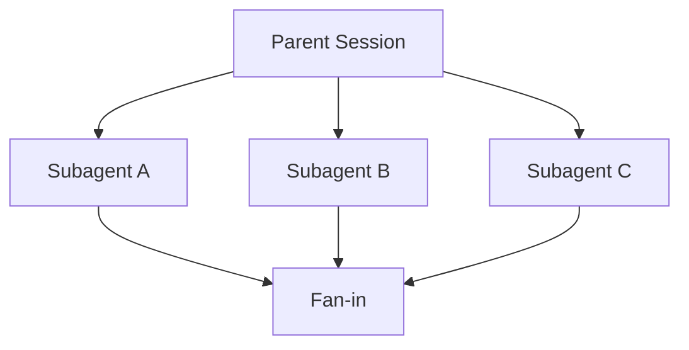

<h1>Fan-Out Subagents </h1>

## Overview

The Fan-Out Subagents pattern spawns many subagent sessions in parallel (for example one per tenant or task), then waits for them to complete.
This maps multi-agent fan-out/fan-in onto Temporal Child Workflows while preserving agent semantics and observability.
Primitives used: SubagentDefinition, SubagentHandle, Child Workflows, `subagent_started` / `subagent_completed`.

## Problem

A parent agent must research or act across many independent items.
Sequential turns are too slow; uncontrolled threads lose approvals and events.

## Solution

For each item, start a child Session (Child Workflow) as a subagent.
Record `subagent_started` with parent/child IDs, await completion (or bounded first-N), then merge results in the parent Turn.



The following describes each step in the diagram:

1. The parent Turn decides the set of child sessions.
2. Children run as durable Sessions with their own tools and events.
3. The parent awaits results and emits completion events linking parent and child IDs.

```python
# Parent Workflow fan-out example
handles = [
    await workflow.start_child_workflow(SubagentSession.run, item, id=f"{session_id}-{item}")
    for item in items
]
results = [await h for h in handles]
```

## Implementation

Bound concurrency (`maxSubagents`) and timeouts.
Propagate cancellation when the parent Turn is cancelled.
Keep parent/child links in the event stream for UI trees.

## When to use

Use fan-out when child work is independent and worth parallel wall-clock time.
Prefer a single subagent when work is tightly sequential or shared mutable state is required.

## Benefits and trade-offs

You gain throughput and isolation per child.
You pay Child Workflow overhead and must merge partial failures deliberately.

## Comparison with alternatives

| Approach | Parallelism | Isolation |
| :--- | :--- | :--- |
| Fan-Out Subagents | High | Per child session |
| Sequential subagent calls | Low | High |
| Activity parallel IO only | High | No agent semantics |

## Best practices

- **Cap fan-out.** Protect downstream systems.
- **Decide failure policy.** Fail-fast vs best-effort merge.
- **Namespace child IDs.** Include parent `session_id` prefixes.

## Common pitfalls

- **Unbounded Promise fan-out.** Exhausts workers and downstream quotas.
- **Orphan children on parent Continue-As-New.** Set Parent Close Policy intentionally.

## Related patterns

- [Subagent Toolset](/subagent-toolset)
- [Script Fan-Out](/script-fan-out)
- [Persistent Subagent Threads](/persistent-subagent-threads)

## Sample code

Compose Child Workflows with the [Session Workflow](/session-workflow) sample structure for parent and child sessions.

## References

- [Temporal Docs: Child Workflows](https://docs.temporal.io/child-workflows)
