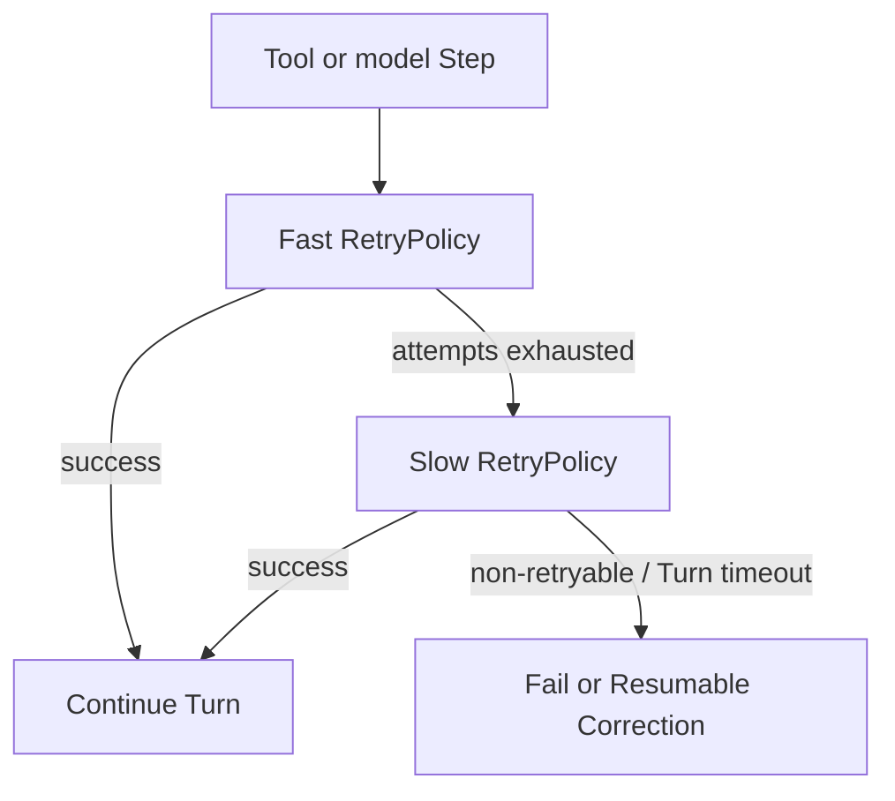

<h1>Fast/Slow Tool Retries </h1>

## Overview

The Fast/Slow Tool Retries pattern runs a model or tool Activity through two Workflow-orchestrated phases: a short, bounded fast RetryPolicy for blips, then a slow, patient RetryPolicy for extended provider or API outages—without flooding the downstream or abandoning the Turn too early.
Primitives used: Activity RetryPolicy phases, Durable Model Call / Activity Tool, optional Rate-Limit Aware delays, Turn timeouts.

## Problem

One RetryPolicy cannot serve both cases well:

- Short intervals + low max attempts: recovers from blips, fails the Turn during a 30-minute provider incident.
- Short intervals + huge max attempts: hammer a degraded API and burn tokens/cost.
- Long intervals only: interactive agents feel broken on ordinary 503s.

Agents need "try hard for a minute, then wait patiently" while the Session stays durable.

## Solution

In the Turn Workflow, execute the Activity with a **fast** RetryPolicy.
On exhaustion (`ActivityError`), execute again with a **slow** RetryPolicy (long fixed interval, higher or unlimited attempts) until success, non-retryable failure, or Turn-level timeout/cancel.



The following describes each step in the diagram:

1. The Turn starts the Activity under a fast policy (seconds-scale backoff, small max attempts).
2. Success continues the Agent Tool Loop.
3. If the fast budget is spent on retryable errors, the Workflow starts a second execute with a slow policy.
4. Non-retryable errors skip the slow phase; Turn timeout or cancel aborts both.

```python
from datetime import timedelta

from temporalio import workflow
from temporalio.common import RetryPolicy
from temporalio.exceptions import ActivityError

fast = RetryPolicy(
    initial_interval=timedelta(seconds=1),
    backoff_coefficient=1.5,
    maximum_interval=timedelta(seconds=20),
    maximum_attempts=8,
)
slow = RetryPolicy(
    initial_interval=timedelta(minutes=2),
    backoff_coefficient=1.0,
    maximum_interval=timedelta(minutes=2),
    maximum_attempts=0,  # unlimited until Turn timeout
)

async def execute_with_fast_slow(activity_fn, arg):
    try:
        return await workflow.execute_activity(
            activity_fn,
            arg,
            start_to_close_timeout=timedelta(seconds=120),
            retry_policy=fast,
        )
    except ActivityError:
        workflow.logger.warning("fast retries exhausted; entering slow phase")
        return await workflow.execute_activity(
            activity_fn,
            arg,
            start_to_close_timeout=timedelta(seconds=120),
            schedule_to_close_timeout=timedelta(hours=2),
            retry_policy=slow,
        )
```

## Implementation

<DaytonaRunner pattern="fast-slow-tool-retries" />


### When to enter the slow phase

Enter only for retryable classes ([Model Error Classification](/model-error-classification)): timeouts, 5xx, connection errors.
Do not slow-retry 401, invalid args, or content-policy failures—park with [Resumable Correction](/resumable-correction) or fail the Step.

### Rate limits

Prefer [Rate-Limit Aware Model Calls](/rate-limit-aware-model-calls) / tool `next_retry_delay` inside the Activity for 429s.
Fast/Slow sets phase budgets; `next_retry_delay` sets the next wait when the provider says so.

### Interactive vs batch

Interactive Turns should cap slow-phase wall time with `schedule_to_close_timeout` or Turn cancel.
Batch / [Scheduled Agent Turns](/scheduled-agent-turns) can afford longer slow phases.

### Events and cost

Emit `retry_phase=fast|slow` on step events and include attempt counts in Cost & Token Accounting so slow phases do not look like silent hangs.

## When to use

Use for critical model or tool Steps that must survive both blips and multi-hour outages.
Prefer a single RetryPolicy when the provider is highly available and Turns are short-lived.

## Benefits and trade-offs

You get responsive recovery and patient outage handling in one durable Turn.
You accept more Workflow logic and must bound slow phases so Sessions do not wait forever.

## Comparison with alternatives

| Approach | Blips | Long outage |
| :--- | :--- | :--- |
| Fast/Slow Tool Retries | Fast phase | Slow phase |
| Single short policy | Good | Fails early |
| Single long policy | Slow UX | Patient but sluggish |
| Queue rate limit only | Prevents bursts | Does not wait out incidents |

## Best practices

- **Classify errors before the slow phase.**
- **Bound slow phase with Turn or schedule_to_close timeouts.**
- **Alert when slow phase starts** ([Agent Step Retry Alerting](/agent-step-retry-alerting)).
- **Document per-tool profiles** next to [Tool Retry Profiles](/tool-retry-profiles).

## Common pitfalls

- **Unlimited slow retries on interactive chat** with no Turn timeout.
- **Slow-retrying non-retryable model errors.**
- **Forgetting provider Retry-After** and still hammering on 429s.
- **Double-counting tokens** across phases without attempt keys in cost events.

## Related patterns

- [Tool Retry Profiles](/tool-retry-profiles)
- [Model Timeout Profiles](/model-timeout-profiles)
- [Model Error Classification](/model-error-classification)
- [Rate-Limit Aware Model Calls](/rate-limit-aware-model-calls)
- [Provider Retry Delegation](/provider-retry-delegation)
- [Resumable Correction](/resumable-correction)
- [Agent Step Retry Alerting](/agent-step-retry-alerting)

## Sample code

- [`sandbox-runner/patterns/fast-slow-tool-retries/python/`](https://github.com/temporal-sa/temporal-agentic-patterns/tree/main/sandbox-runner/patterns/fast-slow-tool-retries/python)

## References

- [Temporal Docs: Retry policies](https://docs.temporal.io/encyclopedia/retry-policies)
- [Temporal Docs: Activity timeouts](https://docs.temporal.io/encyclopedia/detecting-activity-failures)
