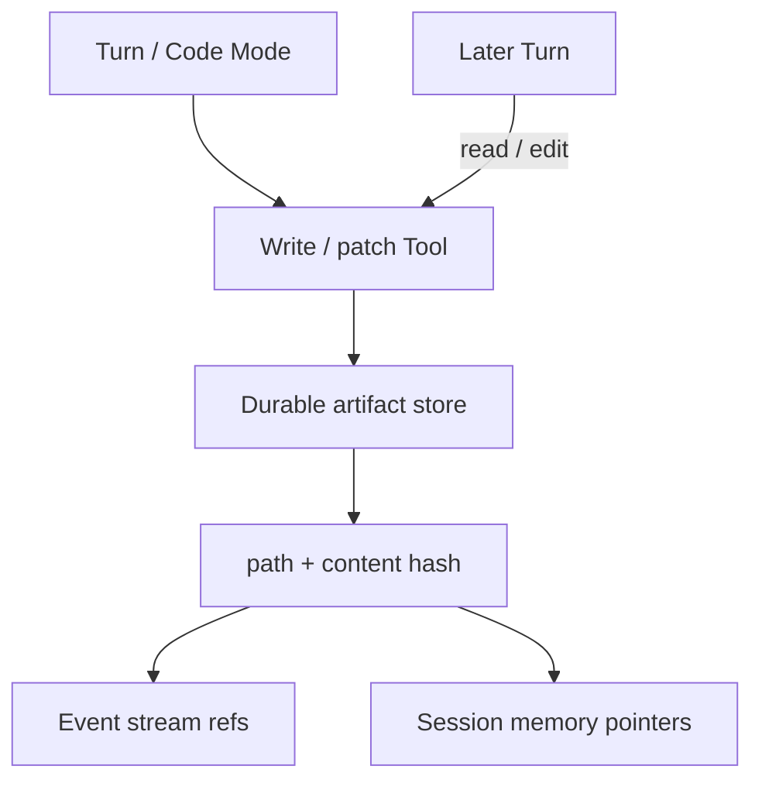

# Filesystem Authoring

## Overview

Filesystem Authoring treats files and directories as durable artifacts an agent creates, revises, and hands off—plans, code, reports, and patches—rather than only chat text in Session memory.
Paths and content hashes become part of the agent's observable work product.

## Problem

If agents keep all outputs in message history, large artifacts bloat the event stream and disappear when you summarize memory.
Ad-hoc temp directories on a worker are not durable across retries and are hard to audit.
You need shared terms for authored files as first-class Session outputs.

## Solution

Write artifacts through Tools (or sandbox host Tools) into a durable store, and reference them by path or content ID in events and memory:

The following describes each step in the diagram:

1. A Turn decides to author or revise an artifact (document, script, patch set).
2. A Tool Activity writes bytes to durable storage (object store, repo, or workspace volume under Workflow control)—not to ephemeral worker disk alone.
3. The Session records path (or URI) and content hash on the event stream and may keep a short pointer in Session memory.
4. Later Turns read or patch the same artifact by reference, so Continue-As-New does not need to carry full file bodies in Workflow state.

Identity of an artifact is the stable path or ID within a workspace scoped to the Session (or entity), plus hashes for versions.

## When to use

Use filesystem authoring when outputs are large, multi-file, or meant for humans and downstream systems to consume outside the chat transcript.
Skip it for tiny structured replies that belong in the Turn result.

## Benefits and trade-offs

Artifacts stay inspectable, diffable, and reusable across Turns without bloating Workflow history.
The trade-off is storage, path conventions, and cleanup policy for abandoned Sessions.

## Comparison with alternatives

| Approach | Size limits | Audit / handoff |
| :--- | :--- | :--- |
| Durable artifact store + refs | High | Strong |
| Full files in Session memory | Low | Weak |
| Worker `/tmp` only | Medium | Lost on retry |

## Best practices

- **Scope workspaces to Session or entity IDs.** Avoid shared writable roots across tenants.
- **Emit hashes on write.** Consumers can detect silent mutation.
- **Prefer patch Tools over rewrite** for large files when the model can target hunks.
- **Garbage-collect with Session lifetime.** Tie retention to Session end or entity archival.

## Common pitfalls

- **Writing only to the sandbox temp dir** without persisting through a host Tool.
- **Putting entire file contents into Signals or events.** Store refs instead.
- **Unclear ownership of paths** when fan-out subagents write concurrently—namespace by `turn_id` or lock.

## Related patterns

- [Externalized Memory](/externalized-memory)
- [Code Mode Orchestrator](/code-mode-orchestrator)
- [Tools-Only Sandbox](/tools-only-sandbox)
- [Session Memory](/session-memory)
- [Callback Tool](/callback-tool)

## Sample code

See [Externalized Memory](/externalized-memory) and [Code Mode Orchestrator](/code-mode-orchestrator) for patterns that move large content out of Workflow state.

## References

- [Temporal Docs: Activities](https://docs.temporal.io/activities)
- [Temporal Docs: Continue-As-New](https://docs.temporal.io/workflows#continue-as-new)
