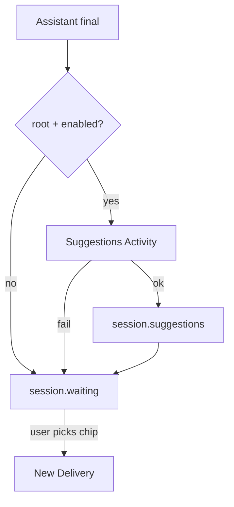

<h1>Follow-up Suggestions </h1>

## Overview

The Follow-up Suggestions pattern runs a non-fatal structured model Activity after a root Turn completes, emits suggestion chips on the Session event stream, and waits for the user to send a chosen chip as a normal Delivery—never auto-continuing the agent.
Primitives used: post-Turn Activity, Standardized Event Stream, Idempotent Delivery, Task-Mode Session exclusion.

## Problem

After a reply, users often need a nudge for the next useful ask.
Baking suggestions into the main completion couples UX chips to the reasoning Turn and makes failures block the answer.

## Solution

1. Complete the assistant final for the Turn.
2. If the Session is a root conversation and suggestions are enabled, call a short structured generation Activity.
3. Validate 1–N suggestion strings; emit `session.suggestions`.
4. Enter waiting; chips are inert until clicked.
5. A click becomes a new Delivery—not an automatic Turn.



The following describes each step in the diagram:

1. The Turn finishes its user-visible answer first.
2. Eligible Sessions start a bounded suggestions Activity.
3. Failures skip chips without failing the Turn.
4. User selection arrives as a fresh Delivery.

```python
from datetime import timedelta
from temporalio import workflow
from temporalio.common import RetryPolicy

@workflow.defn
class AgentSessionWorkflow:
    @workflow.run
    async def run(self, user_message: str, enable_suggestions: bool) -> dict:
        reply = await workflow.execute_activity(
            answer_turn, user_message, start_to_close_timeout=timedelta(seconds=30)
        )
        suggestions: list[str] = []
        if enable_suggestions:
            suggestions = await workflow.execute_activity(
                generate_suggestions,
                args=[user_message, reply],
                start_to_close_timeout=timedelta(seconds=5),
                retry_policy=RetryPolicy(maximum_attempts=1),
            )
        return {"reply": reply, "suggestions": suggestions}
```

## Implementation

<DaytonaRunner pattern="follow-up-suggestions" />

### Eligibility

Skip suggestions for [Task-Mode Session](/task-mode-session), schedules, and subagent Threads.
Root interactive Sessions only.

### Non-fatal

Cap attempts at one and swallow failures after logging.
Never block `session.waiting` on suggestion errors.

## When to use

Use this when channel UIs benefit from next-step chips after conversational Turns.
Omit for headless automation and high-cost model budgets without UX surfaces.

## Benefits and trade-offs

You improve continuation UX without coupling it to the main completion.
You add a second model call and must guard cost and latency.

## Comparison with alternatives

| Approach | Behavior |
| :--- | :--- |
| Follow-up suggestions | Separate Activity; click = Delivery |
| Inline “next steps” in reply | Couples UX to main completion |
| Auto-continue agent | Unsafe / surprising |

## Best practices

- **Max suggestions small** (about 1–5).
- **Deduplicate** near-identical strings.
- **Attribute cost** under suggestions, not the main Turn, in accounting.

## Common pitfalls

- **Auto-starting a Turn from suggestions.** Chips must be user-initiated Deliveries.
- **Running suggestions on subagents.** No human channel.
- **Retrying aggressively.** Spikes cost when the provider is down.

## Related patterns

- [Standardized Event Stream](/standardized-event-stream)
- [Idempotent Delivery](/idempotent-delivery)
- [Task-Mode Session](/task-mode-session)
- [Cost & Token Accounting](/cost-token-accounting)
- [Durable Model Call](/durable-model-call)

## Sample code

- [Python sample](https://github.com/temporal-sa/temporal-agentic-patterns/tree/main/sandbox-runner/patterns/follow-up-suggestions/python)
- [Temporal Activities](https://docs.temporal.io/activities)

## References

- [Temporal Python SDK](https://docs.temporal.io/develop/python)
- [Workflows](https://docs.temporal.io/workflows)
