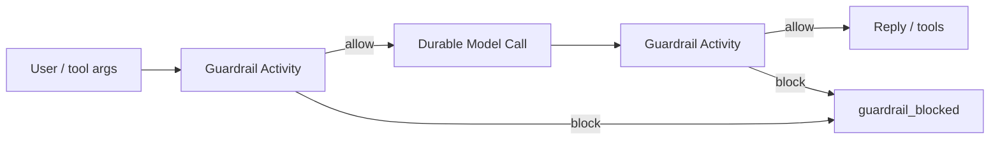

<h1>Guardrail Steps </h1>

## Overview

The Guardrail Steps pattern runs durable Activity Steps that enforce content and policy checks (PII, allowlists, jailbreak screens, output filters) before or after Durable Model Calls and tools—with retries, non-retryable rejects, and audit events.
Primitives used: Activities as Steps, ApplicationError (non-retryable), Durable Model Call / Activity Tool boundaries, Standardized Event Stream, Safety profiles.

## Problem

Prompt-only "be safe" instructions are not enforceable.
HTTP checks inside Workflow code break determinism; silent client-side filters leave no durable audit trail and vanish on retry.
Treating every policy failure as retryable burns tokens in a loop.

## Solution

Insert explicit guardrail Activities (or Local Activities for tiny pure checks) at Turn boundaries:

1. **Pre-model** — validate user input / retrieved context.
2. **Post-model** — validate assistant text or structured output before tools or channel delivery.
3. **Pre-tool** — validate tool args against allowlists after the model chooses a tool.

On block: raise a **non-retryable** ApplicationError (or return a typed `blocked` result), emit `guardrail_blocked`, and end or park the Turn—do not auto-retry the same payload.



The following describes each step in the diagram:

1. Input (or model output / tool args) enters a guardrail Activity.
2. Allow continues the Agent Tool Loop; block records an event and stops retrying that payload.
3. The Session/Turn decides whether to ask the user to revise ([Ask-User Wait](/ask-user-wait) / [Resumable Correction](/resumable-correction)) or fail the Turn.

```python
from datetime import timedelta

from temporalio import activity, workflow
from temporalio.exceptions import ApplicationError

@activity.defn
async def guardrail_check(kind: str, text: str) -> dict:
    if "FORBIDDEN" in text:
        raise ApplicationError("guardrail_blocked", type="GuardrailBlocked", non_retryable=True)
    return {"kind": kind, "status": "allow"}

@workflow.defn
class AgentTurnWorkflow:
    @workflow.run
    async def run(self, session_id: str, user_message: str) -> str:
        await workflow.execute_activity(
            guardrail_check,
            args=["pre_model", user_message],
            start_to_close_timeout=timedelta(seconds=10),
        )
        reply = await workflow.execute_activity(
            call_model,
            user_message,
            start_to_close_timeout=timedelta(seconds=60),
        )
        await workflow.execute_activity(
            guardrail_check,
            args=["post_model", reply],
            start_to_close_timeout=timedelta(seconds=10),
        )
        return reply
```

## Implementation

<DaytonaRunner pattern="guardrail-steps" />

### vs Safety-Profiled Tools

[Safety-Profiled Tools](/safety-profiled-tools) labels *how tools may be retried/approved*.
Guardrail Steps are *content/policy I/O checks* around model and tool payloads.
Use both: profile decides retry/approval; guardrails decide allow/block for a specific payload.

### vs Structured Model Output

Schema validation catches shape errors; guardrails catch semantic/policy violations (PII, disallowed topics) that schemas do not express.

### Local vs regular Activities

Tiny pure regex/allowlist checks may be Local Activities ([Local Activity Tools](/local-activity-tools)).
External classifiers, DLP APIs, or model-based moderators are regular Activities with timeouts and non-retryable policy errors.

### Pin versions

Pin guardrail prompt/model/rules under [Agent Definition Versioning](/agent-definition-versioning) so evals and incidents reproduce.

## When to use

Use for production agents that touch users, PII, or high-risk tools.
Skip only for closed demos with trusted synthetic inputs.

## Benefits and trade-offs

You get durable, auditable policy enforcement with correct retry semantics.
You add latency and must operate classifier/DLP dependencies.

## Comparison with alternatives

| Approach | Durable audit | Retry-safe |
| :--- | :--- | :--- |
| Guardrail Steps | Yes | Non-retryable blocks |
| Prompt-only safety | No | N/A |
| Client-side filter | Weak | Lost on retry |
| Workflow-inline HTTP | Breaks determinism | Unsafe |

## Best practices

- **Non-retryable on policy block** so Temporal does not loop.
- **Emit `guardrail_blocked` with rule id**, not raw sensitive text in Visibility.
- **Fail closed** when the guardrail service is unavailable if risk demands it (or park for operator).
- **Separate pre-tool guards** from approval gates—both can apply.

## Common pitfalls

- **Retryable errors on jailbreak/PII hits**—infinite moderation loops.
- **Putting DLP HTTP in Workflow code.**
- **Logging full blocked payloads** into Search Attributes.
- **Skipping post-model checks** before tool execution.
- **Equating schema validation with policy.**

## Related patterns

- [Safety-Profiled Tools](/safety-profiled-tools)
- [Durable Model Call](/durable-model-call)
- [Structured Model Output](/structured-model-output)
- [Approval-Gated Tools](/approval-gated-tools)
- [Ask-User Wait](/ask-user-wait)
- [Resumable Correction](/resumable-correction)
- [Agent Definition Versioning](/agent-definition-versioning)
- [Local Activity Tools](/local-activity-tools)
- [Standardized Event Stream](/standardized-event-stream)

## Sample code

- [`sandbox-runner/patterns/guardrail-steps/python/`](https://github.com/temporal-sa/temporal-agentic-patterns/tree/main/sandbox-runner/patterns/guardrail-steps/python)

## References

- [Temporal Docs: Application Failure](https://docs.temporal.io/encyclopedia/retry-policies#non-retryable-errors)
- [Temporal Docs: Activities](https://docs.temporal.io/activities)
